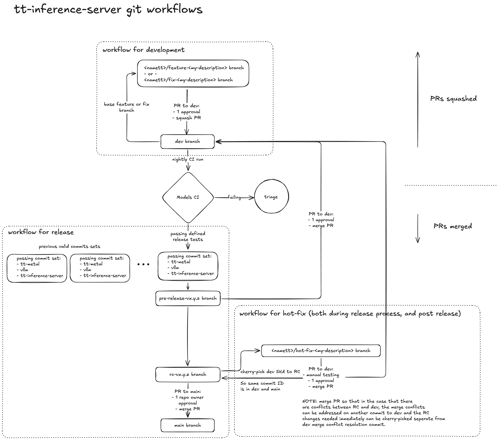

# Development

All development uses the following workflows in git for the repo repository https://github.com/tenstorrent/tt-inference-server.

## Git Workflows

### development in `dev`

All normal development work should be done using this simple workflow, making branchs off `dev` and making PRs back to `dev`.

**branches:**
- `<namett>/feature-<my-description>`
- `<namett>/fix-<my-description>`
- `dev`

**workflow for development:**
1. git checkout `dev` && git pull
1. git checkout -b `<namett>/feature-<my-description>` or `<namett>/fix-<my-description>`
1. make code changes
1. PR `<namett>/feature-<my-description>` to `dev`
1. PR reviewed and approved by >= 1 responsible person defined in CODEOWNERS.md
1. squash and merge PR to `dev`

### releases in `main`

Only repo maintainers do releases to `main`.

branches:
- `dev`
- `pre-release-v<MAJOR>.<MINOR>.<PATCH>`
- `rc-v<MAJOR>.<MINOR>.<PATCH>`
- `main`

workflow for release:
- git checkout `dev` && git pull
- git checkout `<specific-release-commit-SHA>` (from Models CI, should be a recent commit on `dev`)
- follow release doc at [../scripts/release/README.md](../scripts/release/README.md)
- PR reviewed and approved by >= 1 responsible person defined in CODEOWNERS.md
- squash and merge PR to `dev`

### Branch descriptions

`main` (default on GitHub):
- releases only via PR
- all changes must be passing in Models CI
- PR merge sign-off from repo owners
- PRs are merged into main to allow users to see well documented linear history

`dev`:
- where independent development work is consolidated
- Models CI runs nightly using this branch
- Merge criteria
  - PR reviewed and approved by from >= 1 responsible person defined in CODEOWNERS.md
  - well named and documented commits refing PR 
  - squash to merge in GitHub

`<namett>/feature-<my-description>`:
- specific WIP development work
- based off `dev`, PR back to `dev`
- multiple people can work together on a single branch, but generally easier to structure collaboration  via multiple PRs into `dev

`<namett>/fix-<my-description>`:
- bug fix (generally) higher priority than features
- based off `dev`, PR back to `dev`
- similar approach as feature branches

`pre-release-v<MAJOR>.<MINOR>.<PATCH>`:
- branch specifically for updating based on Models CI, for a given release:
  1. tt-metal and vLLM commits
  2. VERSION
  3. metadata
  4. documentation
- based off `dev` release commit (from Models CI passing), PR back to `dev`

`rc-v<MAJOR>.<MINOR>.<PATCH>`:
- release candidate (RC) branches are based from `dev` commit that is passing Models CI nightly and intended for release, this is to provide a "stable" branch for release to avoid inclusion of on-going work on `dev`.
- bug fix (hot fix) commits can be cherry-picked into RC branches directly. 
- features should be passing Models CI from dev before adding to RC, and therefore RC branch should be rebased to `dev` if additional features are needed in a given release last minute (best if avoided, push them into next release if possible and release frequently).
- follows [semver](https://semver.org/), the "API" is generally 1) run.py automation CLI script, 2) openai API for serving LLMs, 3) tt-media-server defined HTTP APIs for serving multi-media models.
  - MAJOR version when you make incompatible API changes
  - MINOR version when you add functionality in a backward compatible manner
  - PATCH version when you make backward compatible bug fixes
- based off `pre-release-v<MAJOR>.<MINOR>.<PATCH>`, PR to `main`

### Git Workflows Diagram

Follow the development and release git workflow, steps described below image:



### pre-commit

Pre-commit usage is defined in `.pre-commit-config.yaml`.

Set up linting and formatting for development:
```bash
# [optional] step 1: use venv
python3 -m venv .pre-commit
source .pre-commit/bin/activate

# step 2: install
pip install --upgrade pip setuptools wheel
pip install -r requirements-dev.txt

# step 3: pre-commit
pre-commit install
```

run pre-commit:
```bash
# pre-commit behaviour is defined in .pre-commit-config.yaml
# by default it runs only on git staged files
pre-commit run
# run on all files in repo
pre-commit run --all-files
# or point to specific files
pre-commit run --files path/to/file
```

### How to build Docker images for a specific model (tt-metal, vLLM commits)

For building containers for development it is generally faster to use 
```bash
python3 scripts/build_docker_images.py --build-metal-commit <my_metal_commit_SHA_or_tag>
```
This filters the Docker images to be built for only the tt-metal version needed.

## Release process

See document on release process and scripts: [../scripts/release/README.md](../scripts/release/README.md)

## Git worktree usage

How to manage many branches in parallel on a single host machine.

### Why use `git worktree`?
- true parallel development on single machine (good for multiple code agents)
- better context switching without stashing changes
- saves disk space and overhead compared to multiple clones of repo locally, all worktrees share the same git object database and repository history
- avoid issues with persisent data that is not tracked in git

```bash
# create a new worktree AND a new branch on it off the current branch (e.g. from dev)
git worktree add ../tt-inference-server-feature-x -b github-id/feature-branch-name

git worktree add ../tt-inference-server-remove-lm-eval-cuda -b tstesco/remove-lm-eval-cuda


# go to the worktree + branch
cd ../tt-inference-server-feature-x

# or just open it in cursor
cursor ../tt-inference-server-feature-x

# remove worktree after completed work on the branch
git worktree remove ../branch-dir
```

For example:
```
├── tt-inference-server/           # main worktree
├── tt-inference-server-feature-x/ # additional worktree
├── tt-inference-server-fix-y/     # additional worktree
└── tt-inference-server-hotfix/    # additional worktree
```

### manage persistent data
```bash
# copy any files you dont want edit separately from main repo
cp -rf ../tt-inference-server/.env ./
# make symlink if you want to use and edit the main repo data
ln -s ../tt-inference-server/persistent_volume ./persistent_volume
```
