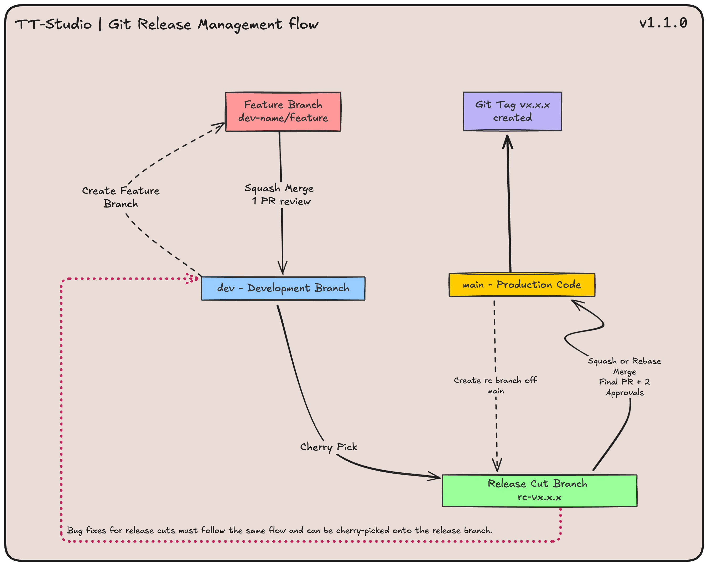

# Development

Set up linting and formatting for development:
```bash
# [optional] step 1: use venv
python3 -m venv .venv
source .venv/bin/activate

# step 2: install
pip install --upgrade pip setuptools wheel
pip install -r requirements-dev.txt

# step 3: pre-commit
pre-commit install
```

run pre-commit:
```bash
# pre-commit behaviour is defined in .pre-commit-config.yaml
# by default it runs only on git staged files
pre-commit run
# run on all files in repo
pre-commit run --all-files
# or point to specific files
pre-commit run --files path/to/file
```

# Contributions

Follow the development and release git workflow, steps described below image:



## Development workflow

1. Make changes on a branch from `dev` following the convention: `username/feature-name` or `username/fix-name`
2. Test those changes locally (rebase from `dev` if needed)
3. merge your branch, e.g. `username/feature-name` to `dev` to consolidate development changes rapidly

For building containers for development it is generally faster to use 
```bash
python3 scripts/build_docker_images.py --build-metal-commit <my_metal_commit_SHA_or_tag>
```
This filters the Docker images to be built for only the tt-metal version needed.

## Release workflow

1. make Release Candidate (RC) branch from `main` following convention `rc-vx.x.x`
2. cherry pick changes from `dev` to the RC branch
3. make Docker images for RC.
Note: use --force-build to avoid using existing `dev` images that may have different files copied into them:
```bash
python3 scripts/build_docker_images.py --force-build
```
4. test RC branch locally
5. PR from `rc-vx.x.x` to `main`
6. Add any changes/fixes needed to `dev` and similarly cherry pick onto `rc-vx.x.x`, re-test changes.
7. after PR merges to `main`, create release tag `vx.x.x` from `main`, publish release package Docker images.
```bash
python3 scripts/build_docker_images.py --release --force-build --push
```

### Update release docs

To generate the LLMs table showing the models supported:
```bash
python3 scripts/release_docs_table.py
```
