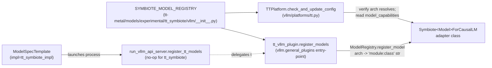

# tt_symbiote × tt-inference-server Pipeline

> Comprehensive developer guide for integrating a new `tt_symbiote` model into
> `tt-inference-server` and bringing it up under the local vLLM API server on
> Tenstorrent hardware.
>
> **Audience:** internal developers adding a new symbiote-style model
> (HF-architecture preserved, with selected modules replaced by TTNN).
> **Success criterion:** a healthy vLLM API server returning HTTP 200 on
> `/v1/models` and a non-empty response on `/v1/chat/completions`.
> **Out of scope:** model authoring (you must already have a working
> standalone pytest in `tt-metal`), benchmark interpretation, eval methodology.

This document is the single source of truth for the tt_symbiote integration
pipeline. It supersedes any earlier symbiote-specific bring-up notes.

---

## Table of Contents

1. [Background — `tt_symbiote` vs `tt_transformers`](#1-background--tt_symbiote-vs-tt_transformers)
2. [The three repositories and the boundary rules](#2-the-three-repositories-and-the-boundary-rules)
3. [Architecture: how the pipeline is wired](#3-architecture-how-the-pipeline-is-wired)
4. [Component map: every file and its role](#4-component-map-every-file-and-its-role)
5. [Runtime flow: from `python3 run.py` to a token](#5-runtime-flow-from-python3-runpy-to-a-token)
6. [The `SymbioteAdapterBase` contract](#6-the-symbioteadapterbase-contract)
7. [The `ModelSpec` contract](#7-the-modelspec-contract)
8. [Step-by-step: add a new tt_symbiote model](#8-step-by-step-add-a-new-tt_symbiote-model)
9. [Common pitfalls and fixes](#9-common-pitfalls-and-fixes)
10. [Reference tables](#10-reference-tables)
11. [Going beyond bring-up: evals, perf-reference, hand-off](#11-going-beyond-bring-up-evals-perf-reference-hand-off)
12. [Open items and known limitations](#12-open-items-and-known-limitations)

---

## 1. Background — `tt_symbiote` vs `tt_transformers`

Tenstorrent supports two integration styles for HuggingFace models on its
hardware:

| Style | Where the model lives | What gets replaced | Trade-off |
|---|---|---|---|
| **`tt_transformers`** | `tt-metal/models/tt_transformers/...` | The whole model — re-implemented in TTNN from scratch | Maximum performance, but every architectural change in the upstream HF model has to be re-ported |
| **`tt_symbiote`** | `tt-metal/models/experimental/tt_symbiote/...` | Selected hot-spot modules (attention, MoE blocks, RMSNorm, RoPE, MLP) — the rest of the HF model code path runs unmodified | Faster integration of new architectures; you keep HF's tokenizer, generation utilities, weight loading; performance ceiling is set by how aggressively you replace modules |

The symbiote approach exists for cases where re-implementing a whole novel
architecture from scratch in TTNN is expensive, but the bulk of inference
time concentrates in a few well-defined op kernels (attention, MoE expert
routing, RoPE) that *are* worth porting. `tt_symbiote` lets the model
author replace those modules at `from_pretrained` time and let the rest of
the HF forward pass run as-is.

This pipeline document is specifically about the integration *between*
those tt_symbiote models and the `tt-inference-server` serving harness
(which in turn wraps the vLLM v1 engine).

---

## 2. The three repositories and the boundary rules

```
~/tt-metal/                         # Model code (model + adapters)
  models/experimental/tt_symbiote/
    models/                         # Per-model HF wrappers (e.g. ling_mini.py)
    modules/                        # TTNN replacements (attention, RoPE, MLP, MoE)
    vllm/                           # vLLM-side adapters and the central registry
    tests/                          # Standalone pytest harness (entry point for new models)

~/tt-inference-server/              # Serving harness
  workflows/model_spec.py           # Per-model serving spec + tt_symbiote validator
  evals/eval_config.py              # Per-model eval task definitions
  benchmarking/benchmark_targets/   # Per-model perf reference (theoretical targets)
  vllm-tt-metal/                    # Server entry point + chat templates + dependencies
  scripts/add_symbiote_model.py     # Scaffolder for new symbiote models
  tt-vllm-plugin/                   # vLLM plugin (READ-ONLY for model integrators)

~/vllm/                             # vLLM fork (READ-ONLY for model integrators)
  vllm/platforms/tt.py              # The TTPlatform that hooks into vLLM
```

**Hard rules** (these come from `CLAUDE.md` §2 in the workspace root and apply
to every symbiote integration):

1. **Never** edit `~/vllm/`. Symbiote models register through the central
   registry; bypassing it makes the integration brittle and breaks
   upstream-rebase compatibility.
2. **Never** edit `~/tt-inference-server/tt-vllm-plugin/`. The plugin is
   generic; per-model logic belongs in the symbiote adapter or the
   `ModelSpecTemplate`.
3. **Never** modify a working `tt_transformers` entry in `model_spec.py`.
   Side-effects there will break unrelated CI.
4. Read before you write. The symbiote codebase has subtle invariants
   (transformers-version shims, watchdog behavior, fabric topology
   requirements) that are not always obvious from the call sites.

---

## 3. Architecture: how the pipeline is wired

The integration relies on **one single source of truth** — a dictionary in
`tt-metal` that maps each TT architecture name to its adapter class. Three
distinct call sites in three different processes import this same dict, so
adding a new symbiote model only ever requires adding one entry there.

### 3.1 The central registry

```python
# ~/tt-metal/models/experimental/tt_symbiote/vllm/__init__.py
SYMBIOTE_MODEL_REGISTRY: dict[str, str] = {
    "TTBailingMoeV2ForCausalLM": (
        "models.experimental.tt_symbiote.vllm.generator_vllm_ling:SymbioteBailingMoeV2ForCausalLM"
    ),
    # ... one entry per integrated model ...
}
```

The key is the **TT architecture name**: the HuggingFace `architectures[0]`
value (e.g. `BailingMoeV2ForCausalLM`) prefixed with literal `"TT"`. The
prefix is added by `vllm.platforms.tt.TTPlatform.check_and_update_config`
at runtime — your registry key must include it.

The value is a vLLM lazy-loader string of the form
`"<module.path>:<ClassName>"`. vLLM's `ModelRegistry.register_model`
imports the module the first time the architecture is requested.

### 3.2 The three import sites



| Site | When it runs | What it does |
|---|---|---|
| `tt_vllm_plugin.register_models` | At every vLLM process start (engine, workers, API server) — wired via the `vllm.general_plugins` setuptools entry-point | Imports `SYMBIOTE_MODEL_REGISTRY` and calls `ModelRegistry.register_model(arch, "module:class")` for each entry |
| `run_vllm_api_server.register_tt_models(impl_id)` | Once at API-server startup | For `impl_id == "tt_symbiote"` it logs and delegates to the plugin entry-point (no direct registration) |
| `TTPlatform.check_and_update_config` | Once per process when vLLM resolves the `VllmConfig` | Imports `SYMBIOTE_MODEL_REGISTRY` again (idempotent), prefixes the HF architecture with `"TT"`, verifies it resolves, and reads `model_capabilities` off the resolved class |

The triple registration is intentional: by the time `TTPlatform` reads
capabilities the architecture *must* already be registered, but engine
workers spawn as subprocesses so the entry-point also has to fire there.
The dict is the same import in all three sites, so it stays consistent.

### 3.3 What the model author does (and does not) touch

| You touch | You do not touch |
|---|---|
| `tt-metal/models/experimental/tt_symbiote/vllm/__init__.py` (one new line) | `tt-vllm-plugin/` (auto-discovers the registry) |
| `tt-metal/models/experimental/tt_symbiote/vllm/generator_vllm_<your-model>.py` (new adapter file) | `~/vllm/vllm/platforms/tt.py` (auto-discovers the registry) |
| `tt-inference-server/workflows/model_spec.py` (new `ModelSpecTemplate`) | `vllm.platforms.tt.register_tt_models` |
| `tt-inference-server/evals/eval_config.py` (new `EvalConfig`) | Anything inside `~/vllm/vllm/` |
| `tt-inference-server/benchmarking/benchmark_targets/model_performance_reference.json` (new device row) | Existing `tt_transformers` model entries |
| Optionally a chat template under `vllm-tt-metal/chat_templates/<model>.jinja` | The existing `SymbioteAdapterBase` |

---

## 4. Component map: every file and its role

### 4.1 In `tt-metal`

| File | Role | Edited per new model? |
|---|---|---|
| `models/experimental/tt_symbiote/models/<model>.py` | HF-style wrapper around the model: defines forward, applies module replacement at `from_pretrained` | Yes (new file, but model authoring is upstream of this guide) |
| `models/experimental/tt_symbiote/modules/{attention,rotary_embedding,mlp,...}.py` | TTNN-native replacements for the corresponding HF modules | Reused; new only if a new module class is needed |
| `models/experimental/tt_symbiote/tests/test_<model>.py` | Standalone pytest harness — must pass before any vLLM bring-up | Yes (precondition) |
| `models/experimental/tt_symbiote/vllm/symbiote_adapter_base.py` | Shared base class providing prefill/decode forwards, warmup, watchdog, DIAG instrumentation, host-tensor conversion | **No** (do not edit unless you are extending the base for everyone) |
| `models/experimental/tt_symbiote/vllm/generator_vllm_<model>.py` | Per-model adapter — subclass of `SymbioteAdapterBase` providing `MODEL_KEY`, `WARMUP_PREFILL_SEQ_LENS`, and `_build_model_and_kv_cache` | **Yes** (new file) |
| `models/experimental/tt_symbiote/vllm/__init__.py` | Central `SYMBIOTE_MODEL_REGISTRY` dict | **Yes** (one new line) |

### 4.2 In `tt-inference-server`

| File | Role | Edited per new model? |
|---|---|---|
| `workflows/model_spec.py` | `ModelSpecTemplate` declares per-device serving spec. Includes the `tt_symbiote_impl` `ImplSpec`, the `_validate_tt_symbiote` validator, the `_TT_SYMBIOTE_DEFAULT_ENV_VARS` defaults, and one block per registered symbiote model | **Yes** (one new `ModelSpecTemplate` block) |
| `evals/eval_config.py` | Eval task definitions (lm-eval-harness wiring) | **Yes** (one new `EvalConfig` block) |
| `benchmarking/benchmark_targets/model_performance_reference.json` | Theoretical TTFT / tput targets per `(model, device, isl, osl)` row | **Yes** (one new row per supported device) |
| `vllm-tt-metal/chat_templates/<model>.jinja` | Optional chat template if the HF tokenizer does not ship one | Only when needed |
| `scripts/add_symbiote_model.py` | Scaffolder that emits all of the above as boilerplate | Run once per new model; not edited |
| `tt-vllm-plugin/` | Generic vLLM plugin (entry-point `vllm.general_plugins`) | **Never** edit |
| `vllm-tt-metal/src/run_vllm_api_server.py` | Server entry-point launched by `run.py --workflow server --local-server` | **Never** edit |

### 4.3 In `~/vllm/` (the fork)

You only ever read these. They are listed here so you understand the
control flow when debugging.

| File | Role |
|---|---|
| `vllm/platforms/tt.py` | `TTPlatform`. Prefixes architectures with `"TT"`, verifies registration, reads `model_capabilities`, sets `TTScheduler` |
| `vllm/v1/worker/tt_worker.py` | Worker that drives the adapter's `prefill_forward` / `decode_forward` |

---

## 5. Runtime flow: from `python3 run.py` to a token

This is what actually happens when the operator invokes the canonical
local-server command (substitute `<MODEL>` and `<DEVICE>` for your model):

```bash
cd ~/tt-inference-server
export VLLM_USE_V1=1
python3 run.py \
    --model <MODEL> \
    --device <DEVICE> \
    --workflow server \
    --local-server \
    --dev-mode \
    --tt-metal-home ~/tt-metal \
    --vllm-dir ~/vllm \
    --skip-system-sw-validation
```

### 5.1 Sequence

```mermaid
sequenceDiagram
    autonumber
    participant Op as Operator
    participant RunPy as run.py
    participant LS as run_local_server.py
    participant VS as run_vllm_api_server.py
    participant Plugin as tt_vllm_plugin
    participant TTP as TTPlatform
    participant Adapter as Symbiote&lt;Model&gt;ForCausalLM
    participant TT as TTNN / device

    Op->>RunPy: python3 run.py --workflow server --local-server
    RunPy->>RunPy: load ModelSpec (validates tt_symbiote shape)
    RunPy->>LS: launch local server subprocess
    LS->>VS: spawn vLLM API server with --model, env_vars, vllm_args
    VS->>Plugin: import (vllm.general_plugins entry-point)
    Plugin->>Plugin: ModelRegistry.register_model(arch, "module:class") for each SYMBIOTE_MODEL_REGISTRY entry
    VS->>TTP: build VllmConfig
    TTP->>TTP: prefix arch with "TT", verify resolves, read capabilities
    TTP->>Adapter: lazy-import "module:class"
    VS->>Adapter: initialize_vllm_model(hf_config, mesh_device, ...)
    Adapter->>Adapter: assert transformers >= REQUIRED_TRANSFORMERS_MAJOR
    Adapter->>Adapter: _build_model_and_kv_cache (HF load + module replacement + KV alloc)
    Adapter->>TT: open mesh device, allocate KV cache, warm up tile cache
    Adapter->>Adapter: warmup_model_prefill (sweep WARMUP_PREFILL_SEQ_LENS)
    Adapter->>Adapter: warmup_model_decode (4 decode steps at longest warmed ISL)
    VS->>Op: "Application startup complete"; HTTP 200 on /v1/models
    Op->>VS: POST /v1/chat/completions
    VS->>Adapter: prefill_forward(tokens, page_table, kv_cache, prompt_lens)
    Adapter->>TT: model.forward(...) under torch.no_grad
    TT-->>Adapter: logits (TTNN tensor)
    Adapter->>Adapter: _to_host_tensor + DIAG sample + watchdog tripwire
    Adapter-->>VS: prefill logits (host tensor)
    loop until EOS or max_tokens
        VS->>Adapter: decode_forward(token, cache_position, ...)
        Adapter->>TT: model.forward(...)
        Adapter->>Adapter: _maybe_emit_decode_diag (periodic sync barrier + watchdog)
        Adapter-->>VS: next-token logits
    end
    VS-->>Op: streaming chunks → final response
```

### 5.2 Key timing characteristics

* **Spec validation** runs at module import time. Misconfigured tt_symbiote
  templates fail before the server process even launches.
* **First request** is much slower than steady state because TTNN kernels
  are JIT-compiled on demand. The warmup sweep (§6) primes most of them,
  but the first prompt against a never-seen ISL bucket can still take
  tens of seconds.
* **`max_concurrency=1`** is the safe default for new symbiote models.
  Many model implementations hardcode `batch_idx=0` in their attention
  prefill path; raising concurrency requires explicit model-side work
  (see [§12](#12-open-items-and-known-limitations)).

---

## 6. The `SymbioteAdapterBase` contract

The shared base class lives in
`tt-metal/models/experimental/tt_symbiote/vllm/symbiote_adapter_base.py`
and provides every piece of behavior that does not depend on a specific
model's TTNN module replacements. It exists so each new symbiote adapter
can stay short (~100–200 lines) and consistent — every one of them gets
the same DIAG instrumentation, the same watchdog, the same warmup loop,
the same host-tensor conversion semantics.

### 6.1 What subclasses provide

A subclass must override exactly two things and may optionally override
two more:

```python
class Symbiote<Model>ForCausalLM(SymbioteAdapterBase):
    # ---- REQUIRED ----

    # Used in watchdog log strings as TT_SYMBIOTE_<MODEL_KEY>_PREFILL_SYNC.
    # Convention: short uppercase, e.g. "LING".
    MODEL_KEY: str = "<MODEL>"

    # ISLs primed during warmup. Must include every ISL bucket the
    # benchmark sweep will exercise within the spec's max_context cap.
    WARMUP_PREFILL_SEQ_LENS: tuple[int, ...] = (128, 1024, 2048)

    # The one real implementation method: load the HF model, replace
    # whichever modules need replacement, allocate the KV cache.
    @classmethod
    def _build_model_and_kv_cache(
        cls,
        hf_config,
        mesh_device,
        max_batch_size,
        max_seq_len,
        **kwargs,
    ):
        # 1. AutoModelForCausalLM.from_pretrained(...)
        # 2. Replace HF modules with TTNN counterparts
        # 3. Allocate the paged KV cache and bind it to the model
        # Return (model, kv_cache, model_device).
        ...

    # ---- OPTIONAL ----

    # Minimum required transformers major version. The base asserts in
    # initialize_vllm_model. Default 5.
    REQUIRED_TRANSFORMERS_MAJOR: int = 5

    # vLLM model_capabilities. Default: prefix caching, async decode, and
    # multimodal disabled. Override only if your model needs a different
    # capability profile.
    model_capabilities = {
        "supports_prefix_caching": False,
        "supports_async_decode": False,
        "supports_multimodal": False,
    }
```

### 6.2 What subclasses inherit (do not re-implement)

Everything below is provided by the base — touch any of it only if you
have a documented reason and only by overriding, not by editing the base.

| Inherited member | Behavior |
|---|---|
| `__init__(self, model, mesh_device, kv_cache, hf_config)` | Stores references and resets per-request decode counters |
| `initialize_vllm_model(...)` (`@classmethod`) | Asserts transformers version, calls `_build_model_and_kv_cache`, sets `model.eval()`, disables grad, applies device-property patches, instantiates the subclass |
| `_to_host_tensor(tensor)` | Multi-device-aware conversion of `ttnn.Tensor` / `TorchTTNNTensor` / plain `torch.Tensor` to host |
| `prefill_forward(tokens, page_table, kv_cache, prompt_lens, **kwargs)` | Resets KV, runs model.forward under `torch.no_grad`, converts to host, samples DIAG, fires watchdog if elapsed > `TT_SYMBIOTE_PREFILL_WATCHDOG_SEC` |
| `decode_forward(...)` | Sync/async decode paths, periodic command-queue drain, DIAG and watchdog tripwires |
| `_maybe_emit_decode_diag(...)` | Periodic `ttnn.synchronize_device` every `TT_SYMBIOTE_SYNC_EVERY_N_DECODES` steps |
| `process_decode_output_host(...)` | Async-controller post-processing |
| `warmup_model_prefill(...)` | Sweeps `WARMUP_PREFILL_SEQ_LENS` (filtered by `<= max_position_embeddings`) |
| `warmup_model_decode(...)` | Re-primes KV at the longest warmed ISL, runs 4 decode steps |
| `allocate_kv_cache(...)` | Returns `self.kv_cache` allocated by `_build_model_and_kv_cache` |
| Module-level DIAG state | `_DIAG_ENABLED`, `_diag_progcache_entries`, `_diag_log`, watchdog/sync env vars |

### 6.3 HuggingFace custom-code shims

Some HF custom-code models reference symbols that move or disappear
across transformers releases (most commonly between transformers 4.x and
5.x). Because the per-model adapter file is what gets imported by the
plugin's `ModelRegistry.register_model` lazy-load path, any compatibility
patch must be applied at **module top of the per-model adapter file**,
**before** the `SymbioteAdapterBase` import or any HF `from_pretrained`
call triggers the dynamic-import chain.

Pattern (this is the correct location and ordering):

```python
# ~/tt-metal/models/experimental/tt_symbiote/vllm/generator_vllm_<model>.py

# ---- 1. Apply transformers shims FIRST, before any other imports that
#         might trigger HF dynamic-import. ----
import transformers
import transformers.utils as _trans_utils

if not hasattr(_trans_utils, "is_torch_fx_available"):
    _trans_utils.is_torch_fx_available = lambda: False

# ... any other shims your HF custom code requires ...

# ---- 2. Now safe to import the rest. ----
from models.experimental.tt_symbiote.vllm.symbiote_adapter_base import (
    SymbioteAdapterBase,
)
# ... rest of your adapter ...
```

The base intentionally does **not** apply these — they are model-specific,
and ordering matters.

### 6.4 Resulting per-model adapter shape

A typical post-base symbiote adapter is roughly:

* ~30 lines of imports + the optional transformers shim block
* ~5–10 lines of class scaffolding (`MODEL_KEY`, `WARMUP_PREFILL_SEQ_LENS`)
* ~50–150 lines of `_build_model_and_kv_cache` (model-specific HF load +
  module-replacement logic + KV-cache allocation)

Everything else is inherited.

---

## 7. The `ModelSpec` contract

The serving harness reads a `ModelSpecTemplate` for each known model.
For tt_symbiote models, the template carries enough information for the
operator to bring the server up with no hand-tuning.

### 7.1 The `tt_symbiote_impl`

`workflows/model_spec.py` declares one `ImplSpec` shared by every
symbiote model:

```python
tt_symbiote_impl = ImplSpec(
    impl_id="tt_symbiote",
    # ... shared paths, repos, commits ...
)
```

Setting `impl=tt_symbiote_impl` on a `ModelSpecTemplate` is what makes
the validator (§7.2) run and the env-var defaults (§7.3) apply.

### 7.2 The `_validate_tt_symbiote` validator

`ModelSpecTemplate._validate_data` calls `_validate_tt_symbiote(self)`
when `self.impl is tt_symbiote_impl`. The validator runs at module-import
time, so misconfigured templates fail fast — the operator never sees a
runtime hang from a typo. The asserts and warnings:

| Field | Required value | Failure mode |
|---|---|---|
| `has_builtin_warmup` | `True` | `AssertionError` |
| `override_tt_config["enable_model_warmup"]` | `True` (per device) | `AssertionError` |
| `override_tt_config["trace_mode"]` | `"none"` | `AssertionError` (TRACED is incompatible with tt_symbiote) |
| `env_vars["TT_SYMBIOTE_DISPATCHER"]` | One of `{"DEFAULT", "DEBUG", "CPU", "TENSOR_OPS"}` | `AssertionError` |
| `env_vars["MESH_DEVICE"]` | Matches the `DeviceModelSpec` device | `AssertionError` |
| `override_tt_config["fabric_config"]` (multi-chip devices: `N300`, `T3K`, `GALAXY_T3K`) | Set, recommended `"FABRIC_1D_RING"` | `WARNING` log; `FABRIC_1D` (linear) sometimes deadlocks symbiote attention kernels |

### 7.3 Default env-var injection

`ModelSpec.__post_init__` injects sensible defaults for tt_symbiote
specs. Per-spec overrides win. The defaults come from
`_TT_SYMBIOTE_DEFAULT_ENV_VARS` in `model_spec.py`:

| Env var | Default | Purpose |
|---|---|---|
| `TT_SYMBIOTE_DISPATCHER` | `CPU` | Matches the validated standalone-pytest dispatcher; `DEFAULT`, `DEBUG`, `TENSOR_OPS` are the other allowed values |
| `TT_SYMBIOTE_DIAG` | `1` | Per-prefill / per-decode CSV diag line on; cheap, helps diagnose later regressions |
| `TT_SYMBIOTE_PREFILL_WATCHDOG_SEC` | `60` | Surfaces a `[WATCHDOG] prefill_forward took N.NNs` log line if a single prefill exceeds this; raise per-spec if your model has long cold-boot JIT |
| `TT_SYMBIOTE_DECODE_WATCHDOG_SEC` | `30` | Same idea for decode |
| `TT_SYMBIOTE_SYNC_EVERY_N_DECODES` | `32` | Drains the in-flight TTNN command queue every N decode steps to bound memory and reveal deadlocks early |
| `DISABLE_METAL_OP_TIMEOUT` | `1` | Long warmup ISLs can exceed the default per-op timeout during JIT compile |

### 7.4 Example template

The Ling-mini-2.0 spec illustrates the shape (paths shortened for
readability). Adapt for your model:

```python
ModelSpecTemplate(
    weights=["Ling-mini-2.0"],
    impl=tt_symbiote_impl,
    tt_metal_commit="<HEAD>",
    vllm_commit="<HEAD>",
    inference_engine=InferenceEngine.VLLM.value,
    device_model_specs=[
        DeviceModelSpec(
            device=DeviceTypes.T3K,
            max_concurrency=1,
            max_context=2048,
            default_impl=True,
            vllm_args={
                "max_model_len": "2304",          # max_context + chat-template overhead
                "max_num_batched_tokens": "2304",
                "max_num_seqs": "1",
                "block_size": "64",
                "trust-remote-code": True,
                # "chat-template": "vllm-tt-metal/chat_templates/<model>.jinja",  # only if needed
            },
            override_tt_config={
                "enable_model_warmup": True,
                "trace_mode": "none",
                "trace_region_size": 200000000,
                "fabric_config": "FABRIC_1D_RING",
            },
            env_vars={
                "MESH_DEVICE": "T3K",
                # The defaults from §7.3 are injected automatically.
                # Override only when needed, e.g. cold-boot JIT:
                "TT_SYMBIOTE_PREFILL_WATCHDOG_SEC": "180",
            },
        ),
    ],
    status=ModelStatusTypes.EXPERIMENTAL,
    has_builtin_warmup=True,
)
```

A note on `max_model_len` vs `max_context`: vLLM applies
`truncate_prompt_tokens=ISL` *after* chat-template rendering. If your
benchmark or eval harness sends the maximum ISL, the rendered prompt can
exceed `max_context` by a few dozen tokens worth of system/user role
markers, BOS/EOS, etc. Set `max_model_len` ~10–15% above `max_context`
so the engine accepts those requests without HTTP 400 ("Bad Request").

---

## 8. Step-by-step: add a new tt_symbiote model

Use Ling-mini-2.0 as a concrete worked example. Substitute your own
values for the marked placeholders.

### Step 0 — Preconditions

1. The model already runs to completion in standalone pytest under
   `tt-metal/models/experimental/tt_symbiote/tests/test_<model>.py`.
   This guide does **not** cover authoring the model; it covers
   integrating an already-working model into the serving harness.
2. You have read the hard rules in §2 of this document and `CLAUDE.md`
   §2 in the workspace root.
3. You know which device(s) you are targeting and have device access
   for the local-server bring-up at the end of this guide.
4. You have noted the HF model details:
   * `architectures[0]` (e.g. `BailingMoeV2ForCausalLM`)
   * `max_position_embeddings`
   * Whether the tokenizer ships a chat template
     (`tokenizer.chat_template is not None`)

### Step 1 — Scaffold all five files

```bash
cd ~/tt-inference-server
python3 scripts/add_symbiote_model.py \
    --hf-arch BailingMoeV2ForCausalLM \
    --weights inclusionAI/Ling-mini-2.0 \
    --short-name Ling-mini-2.0 \
    --device t3k \
    --max-context 2048 \
    --max-concurrency 1 \
    --tt-metal-commit <tt-metal-HEAD> \
    --vllm-commit <vllm-HEAD>
```

The scaffolder is **read-only**: it prints five blocks (each marked with
a `# ===== FILE: ... =====` header) and never mutates the source repos.
Paste each block at its marked location.

The five files, in dependency order:

1. `~/tt-metal/models/experimental/tt_symbiote/vllm/generator_vllm_<model>.py`
   *(NEW FILE — adapter subclass)*
2. `~/tt-metal/models/experimental/tt_symbiote/vllm/__init__.py`
   *(add new entry to `SYMBIOTE_MODEL_REGISTRY`)*
3. `~/tt-inference-server/workflows/model_spec.py`
   *(add `ModelSpecTemplate` near the existing `impl=tt_symbiote_impl` entries)*
4. `~/tt-inference-server/evals/eval_config.py`
   *(add `EvalConfig` to `EVAL_CONFIGS`)*
5. `~/tt-inference-server/benchmarking/benchmark_targets/model_performance_reference.json`
   *(add perf-reference stub — leave `theoretical: null` or fill from internal numbers)*

The scaffolder does **not** invent values that require runtime
measurement (perf targets, eval scores). Those are operator decisions.

### Step 2 — Fill in the adapter

Open the new `generator_vllm_<model>.py`. The scaffold has `# TODO`
markers at every model-specific section. Minimum required edits:

1. Set `MODEL_KEY` to a short uppercase identifier (e.g. `LING`, `<MYMODEL>`).
2. Set `WARMUP_PREFILL_SEQ_LENS` to cover every ISL bucket the benchmark
   sweep will exercise within `max_context`. Typical: `(128, 1024, 2048)`.
3. Implement `_build_model_and_kv_cache`. Refer to
   `generator_vllm_ling.py` as a working example. The required outputs
   are `(model, kv_cache, model_device)`.
4. If your HF custom code references symbols that have moved in
   transformers 5.x, apply the shims at **module top** (see §6.3).

### Step 3 — Register the new architecture

Add **one line** to `~/tt-metal/models/experimental/tt_symbiote/vllm/__init__.py`:

```python
SYMBIOTE_MODEL_REGISTRY: dict[str, str] = {
    # ... existing entries ...
    "TT<HFArchName>": (
        "models.experimental.tt_symbiote.vllm.generator_vllm_<model>:Symbiote<HFArchName>"
    ),
}
```

The key **must** be the HF `architectures[0]` value with a literal `"TT"`
prefix. The value is a vLLM-style `"module.path:ClassName"` lazy loader.

Verify the import resolves before going further:

```bash
~/tt-metal/python_env/bin/python -c "
from models.experimental.tt_symbiote.vllm import SYMBIOTE_MODEL_REGISTRY
print(SYMBIOTE_MODEL_REGISTRY)
"
```

### Step 4 — Drop in the `ModelSpecTemplate`

Paste the scaffolded `ModelSpecTemplate` block into
`~/tt-inference-server/workflows/model_spec.py` next to the existing
`impl=tt_symbiote_impl` entries. Adjust:

* `weights=["<short-name>"]` — the value the operator passes via `--model`
* `tt_metal_commit` and `vllm_commit` — current HEADs of your local
  checkouts
* One `DeviceModelSpec` per supported device

Run the validator unit tests to catch any misconfiguration immediately:

```bash
cd ~/tt-inference-server
PYTHONPATH=. ~/tt-metal/python_env/bin/python -m pytest \
    tests/workflows/test_tt_symbiote_validator.py -v
```

### Step 5 — Chat template (only if needed)

Inspect the tokenizer:

```bash
~/tt-metal/python_env/bin/python -c "
from transformers import AutoTokenizer
t = AutoTokenizer.from_pretrained('<HF-REPO>', trust_remote_code=True)
print('has chat template?', t.chat_template is not None)
"
```

If `True`, you are done — vLLM picks it up automatically. If `False`,
drop a Jinja template into
`~/tt-inference-server/vllm-tt-metal/chat_templates/<model>.jinja` and
wire it via `vllm_args["chat-template"]` in the `DeviceModelSpec`. Paths
are resolved relative to the project root by
`run_vllm_api_server._resolve_vllm_file_args`.

If the prompt format is novel (i.e. you cannot crib from an existing
model's template), pause and ask the model author what the canonical
prompt format is — getting this wrong silently degrades all eval scores.

### Step 6 — Eval and perf-reference (recommended)

Even if you do not run evals or benchmarks yourself, drop in stubs so
that whoever runs them later does not have to re-discover the schema:

* `evals/eval_config.py`: add an `EvalConfig` with at least one `EvalTask`
  per major modality your model supports. Use existing tt_transformers
  entries (e.g. `gpt-oss-20b`, `Mistral-Small-3.1-24B-Instruct-2503`) as
  the canonical shape.
* `benchmarking/benchmark_targets/model_performance_reference.json`:
  add one row per supported device with `(isl=128, osl=128,
  max_concurrency=<from spec>, num_prompts=8, task_type="text", ...)`
  and theoretical targets where you have them. Use `Llama-3.1-8B-Instruct`
  as the canonical shape.

### Step 7 — Bring up the local server

Reset the device(s) and run the canonical bring-up command:

```bash
tt-smi -r 0,1,2,3                      # T3K example; adjust indices for your device
sleep 5

cd ~/tt-inference-server
export VLLM_USE_V1=1
export HF_TOKEN=hf_...                 # only if your HF repo is gated
python3 run.py \
    --model <YOUR-MODEL-ID> \
    --device <YOUR-DEVICE> \
    --workflow server \
    --local-server \
    --dev-mode \
    --tt-metal-home ~/tt-metal \
    --vllm-dir ~/vllm \
    --skip-system-sw-validation \
    --no-auth
```

Watch the server log for `Application startup complete`. First-time
startup can take several minutes due to weight loading + warmup +
JIT compile of TTNN kernels.

### Step 8 — Health check

The server is healthy when **all three** of the following pass:

```bash
# 1. Architecture is registered and config is valid:
curl -s -o /dev/null -w "%{http_code}\n" http://localhost:8000/v1/models
# expect: 200

# 2. The model can prefill + decode end-to-end:
curl -s -X POST http://localhost:8000/v1/chat/completions \
    -H 'Content-Type: application/json' \
    -d '{
        "model": "<YOUR-MODEL-ID>",
        "messages": [{"role": "user", "content": "Hello, what is your name?"}],
        "max_tokens": 32
    }'
# expect: 200 with non-empty choices[0].message.content

# 3. Or use the bundled CLI tool:
python3 utils/local_server_prompt.py --no-auth --prompt "Hello, what is your name?"
```

When all three pass, bring-up is done. Stop the server (`Ctrl-C` or
`kill <pid>`) and reset the device (`tt-smi -r ...`) so it is clean for
the operator's benchmark / eval pass.

### Step 9 — Hand off

Per `CLAUDE.md` §1, integration ends at HTTP 200. After that, the
operator runs the benchmark and eval workflows:

```bash
# Operator, after Step 8 is green:
python3 run.py --model <MODEL> --device <DEVICE> --workflow benchmarks ...
python3 run.py --model <MODEL> --device <DEVICE> --workflow evals ...
```

Cross-link your hand-off note to this document so the operator (or a
future you) can re-trace the integration. See §11 for what runs after
hand-off.

---

## 9. Common pitfalls and fixes

### 9.1 `ValueError: No TT model architecture is registered for model: '...'`

**Cause:** The architecture is missing from `SYMBIOTE_MODEL_REGISTRY`,
or `tt-metal` is not on the venv's `PYTHONPATH`, or the registry key
is missing the `"TT"` prefix.

**Fix:**
1. Verify the registry has the key with the `"TT"` prefix.
2. Verify the local `tt-metal` checkout matches `--tt-metal-home`.
3. Verify the import resolves in the venv:
   ```bash
   ~/tt-metal/python_env/bin/python -c \
       "from models.experimental.tt_symbiote.vllm import SYMBIOTE_MODEL_REGISTRY; print(SYMBIOTE_MODEL_REGISTRY)"
   ```

### 9.2 `Active dispatcher 'X' not registered`

**Cause:** Invalid value for `TT_SYMBIOTE_DISPATCHER` in `env_vars`.

**Fix:** Set it to one of the allowed values
(`DEFAULT`, `DEBUG`, `CPU`, `TENSOR_OPS`). The validator in §7.2 will
catch this on the next module import. `CPU` is the default and is what
the standalone pytest harness uses.

### 9.3 Server hangs at "Loading model on TT platform..."

**Most likely:** weight loading on a slow filesystem or the warmup loop
running. Wait at least 5 minutes the first time. Subsequent runs are
faster (TT cache is warm). If the log shows no progress after 10
minutes:

* Check `~/.cache/huggingface` for the weights — are they actually there?
* Check `MODEL_WEIGHTS_DIR` and `TT_CACHE_PATH` in the server log.
* Capture a `py-spy dump $(pgrep -f 'VLLM::EngineCore')` and inspect
  where the worker is stuck before killing.

### 9.4 `chip in use 0 PCIe` on startup

**Cause:** Stale device lock from a previous server.

**Fix:** `tt-smi -r <chip-indices>`, wait 5 s, retry.

### 9.5 First request returns HTTP 400 ("Bad Request") at maximum ISL

**Cause:** vLLM's `max_model_len` is set equal to `max_context`, but
chat-template rendering adds tokens (system/user role markers, BOS/EOS).
The request's rendered prompt + completion exceeds `max_model_len`.

**Fix:** Set `vllm_args["max_model_len"]` (and
`max_num_batched_tokens`) to `max_context + ~10–15%`. For
`max_context=2048` a typical safe value is `2304`.

### 9.6 `/v1/chat/completions` hangs with `[WATCHDOG] prefill_forward took 60.00s`

**Cause (canonical):** cross-request TTNN command-queue deadlock —
typically a kernel reshape race in attention prefill.

**Diagnosis:**
1. Capture `py-spy dump $(pgrep -f 'VLLM::EngineCore')` and save the
   trace.
2. If the dump points at a `ttnn.reshape` (or similar) inside the
   model's attention prefill kernel, you have the canonical race.

**Fix (model-side, not integration):** Apply a sync-barrier mitigation
in the model's `forward`:

```python
# ~/tt-metal/models/experimental/tt_symbiote/models/<model>.py
import os
import ttnn

_PREFILL_SYNC = os.environ.get("TT_SYMBIOTE_<MODEL_KEY>_PREFILL_SYNC", "1") == "1"

def call(self, input_ids, ...):
    inputs_embeds = self.embed_tokens(input_ids)
    is_prefill = inputs_embeds.shape[1] > 1
    if is_prefill and _PREFILL_SYNC:
        try: ttnn.synchronize_device(self.device)
        except Exception as e: logger.warning("sync(before_prefill) failed: %s", e)
    # ... layer loop + norm ...
    if is_prefill and _PREFILL_SYNC:
        try: ttnn.synchronize_device(self.device)
        except Exception as e: logger.warning("sync(after_prefill) failed: %s", e)
    return BaseModelOutputWithPast(...)
```

Then set `TT_SYMBIOTE_SYNC_EVERY_N_DECODES=32` in `model_spec.py`
(this is already the default — see §7.3).

If the dump does not clearly point at a reshape race, **stop and ask**
the model author. Do not attempt random `synchronize_device` insertions.

### 9.7 HF custom code raises `AttributeError` on transformers 5.x

**Cause:** Symbols moved (`is_torch_fx_available`, `ROPE_INIT_FUNCTIONS`
"default" key, etc.) between transformers 4.x and 5.x.

**Fix:** Apply module-level shims at the **top** of your
`generator_vllm_<model>.py`, **before** the `SymbioteAdapterBase`
import. See §6.3 for the exact ordering.

### 9.8 `chat-template` file not found

**Cause:** `vllm_args["chat-template"]` points at a path that does not
resolve.

**Fix:** Paths are resolved against the project root
(`~/tt-inference-server`) by `_resolve_vllm_file_args` in
`vllm-tt-metal/src/run_vllm_api_server.py`. Confirm the file exists
relative to that root (e.g. `vllm-tt-metal/chat_templates/<model>.jinja`).

---

## 10. Reference tables

### 10.1 Production-readiness checklist

A new tt_symbiote model is "production-ready" when all six rows are green:

| # | Item | Source of truth |
|---|---|---|
| 1 | Standalone pytest passes | `tt-metal/models/experimental/tt_symbiote/tests/test_<model>.py` |
| 2 | Registry entry exists with `"TT"` prefix | `tt-metal/models/experimental/tt_symbiote/vllm/__init__.py::SYMBIOTE_MODEL_REGISTRY` |
| 3 | Adapter subclass extends `SymbioteAdapterBase`; `WARMUP_PREFILL_SEQ_LENS` covers every ISL bucket the spec exposes | `tt-metal/models/experimental/tt_symbiote/vllm/generator_vllm_<model>.py` |
| 4 | `ModelSpecTemplate` passes `_validate_tt_symbiote`; `tt_metal_commit` and `vllm_commit` pin known-good HEADs | `workflows/model_spec.py` |
| 5 | `EvalConfig` exists with at least one task per major modality (or marked TBD) | `evals/eval_config.py` |
| 6 | `model_performance_reference.json` has at least one row per supported device | `benchmarking/benchmark_targets/model_performance_reference.json` |

### 10.2 Useful commands

| Purpose | Command |
|---|---|
| Reset T3K | `tt-smi -r 0,1,2,3` |
| List vLLM engine processes | `pgrep -af run_vllm_api_server` |
| Active VLLM_API_KEY (if `JWT_SECRET` is set) | `cat /proc/$(pgrep -f 'VLLM::EngineCore')/environ \| tr '\0' '\n' \| grep '^VLLM_API_KEY='` |
| Verify ttnn imports | `~/tt-metal/python_env/bin/python -c "import ttnn; print('ok')"` |
| Verify vLLM TT plugin discoverable | `~/tt-metal/python_env/bin/python -c "from importlib.metadata import entry_points; print(list(entry_points(group='vllm.platform_plugins')))"` |
| Health probe (no auth) | `curl -s -o /dev/null -w "%{http_code}\n" http://localhost:8000/v1/models` |
| Single chat completion | `curl -s -X POST http://localhost:8000/v1/chat/completions -H 'Content-Type: application/json' -d '{"model":"<id>","messages":[{"role":"user","content":"hi"}],"max_tokens":16}'` |
| `py-spy` engine dump | `py-spy dump --pid $(pgrep -f 'VLLM::EngineCore')` |

### 10.3 Allowed values

| Setting | Allowed values |
|---|---|
| `TT_SYMBIOTE_DISPATCHER` | `DEFAULT`, `DEBUG`, `CPU` (recommended), `TENSOR_OPS` |
| `override_tt_config["trace_mode"]` | `"none"` (only allowed value for tt_symbiote) |
| `override_tt_config["fabric_config"]` | `"FABRIC_1D_RING"` (recommended), `"FABRIC_1D"` |
| Multi-chip devices that need `fabric_config` | `N300`, `T3K`, `GALAXY_T3K` |

---

## 11. Going beyond bring-up: evals, perf-reference, hand-off

This document covers integration up to a healthy server. The full
production lifecycle continues with:

* **Evals.** See `add_support_for_new_model.md` for the canonical
  `EvalConfig` / `EvalTask` shape (the same patterns apply to tt_symbiote
  entries — there is nothing tt_symbiote-specific about eval wiring).
  Tasks like `aime25`, `gpqa_diamond_cot_zeroshot`, `humaneval_instruct`,
  `mmlu_generative` are commonly used; the choice depends on what the
  model's publisher reported.
* **Benchmarks.** `benchmark_config.py` drives the ISL/OSL sweep (e.g.
  `(128,128)`, `(128,1024)`, `(1024,128)`, `(2048,128)`, etc.) and
  filters by your `max_context`. The perf-reference JSON only supplies
  *target* numbers; missing rows render as `N/A` in the report (which is
  a perfectly acceptable shape until you have measured baselines).
* **Hand-off.** Per `CLAUDE.md` §1, integration ends at HTTP 200. The
  operator runs benchmarks and evals; you do not.

---

## 12. Open items and known limitations

These are pipeline-wide, not model-specific. They are documented here so
new integrators know what is *not* their job to fix:

* **Chat-template registry.** Today `vllm_args["chat-template"]` is a
  stringly-typed relative path resolved by `_resolve_vllm_file_args` in
  `run_vllm_api_server.py`. A future iteration could add a small
  `ChatTemplateSpec` registry indexed by HF tokenizer-class name. Out of
  scope for individual model bring-up.
* **Standardised KV-cache hand-off.** Different symbiote models use
  different paged-attention KV-cache variants (single paged cache; dual
  sliding+global; multi-stream). The base intentionally does not
  abstract this — `_build_model_and_kv_cache` returns the cache verbatim.
  A future cleanup could introduce a `KVCacheSpec` if a third pattern
  emerges.
* **`max_concurrency > 1`** is not free for new symbiote models. Many
  HF model implementations (especially MoE) hardcode `batch_idx=0` in
  attention prefill, and `position_ids` are often built as
  `[1, seq_len]` rather than `[batch, seq_len]`. Lifting concurrency
  requires explicit model-side changes in
  `tt-metal/models/experimental/tt_symbiote/{models,modules}/`. Default
  to `max_concurrency=1` until proven otherwise.
* **Long-decode numerical drift.** Some symbiote models exhibit a
  decode-quality cliff after ~100 tokens at bf16 precision. This is a
  model-side numerical issue (typically in attention output
  accumulation, MoE routing, or RoPE under templated prompts), not a
  pipeline issue. The pipeline reports it correctly via DIAG / watchdog
  and the eval scoreboard — the fix is in `models/<model>.py`, not
  here.

---

## Appendix: Minimal worked example (Ling-mini-2.0)

The following is what a complete integration looks like, with file paths
and one-line summaries:

```
~/tt-metal/
  models/experimental/tt_symbiote/
    models/ling_mini.py                                  # HF wrapper, module replacement
    modules/{attention,rotary_embedding,mlp,moe}.py      # TTNN replacements
    tests/test_ling_mini.py                              # standalone pytest
    vllm/
      symbiote_adapter_base.py                           # SHARED base class (do not edit)
      generator_vllm_ling.py                             # adapter (~209 lines)
      __init__.py                                        # adds "TTBailingMoeV2ForCausalLM"

~/tt-inference-server/
  workflows/model_spec.py                                # adds Ling ModelSpecTemplate
  evals/eval_config.py                                   # adds Ling EvalConfig
  benchmarking/benchmark_targets/model_performance_reference.json  # adds Ling t3k+n300 rows
  vllm-tt-metal/chat_templates/                          # (Ling tokenizer ships its own)

~/vllm/                                                  # untouched
```

Bring-up command (after the seven preceding steps):

```bash
tt-smi -r 0,1,2,3 && sleep 5 && cd ~/tt-inference-server && \
    export VLLM_USE_V1=1 && \
    python3 run.py \
        --model Ling-mini-2.0 \
        --device t3k \
        --workflow server \
        --local-server \
        --dev-mode \
        --tt-metal-home ~/tt-metal \
        --vllm-dir ~/vllm \
        --skip-system-sw-validation \
        --no-auth
```

Health check:

```bash
curl -s -o /dev/null -w "%{http_code}\n" http://localhost:8000/v1/models
# 200

python3 utils/local_server_prompt.py --no-auth --prompt "Hello, what is your name?"
# (non-empty response within ~30 s)
```

When both pass, integration is complete. Hand off to the operator for
benchmarks and evals.
