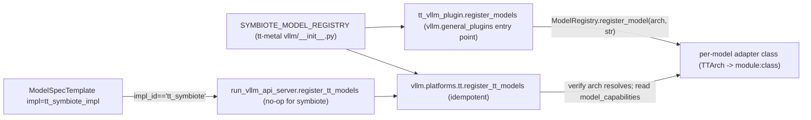
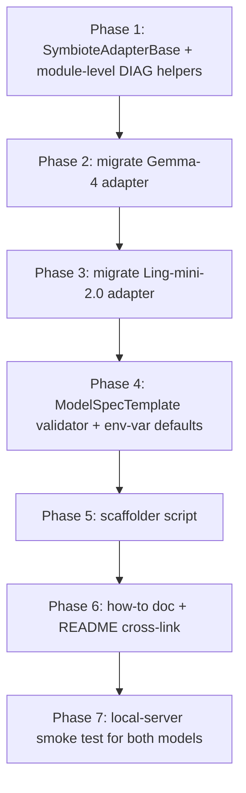

# tt_symbiote Integration Pipeline

This document is the engineering design for the tt_symbiote integration pipeline
in `tt-inference-server`. It captures the architecture that lets a new
tt_symbiote model land with the same ergonomics as a `tt_transformers` model:
a single `ModelSpecTemplate`, a small adapter subclass, an entry in the
shared registry, and one row each in the eval / perf-target catalogs.

The pipeline is deliberately layered across three repositories — the model
code stays in `tt-metal/models/experimental/tt_symbiote/`, the central
registry is the only file shared with the upstream vLLM fork, and everything
serving-side is contained inside `tt-inference-server/`. The boundary
respects the hard rules in `CLAUDE.md` §2 (no edits to upstream `vllm/` and
no edits to `tt-vllm-plugin/`).

## 1. Problem statement

Today's tt_symbiote integration works (Gemma-4-31B and Ling-mini-2.0 both
serve cleanly through the local server) but every new model needs to
duplicate ~510 of 574 lines of vLLM-adapter boilerplate, and the
`ModelSpecTemplate` accepts misconfigured tt_symbiote entries silently —
there is no spec-side validator that fires until something actually deadlocks
in TTNN at runtime.

Concrete frictions, by file:

- [tt-metal/models/experimental/tt_symbiote/vllm/generator_vllm.py](../../tt-metal/models/experimental/tt_symbiote/vllm/generator_vllm.py)
  (Gemma-4 adapter, 574 lines): DIAG instrumentation, watchdog, sync helpers,
  `_to_host_tensor`, `prefill_forward`/`decode_forward` bodies, both
  `warmup_model_*` loops, and the KV-cache hand-off are all generic. The
  per-model delta is `~64` lines: `WARMUP_PREFILL_SEQ_LENS`, the
  `initialize_vllm_model` weight-replacement specific to the model, and one
  watchdog hint string.
- `tt-metal/models/experimental/tt_symbiote/vllm/generator_vllm_ling.py`
  (Ling adapter, 591 lines): the same shape, copied verbatim.
- [workflows/model_spec.py](../workflows/model_spec.py) `ModelSpecTemplate._validate_data`
  (lines 824-838) only enforces shape constraints. Misconfigured tt_symbiote
  entries (`trace_mode="traced"`, missing `fabric_config` on multi-chip
  devices, invalid `TT_SYMBIOTE_DISPATCHER` value, mis-set `MESH_DEVICE`)
  surface as runtime hangs or crashes inside vLLM, not as fast-fail asserts
  at module-import time.
- The chat-templates directory at `vllm-tt-metal/chat_templates/` is a flat
  dir referenced by stringly-typed paths in `vllm_args["chat-template"]`. No
  registry, no auto-discovery.
- There is no how-to document for tt_symbiote analogous to
  [add_support_for_new_model.md](add_support_for_new_model.md), so each new
  model rediscovers the bring-up checklist by reading commits.

## 2. Registration architecture (current and target)

The wiring across the three repos is correct today; the cleanup is purely
about ergonomics on top of it. There is exactly one source of truth for the
TT-architecture-name to adapter-class mapping, imported by three sites.



The three call sites are:

1. `tt_vllm_plugin.register_models` registers every entry into vLLM's
   `ModelRegistry` at process start (the plugin is wired through the
   `vllm.general_plugins` entry point so it runs in every vLLM process,
   including engine workers).
2. `run_vllm_api_server.register_tt_models` is a no-op for `tt_symbiote`
   (delegates to the plugin entry point) and only runs in the API-server
   process.
3. `vllm.platforms.tt.register_tt_models` re-imports the same dict
   idempotently from `TTPlatform.check_and_update_config`, then verifies the
   architecture (with a `TT` prefix) resolves and reads
   `model_capabilities` off the resolved class.

The architecture name is the HuggingFace `architectures[0]` value with a
`TT` prefix. For Ling-mini-2.0 the HF arch is `BailingMoeV2ForCausalLM`,
so the registry key is `"TTBailingMoeV2ForCausalLM"`.

## 3. Target API: `SymbioteAdapterBase`

The shared base class lives in
`tt-metal/models/experimental/tt_symbiote/vllm/symbiote_adapter_base.py` and
provides every piece of behaviour that does not depend on the specific
model's TTNN module replacements. Subclasses become small (~50-100 lines of
real code plus any HF-custom-code compatibility shims).

### 3.1 Subclass contract

A tt_symbiote vLLM adapter subclasses `SymbioteAdapterBase` and overrides
the following:

```python
class Symbiote<Model>ForCausalLM(SymbioteAdapterBase):
    # Used in watchdog log strings: TT_SYMBIOTE_<MODEL_KEY>_PREFILL_SYNC.
    MODEL_KEY = "<MODEL>"

    # ISLs primed during warmup. Must include every ISL the benchmark sweep
    # exercises against the spec's max_context cap.
    WARMUP_PREFILL_SEQ_LENS = (128, 1024)

    # Optional: minimum required transformers major version. The base
    # asserts in initialize_vllm_model. Default is 5 (matches both Gemma-4
    # and Ling-mini-2.0).
    REQUIRED_TRANSFORMERS_MAJOR = 5

    @classmethod
    def _build_model_and_kv_cache(cls, hf_config, mesh_device, max_batch_size,
                                   max_seq_len, **kwargs):
        """Load HF model, perform module replacement, allocate KV cache.

        Returns (model, kv_cache, model_device). The base then runs the
        common post-build steps: model.eval(), grad disable, device-property
        patch.
        """
        ...
```

### 3.2 What the base provides

The base provides everything else, sourced verbatim from the current
Gemma-4 adapter:

| Method / attribute        | Source lines (Gemma adapter) | Behaviour                                                                                                |
|---------------------------|-----------------------------|-----------------------------------------------------------------------------------------------------------|
| `model_capabilities`      | 95-99                       | Default off for prefix caching, async decode, multimodal. Subclasses can override.                        |
| `__init__`                | 110-114                     | `(self, model, mesh_device, kv_cache, hf_config)`.                                                        |
| `_to_host_tensor`         | 120-144                     | Multi-device-aware conversion of any `ttnn.Tensor` / wrapped torch.Tensor / plain torch.Tensor to host.   |
| `initialize_vllm_model`   | 150-259                     | Transformers-version assert + log + call to `_build_model_and_kv_cache` + `model.eval()` + grad disable + device-property patch + `cls(...)`. |
| `prefill_forward`         | 265-333                     | KV reset + `model.forward` + `_to_host_tensor` + DIAG sample + watchdog. Watchdog hint references `MODEL_KEY`. |
| `decode_forward`          | 339-403                     | KV cache use + `model.forward` + sync/async paths.                                                        |
| `_maybe_emit_decode_diag` | 405-445                     | Periodic sync barrier + watchdog tripwire + DIAG sampling.                                                |
| `process_decode_output_host` | 447-455                  | Post-process decode output for the async controller.                                                      |
| `warmup_model_prefill`    | 462-503                     | Sweep `WARMUP_PREFILL_SEQ_LENS` <= `max_position_embeddings`.                                             |
| `warmup_model_decode`     | 505-561                     | Re-prime KV cache at the longest warmed ISL, then 4 decode steps.                                         |
| `allocate_kv_cache`       | 567-573                     | Default returns `self.kv_cache` (set by `_build_model_and_kv_cache`).                                     |
| Module-level DIAG state   | 28-82                       | `_DIAG_ENABLED`, `_diag_progcache_entries`, `_diag_log`, watchdog/sync env vars.                          |

### 3.3 Compatibility shims

HuggingFace custom-code models (e.g. Ling-mini-2.0) sometimes need
transformers compatibility shims applied **before** `from_pretrained`
triggers any HF dynamic-import chain. Because the per-model adapter file
is what gets imported by the plugin's `ModelRegistry.register_model` lazy
load path, the shims live at module level in the per-model file (not in
the base). This is intentional: a one-time monkey-patch at the very top
of the model-specific adapter is unambiguous about ordering.

For Ling, the shims apply two specific patches (transformers 5.x removed
`is_torch_fx_available` and the `default` key in `ROPE_INIT_FUNCTIONS`).
The pattern is documented in
[add_support_for_new_symbiote_model.md](add_support_for_new_symbiote_model.md)
so future model authors do not have to reverse-engineer it.

### 3.4 Resulting per-model adapter shape

After migration, a typical adapter file collapses from 574-591 lines to
roughly 80-130 lines:

- `~30` lines of imports + the module-level transformers shim block (Ling
  only).
- `~5` lines of class scaffolding (`MODEL_KEY`, `WARMUP_PREFILL_SEQ_LENS`).
- `~50-100` lines of `_build_model_and_kv_cache` (model-specific HF load
  and module-replacement logic).

Everything else inherits from the base.

## 4. Spec-side ergonomics

### 4.1 Validator hook

`ModelSpecTemplate._validate_data` is the earliest hook with full
visibility on `self.impl: ImplSpec` and `self.device_model_specs`. The
new `_validate_tt_symbiote(self)` method, fired only when
`self.impl.impl_id == "tt_symbiote"`, asserts:

- `self.has_builtin_warmup is True` (every tt_symbiote model warms up
  through the adapter, not via background trace capture).
- For every `DeviceModelSpec`:
  - `override_tt_config["enable_model_warmup"] is True` (matches the
    adapter's expectation; warmup gating disabled here would race with
    the first benchmark request).
  - `override_tt_config["trace_mode"] == "none"` (TRACED is currently
    incompatible with tt_symbiote; CLAUDE.md §11).
  - For multi-chip devices (`N300`, `T3K`, `GALAXY_T3K`):
    `override_tt_config["fabric_config"]` is set to one of the supported
    values (`"FABRIC_1D_RING"` or `"FABRIC_1D"`). RING is recommended
    via a logged warning when LINEAR is selected.
  - `env_vars["TT_SYMBIOTE_DISPATCHER"]` is one of
    `{"DEFAULT", "DEBUG", "CPU", "TENSOR_OPS"}`.
  - `env_vars["MESH_DEVICE"]` matches the device-spec device.

The validator runs at module import time, so misconfigured entries fail
fast — the operator never sees a runtime hang from a typo.

### 4.2 Default env-var injection

`DeviceModelSpec._infer_env_vars` is extended (with `impl_id` plumbed in
from the parent `ModelSpec.__post_init__`) to inject sensible defaults
for tt_symbiote models when the user has not explicitly set them:

| Env var                                | Default | Purpose                                                                                       |
|----------------------------------------|---------|------------------------------------------------------------------------------------------------|
| `TT_SYMBIOTE_DISPATCHER`               | `CPU`   | Matches the validated standalone-pytest configuration.                                         |
| `TT_SYMBIOTE_DIAG`                     | `1`     | Keep the per-prefill / per-decode CSV diag line on; cheap, helps diagnose later regressions.   |
| `TT_SYMBIOTE_PREFILL_WATCHDOG_SEC`     | `60`    | Surfaces a `[WATCHDOG]` log line if a single prefill exceeds 60 s.                             |
| `TT_SYMBIOTE_DECODE_WATCHDOG_SEC`      | `30`    | Same idea for decode.                                                                          |
| `TT_SYMBIOTE_SYNC_EVERY_N_DECODES`     | `32`    | Caps the in-flight TTNN command-queue depth within a request.                                  |
| `DISABLE_METAL_OP_TIMEOUT`             | `1`     | Long warmup ISLs can exceed the default per-op timeout during JIT compile.                    |

Per-model overrides (e.g. raising `TT_SYMBIOTE_PREFILL_WATCHDOG_SEC` to
180 for cold-boot JIT) win.

## 5. Scaffolder

The scaffolder at
[scripts/add_symbiote_model.py](../scripts/add_symbiote_model.py) emits the
five artefacts that a new tt_symbiote model needs. By default it writes
to stdout (read-only); `--write` flips it to in-place mutation of the
relevant files (with surrounding context preserved).

```bash
python3 scripts/add_symbiote_model.py \
    --hf-arch BailingMoeV2ForCausalLM \
    --weights inclusionAI/Ling-mini-2.0 \
    --short-name Ling-mini-2.0 \
    --device t3k \
    --max-context 2048 \
    --max-concurrency 1 \
    --tt-metal-commit 489d8b0 \
    --vllm-commit 6f6d817
```

Outputs:

1. Skeleton `generator_vllm_<model>.py` extending `SymbioteAdapterBase`
   in `tt-metal/models/experimental/tt_symbiote/vllm/`.
2. `ModelSpecTemplate` block ready to paste into
   [workflows/model_spec.py](../workflows/model_spec.py).
3. Registry entry to add to
   `tt-metal/models/experimental/tt_symbiote/vllm/__init__.py::SYMBIOTE_MODEL_REGISTRY`.
4. Skeleton `EvalConfig` for [evals/eval_config.py](../evals/eval_config.py)
   (with `published_score=None` placeholders for first-run baselines).
5. Skeleton entry for
   [benchmarking/benchmark_targets/model_performance_reference.json](../benchmarking/benchmark_targets/model_performance_reference.json)
   with `theoretical: null` placeholders.

The scaffolder does not invent values that require runtime measurement
(perf targets, eval scores). Those are operator decisions.

## 6. How-to document

[add_support_for_new_symbiote_model.md](add_support_for_new_symbiote_model.md)
mirrors [add_support_for_new_model.md](add_support_for_new_model.md) but
is tt_symbiote-specific. It walks through:

- The 5-file checklist (registry, adapter subclass, spec, eval,
  perf-reference).
- When and how to use the scaffolder.
- The hard rules from `CLAUDE.md` §2 (do not edit `vllm/` or
  `tt-vllm-plugin/`).
- Where the validator (§4.1) catches common mistakes.
- The local-server bring-up command (`python3 run.py --workflow server
  --local-server ...`) for verifying HTTP 200 before handing off.

## 7. Migration plan

Two existing tt_symbiote adapters serve as the migration test cases.



Each phase has a behavioural-parity gate: the model must serve cleanly
(HTTP 200 + non-empty `/v1/chat/completions` content) before the next
phase begins. There is no perf regression check baked into the migration
itself — that is handled by the Track 2 benchmark sweep, which runs
post-migration against the current `model_performance_reference.json`
baseline.

## 8. Production-readiness checklist

A tt_symbiote model is "production-ready" when all five rows below are
green:

| #  | Item                                                                                | Source of truth                                                                                                       |
|----|-------------------------------------------------------------------------------------|------------------------------------------------------------------------------------------------------------------------|
| 1  | Registry entry exists.                                                              | `tt-metal/models/experimental/tt_symbiote/vllm/__init__.py::SYMBIOTE_MODEL_REGISTRY`.                                  |
| 2  | Adapter subclass exists, extends `SymbioteAdapterBase`, sets `WARMUP_PREFILL_SEQ_LENS` to cover every ISL the spec exposes. | `tt-metal/models/experimental/tt_symbiote/vllm/generator_vllm_<model>.py`.                                            |
| 3  | `ModelSpecTemplate` entry passes `_validate_tt_symbiote`; `tt_metal_commit` and `vllm_commit` pin known-good HEADs.        | [workflows/model_spec.py](../workflows/model_spec.py).                                                                  |
| 4  | `EvalConfig` entry exists with at least one task per major modality.                | [evals/eval_config.py](../evals/eval_config.py).                                                                       |
| 5  | `model_performance_reference.json` has at least one row per supported device.       | [benchmarking/benchmark_targets/model_performance_reference.json](../benchmarking/benchmark_targets/model_performance_reference.json). |

A `pytest tests/workflows/test_model_spec_validators.py` run also confirms
a hand-crafted bad symbiote template (e.g. `trace_mode="traced"`) raises
the expected `AssertionError`.

## 9. Open items / future work

- **Chat-template registry.** Today `vllm_args["chat-template"]` is a
  stringly-typed relative path resolved by
  [vllm-tt-metal/src/run_vllm_api_server.py:_resolve_vllm_file_args](../vllm-tt-metal/src/run_vllm_api_server.py)
  (lines 678-698). A future iteration could add a small `ChatTemplateSpec`
  registry indexed by HF tokenizer-class name; out of scope for this
  pipeline.
- **Standardised KV cache hand-off.** Different tt_symbiote models use
  different `TTNNPagedAttentionKVCache` variants (Gemma-4 has dual
  sliding+global; Ling has a single paged cache). The base does not try
  to abstract this; `_build_model_and_kv_cache` returns the cache verbatim.
  A future cleanup could introduce a `KVCacheSpec` if a third model arrives
  with a similar shape to one of the existing two.
- **`max_concurrency > 1` for Ling-mini-2.0.** Tracked separately as a
  model-team item; the prefill path hardcodes `batch_idx=0` in
  `tt-metal/models/experimental/tt_symbiote/modules/attention.py:1810,2623`
  and `position_ids` in `bailing_moe_v2.py:165` are built as `[1, seq_len]`.
  Out of scope for this pipeline.
