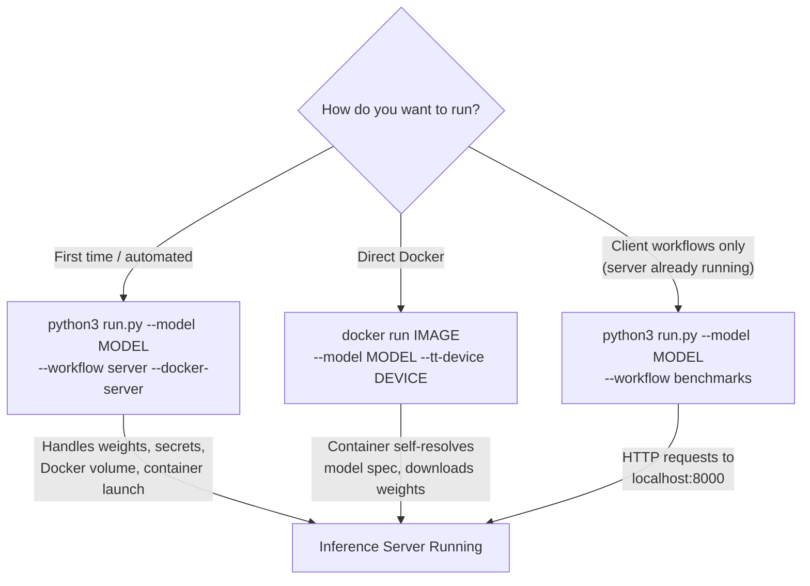

# Model Readiness Workflows User Guide

The `run.py` CLI is the main entry point for running workflows against Tenstorrent inference servers. There are two independent ways to run the inference server:

1. **`run.py --docker-server`** -- automates Docker setup, weight downloads, and container launch.
2. **Direct `docker run`** -- run the container independently with `--model` and `--tt-device`. See the [container interface documentation](../vllm-tt-metal/README.md#container-interface-direct-docker-run).

Client-side workflows (`benchmarks`, `evals`, `reports`) can run against any compatible model server, whether started by `run.py` or externally. For LLMs we use vLLM and the [tt-media-server](../tt-media-server) otherwise.



`--workflow` options:
- `benchmarks`: Send random data prompts to the inference server, profile throughput and latency.
- `evals`: Send evaluation dataset prompts to the inference server, score output for accuracy.
- `reports`: Generate summary reports from `benchmarks` and `evals` output data.
- `release`: Run `evals`, `benchmarks`, `spec_tests`, `tests`, and `reports` in sequence for release certification.
- `server`: Start the inference server only (requires `--docker-server`).
- `spec_tests` (internal): Run server integration tests (device liveness, load tests) against the inference server.
- `stress_tests` (internal): Run sustained load tests to measure server stability and throughput.
- `tests` (internal): Run pytest-based vLLM API parameter tests against the inference server (model-dependent).

For example, start the vLLM server in a Docker container and run client-side benchmarks against it:

```bash
python3 run.py --model Llama-3.2-1B-Instruct --tt-device n150 --workflow benchmarks --docker-server
```

## Table of Contents

- [Requirements](#requirements)
  - [System Requirements](#system-requirements)
  - [Hugging Face Requirements](#hugging-face-requirements)
- [`run.py` CLI Options](#runpy-cli-options)
  - [Required Arguments](#required-arguments)
  - [Model and Device Arguments](#model-and-device-arguments)
  - [Server Arguments](#server-arguments)
  - [Host Storage Options](#host-storage-options)
  - [Advanced Arguments](#advanced-arguments)
- [Serving LLMs with vLLM](#serving-llms-with-vllm)
  - [Server Workflow](#server-workflow)
    - [Docker Server](#docker-server)
    - [Direct Docker Run](#direct-docker-run)
    - [First Run](#first-run)
      - [Secrets](#secrets)
      - [Weights Download](#weights-download)
      - [Release Docker Images](#release-docker-images)
- [Release Workflow](#release-workflow)
  - [Release Return Codes](#release-return-codes)
- [Performance Benchmarks](#performance-benchmarks)
  - [Benchmarking Steps](#benchmarking-steps)
- [Accuracy Evaluations](#accuracy-evaluations)
- [Reports](#reports)
- [Server Spec Tests](#server-spec-tests)
- [API Parameter Tests](#api-parameter-tests)
- [Stress Tests](#stress-tests)
- [Logs](#logs)
- [Additional Documentation](#additional-documentation)

## Requirements

Using `run.py` the workflow scripts bootstraps the various required python virtual environments as needed using `venv` and `uv` (https://github.com/astral-sh/uv). With this design there are no typical python install steps such as `pip install`.

⚠️ NOTE: the first run setup of the Python virtual envs with `uv` and `venv` will take some time, up to 15 minutes in runs that install many required venvs and have low-bandwidth network speeds. This only happens once. If you have errors with a venv [file an issue](https://github.com/tenstorrent/tt-inference-server/issues), when applying a fix to the venv you should remove the specific venv to allow a clean installation.

### System Requirements

The system requirements for `run.py` and the Model Readiness Workflows are:

- Python 3.8+ (Python 3.8.10 is default `python3` on Ubuntu 20.04)
- python3-venv: likely already installed, if needed install via apt:
```bash
$ apt install python3-venv
```

### Hugging Face requirements

HF_TOKEN: for access to gated HF datasets (access your token from https://huggingface.co, go to `Settings` -> `Access Tokens`)

You will need to accept the terms for any specific gated datasets or model repositories required, e.g. https://huggingface.co/meta-llama/Llama-3.3-70B-Instruct

## `run.py` CLI Options

### Required Arguments

| Option         | Description                                                                                  |
|----------------|----------------------------------------------------------------------------------------------|
| `--model`      | Name of the model to run. Available choices are defined in `MODEL_SPECS`. |
| `--workflow`   | Workflow to run: `benchmarks`, `evals`, `release`, `reports`, `server`, `spec_tests` (internal), `stress_tests` (internal), `tests` (internal). |

### Model and Device Arguments

| Option         | Default | Description                                                            |
|----------------|---------|------------------------------------------------------------------------|
| `--tt-device`  | Auto-detected | Target device: `n150`, `n300`, `p100`, `p150`, `t3k`, `galaxy`. Auto-inferred from host hardware via `tt-smi` when omitted. The legacy alias `--device` is still accepted. |
| `--impl`       | Model spec default | Implementation option (e.g. `tt-transformers`). Inferred from model and device when not specified. |
| `--engine`     | Model spec default | Inference engine override: `vllm`, `media`, `forge`. |

### Server Arguments

| Option                   | Default | Description                                                                 |
|--------------------------|---------|-----------------------------------------------------------------------------|
| `--docker-server`        | false   | Run inference server inside a Docker container.                             |
| `--local-server`         | false   | Run the vLLM inference server directly on the host. Requires `--tt-metal-home` and host-backed persistence for logs and TT caches. |
| `-it`, `--interactive`   | false   | Run Docker in interactive mode (`sleep infinity`).                          |
| `--service-port`         | `8000`  | Service port. Also reads from `$SERVICE_PORT` env var.                     |
| `--no-auth`              | false   | Disable vLLM API key authorization (skips `JWT_SECRET` requirement).       |
| `--print-docker-cmd`     | false   | Print the generated Docker run command and exit without starting.          |

### Host Storage Options

When using `--docker-server`, these options control how model weights and caches are persisted. For `--local-server`, they select the weights source while TT caches and logs still use a host persistent volume root. Only one of `--host-volume`, `--host-hf-cache`, `--host-weights-dir` can be specified explicitly at a time.

| Option              | Default                | Description                                                                 |
|---------------------|------------------------|-----------------------------------------------------------------------------|
| `--host-volume`     | None for Docker, repo `persistent_volume/` for local when omitted | Host directory for persistent cache/log/tensor storage. |
| `--host-hf-cache`   | None                   | Host HuggingFace cache directory to reuse for model weights. Bare `--host-hf-cache` defaults to `HOST_HF_HOME`, then `HF_HOME`, then `~/.cache/huggingface`. |
| `--host-weights-dir` | None                  | Host directory with pre-downloaded model weights. |
| `--image-user`      | `1000`                 | UID passed to `docker run --user`. Docker only; `--local-server` ignores this flag and runs as the invoking host user. Must match the UID the image was built with. Default release images use UID `1000`. Only override when using a custom image built with a different UID. |

See [Host Storage Options](../workflows/README.md#host-storage-options) in the workflows reference for detailed descriptions of each strategy and file permission requirements.

### Advanced Arguments

| Option                   | Description                                                                                      |
|--------------------------|--------------------------------------------------------------------------------------------------|
| `--dev-mode`             | Enable developer mode: bind mounts source code into Docker container for live editing.          |
| `--override-docker-image`| Override the Docker image used by `--docker-server`.                                            |
| `--device-id`            | Tenstorrent device IDs, comma-separated PCI indices (e.g. `0` or `0,1,2`).                    |
| `--override-tt-config`   | Override TT config as JSON string (e.g., `'{"data_parallel": 16}'`).                          |
| `--vllm-override-args`   | Override vLLM arguments as JSON string (e.g., `'{"max_model_len": 4096}'`).                   |
| `--disable-trace-capture`| Skip trace capture requests for faster execution if traces are already captured.                |
| `--limit-samples-mode`   | Apply predefined reduced workload presets for `evals` and `benchmarks`: `ci-nightly`, `ci-long`, `ci-commit`, `smoke-test`. Use `smoke-test` for quick developer validation. |
| `--workflow-args`        | Additional workflow arguments (e.g., `'param1=value1 param2=value2'`).                         |

---

## Serving LLMs with vLLM

You can serve a model with vLLM or another OpenAI API-compatible inference server however you like. The client-side workflows (`evals`, `benchmarks`, `reports`) only send HTTP requests to the inference server, so they work with any compatible server.

For example, if you run vLLM following the docs at https://github.com/tenstorrent/vllm/tree/dev/tt_metal during development, you can run the client-side workflows (`evals`, `benchmarks`, `reports`, or all of them with `release`) against that already running server.

This section describes how to use `run.py` automation to also run the inference server.

**Options:**
1. `run.py --docker-server`: automates Docker image pull, weight download, host setup, and container launch.
2. `run.py --local-server`: launches the vLLM server directly from a host tt-metal checkout while reusing host filesystem storage.
3. Direct `docker run`: use the container interface with `--model` and `--tt-device` (see [Direct Docker Run](#direct-docker-run)).
4. Custom: build tt-metal and vLLM from source.

Each combination of `{model_name}` and `{tt-device}` corresponds to a specific run configuration. Loading model weights to the device, starting the model, and compiling kernel binaries for all input sizes can take several minutes (e.g. ~5 minutes for 70B+ models).

### Server workflow

The `server` workflow runs the vLLM inference server for the model as a detached Docker container and exits. Once the server is running, multiple client-side workloads (`benchmarks`, `evals`) can run against it without tearing the server down.

#### Docker server

To run the inference server with Docker, use the `--docker-server` flag:

```bash
python3 run.py --model Llama-3.2-1B-Instruct --tt-device n300 --workflow server --docker-server
```

The `--tt-device` flag can be omitted -- `run.py` will auto-detect the device from host hardware via `tt-smi`.

Add `--dev-mode` to bind mount source code into the container for live editing:

```bash
python3 run.py --model Llama-3.2-1B-Instruct --tt-device n300 --workflow server --docker-server --dev-mode
```

Use `--print-docker-cmd` to inspect the generated Docker command without starting the server:

```bash
python3 run.py --model Llama-3.2-1B-Instruct --tt-device n300 --workflow server --docker-server --print-docker-cmd
```

On successful start, log output includes the container ID and log file path:

```log
INFO: Created Docker container ID: 6b8c7038a44a
INFO: Access container logs via: docker logs -f 6b8c7038a44a
INFO: Docker logs are also streamed to log file: workflow_logs/docker_server/vllm_<timestamp>_<model>_<device>_server.log
INFO: Stop running container via: docker stop 6b8c7038a44a
```

The running container can be viewed with `docker ps -a` and stopped with `docker stop <container-id>`.

#### Local server

To run the vLLM server directly on the host, use `--local-server` and point `--tt-metal-home` at a built tt-metal checkout containing `python_env/` and `build/lib/`:

```bash
python3 run.py --model Llama-3.2-1B-Instruct --tt-device n300 --workflow server \
  --local-server --tt-metal-home /opt/tt-metal
```

If you omit all host storage flags, local server runs use `REPO_ROOT/persistent_volume/` for logs, TT caches, and downloaded weights. `--host-hf-cache` reuses an existing Hugging Face cache for weights, and `--host-weights-dir` points at a pre-downloaded weights directory. In both of those modes, TT caches and logs still use the host volume path.

Because `--local-server` launches a host process, it uses the invoking host user's permissions. If that `persistent_volume/` tree was previously created by Docker or another UID, fix ownership or permissions before retrying. `--image-user` does not apply here.

#### Direct Docker Run

The inference server container can be used independently from `run.py` via a direct `docker run` command. The container entrypoint (`run_vllm_api_server.py`) accepts `--model` and `--tt-device` to resolve the model configuration from a bundled model spec catalog (`model_spec.json`).

```bash
docker run \
  --env "HF_TOKEN=$HF_TOKEN" \
  --ipc host \
  --publish 8000:8000 \
  --device /dev/tenstorrent \
  --mount type=bind,src=/dev/hugepages-1G,dst=/dev/hugepages-1G \
  --volume volume_id_tt_transformers-Llama-3.2-1B-Instruct:/home/container_app_user/cache_root \
  ghcr.io/tenstorrent/tt-inference-server/vllm-tt-metal-src-release-ubuntu-22.04-amd64:0.9.0-84b4c53-222ee06 \
  --model meta-llama/Llama-3.2-1B-Instruct \
  --tt-device n300
```

See the full [container interface documentation](../vllm-tt-metal/README.md#container-interface-direct-docker-run) for all container CLI args, secrets, and persistent volume overrides.

#### First run

##### Secrets

Secrets can be provided via a `.env` file in the repository root or as environment variables:

```bash
# .env file (automatically loaded by run.py)
HF_TOKEN=hf_...
JWT_SECRET=my-secret-string
```

Or as environment variables:

```bash
export HF_TOKEN=hf_...
export JWT_SECRET=my-secret-string
```

- **HF_TOKEN**: Required for access to gated HF repositories (get your token from https://huggingface.co, go to `Settings` -> `Access Tokens`).
- **JWT_SECRET**: Your JWT Token secret for vLLM server authorization. Use `--no-auth` to disable authorization.

If not set via `.env` or environment, `run.py` will prompt interactively on first run.

##### Weights download

By default (Docker named volume mode), model weights are downloaded inside the container on first start via `ensure_weights_available()`. No host-side download is needed.

When using `--host-volume` or `--host-hf-cache` with `--docker-server`, weights are downloaded on the host by `setup_host()` before container launch. When using `--host-weights-dir`, weights are assumed to already exist at the specified path.

For `--local-server`, `setup_host()` resolves the host paths and creates the cache root, but the local vLLM process handles downloads itself unless `MODEL_WEIGHTS_DIR` is pointed at an existing `--host-hf-cache` snapshot or `--host-weights-dir`.

**Permissions note for Docker modes:** The container runs as a non-root user with no root-level entrypoint. The runtime UID is baked into the image (UID `1000` for default release images). When using `--host-volume`, the host directory must be writable by that UID (e.g. `sudo chown 1000 <path>`). When using `--host-hf-cache` or `--host-weights-dir`, the host path is mounted readonly and only needs read access; TT Metal caches are stored in a separate Docker named volume. The default Docker named volume strategy requires no host permission setup. For `--local-server`, the host process instead uses the current host user's permissions.

See [Host Storage Options](../workflows/README.md#host-storage-options) for details on each strategy.

##### Release Docker Images

Each model implementation is mapped to a pre-built release Docker Image that contains pre-built tt-metal and vLLM source builds. These Docker images are tested with the `release` workflow to ensure correctness for each model supported.

The Docker image for each model is listed in the per-model model support pages, starting here: [LLM Models](./model_support/llm/README.md)

## Release Workflow

For the same model-device combination, the `release` workflow runs in sequence:
1. `evals` workflow
2. `benchmarks` workflow
3. `spec_tests` workflow
4. `tests` workflow (only for models with entries in `server_tests/test_config.py`)
5. `reports` workflow

This is a convenience so that a single run on device executes all workflows required to certify a model implementation on Tenstorrent hardware is working correctly and ready for release.

## Performance Benchmarks

The `benchmarks` workflow sends random data prompts to the inference server and profiles throughput and latency.

```bash
python3 run.py --model Llama-3.2-1B-Instruct --tt-device n300 --workflow benchmarks
```

For a quick development smoke test, add `--limit-samples-mode smoke-test`:

```bash
python3 run.py --model Llama-3.2-1B-Instruct --tt-device n300 --workflow benchmarks --limit-samples-mode smoke-test
```

In smoke-test mode, `benchmarks` selects a reduced single benchmark target and ignores `--concurrency-sweeps`.

### Benchmarking Steps

The benchmarks workflow follows this sequence (visible in the runtime logs streamed to `workflow_logs/run_logs/`):

1. **Set up workflow virtual environments**: `run.py` bootstraps dedicated venvs for benchmark scripts.
2. **Start workflow**: `run_benchmarks.py` is launched with the runtime model spec JSON.
3. **Wait for inference server**: Polls the `/health` endpoint until the vLLM server is ready.
4. **Trace capture**: Sends initial requests at each configured input length to warm up the model and compile traces.
5. **Run benchmarks**: Executes a sweep of configurations varying input/output sequence length and concurrency, saving results as JSON.

```log
INFO: Running benchmark Llama-3.2-1B-Instruct: 1/18
INFO: Running command: .workflow_venvs/.venv_benchmarks_vllm/bin/serve --backend vllm ...
Starting initial single prompt test run...
Initial test run completed. Starting main benchmark run...
100%|██████████| 8/8 [00:17<00:00, 2.18s/it]
============ Serving Benchmark Result ============
...
==================================================
```

Benchmark output files are saved to `workflow_logs/benchmarks_output/`, for example:
`benchmark_Llama-3.2-1B-Instruct_n300_<timestamp>_isl-128_osl-128_maxcon-1_n-8.json`

See [benchmarking docs](../benchmarking/README.md) for more detail on code.

## Accuracy Evaluations

The `evals` workflow follows the same pattern as the `benchmarks` workflow: it sets up its own venv, waits for the inference server to be ready, then sends HTTP requests to it. Each evaluation task uses a dedicated venv, which allows multiple different eval repos and different versions of e.g. https://github.com/EleutherAI/lm-evaluation-harness.

```bash
python3 run.py --model Llama-3.2-1B-Instruct --tt-device n300 --workflow evals
```

For a quick development smoke test, add `--limit-samples-mode smoke-test`:

```bash
python3 run.py --model Llama-3.2-1B-Instruct --tt-device n300 --workflow evals --limit-samples-mode smoke-test
```

In smoke-test mode, `evals` runs only the first configured eval task and limits it to 3 samples.

Outputs are stored in: `workflow_logs/evals_output/eval_Llama-3.2-1B-Instruct_n300/meta-llama__Llama-3.2-1B-Instruct`

See [evals docs](../evals/README.md) for more detail on code.

## Reports

The `reports` workflow generates summary log files from the raw data collected by `benchmarks` and `evals` workflows.

```bash
python3 run.py --model Llama-3.2-1B-Instruct --tt-device n300 --workflow reports
```

This report summarizes metrics and uses defined tolerance thresholds to determine if models pass or fail validation.

See [Logs](#logs) section below for example format of the report files generated.

## Server Spec Tests

> **Internal workflow.** `spec_tests` is used for release validation and CI. It requires a running inference server.

The `spec_tests` workflow runs server integration tests against the inference server. Tests are defined in `server_tests/server_tests_config.json` and matched by model name and device. Test classes (e.g. `DeviceLivenessTest`, `ImageGenerationLoadTest`) are loaded dynamically and executed via `server_tests/run_spec_tests.py`.

```bash
python3 run.py --model Llama-3.1-8B-Instruct --tt-device n150 --workflow spec_tests
```

Each test case entry in `server_tests_config.json` specifies:
- `name` / `module`: the test class and its Python module path.
- `enabled`: set to `false` to skip a test case.
- `test_config`: execution settings — `test_timeout`, `retry_attempts`, `retry_delay`, `break_on_failure`, `mock_mode`.
- `targets`: test-specific numerical thresholds (e.g. `image_generation_time`, `num_of_devices`).

Output is written as JSON and Markdown reports to `workflow_logs/spec_tests_output/`.

## API Parameter Tests

> **Internal workflow.** `tests` is used for release validation and CI. It requires a running inference server. Not all models have test entries defined.

The `tests` workflow runs pytest-based tests that exercise vLLM API sampling parameters (`n`, `max_tokens`, `stop`, `seed`, `logprobs`, `temperature`, `top_k`, `top_p`, and penalty parameters). Model support is defined in `server_tests/test_config.py` (`TEST_CONFIGS`); models not listed there will skip this workflow.

```bash
python3 run.py --model Llama-3.1-8B-Instruct --tt-device n150 --workflow tests
```

The run script (`server_tests/run_tests.py`) iterates over `TestTask` entries for the model, invoking `pytest` with `-s -v` on `server_tests/test_cases/test_vllm_server_parameters.py`.

Output is written to `workflow_logs/tests_output/`.

## Stress Tests

> **Internal workflow.** `stress_tests` is used for release validation and CI. It requires a running inference server.

The `stress_tests` workflow runs sustained load tests against the inference server to measure server stability and throughput over time. The run script is `stress_tests/run_stress_tests.py`.

```bash
python3 run.py --model Llama-3.1-8B-Instruct --tt-device n150 --workflow stress_tests
```

Output is written to `workflow_logs/stress_tests_output/`.

## Logs

Log types:
- **run_logs**: the stdout and stderr output from `run.py`, stored for debugging.
- **runtime_model_specs**: the serialized `ModelSpec` + `RuntimeConfig` JSON used for each run.
- **docker_server**: the logs from the Docker container running the vLLM inference server.
- **benchmarks_output**: the raw data output from the `benchmarks` workflow.
- **evals_output**: the raw data output from the `evals` workflow.
- **reports_output**: for each workflow, the markdown (.md) summary output and `/data` summary data. The `release` workflow output has a summary report of both `benchmarks` and `evals` results, used to determine if a model passes release validation. An example report: https://github.com/tenstorrent/tt-inference-server/issues/164.
- **spec_tests_output**: JSON and Markdown test reports from the `spec_tests` workflow.
- **tests_output**: pytest result output from the `tests` workflow.
- **stress_tests_output**: result data from the `stress_tests` workflow.

In this example for:
- `model_name` := Llama-3.2-1B-Instruct
- `tt-device` := n300

The logs have the following structure:

```
./workflow_logs
├── benchmarks_output
│   ├── benchmark_Llama-3.2-1B-Instruct_n300_2025-03-25_04-23-40_isl-128_osl-128_maxcon-1_n-8.json
│   ├── ...
│   └── benchmark_Llama-3.2-1B-Instruct_n300_2025-03-25_04-48-11_isl-16000_osl-64_maxcon-32_n-256.json
├── docker_server
│   └── vllm_2025-03-25_20-58-29_Llama-3.2-1B-Instruct_n300_benchmarks.log
├── evals_output
│   └── eval_Llama-3.2-1B-Instruct_n300/meta-llama__Llama-3.2-1B-Instruct
│       ├── results_2025-03-25T04-57-53.064778.json
│       └── samples_meta_gpqa_2025-03-25T04-57-53.064778.jsonl
├── reports_output
│   ├── benchmarks
│   │   ├── data
│   │   │   └── benchmark_stats_Llama-3.2-1B-Instruct_n300.csv
│   │   └── benchmark_display_Llama-3.2-1B-Instruct_n300.md
│   ├── evals
│   │   ├── data
│   │   │   └── eval_data_Llama-3.2-1B-Instruct_n300.json
│   │   ├── summary_Llama-3.2-1B-Instruct_n300.md
│   └── release
│       ├── data
│       │   └── report_data_Llama-3.2-1B-Instruct_n300.json
│       └── report_Llama-3.2-1B-Instruct_n300.md
├── run_logs
│   └── run_2025-03-26_02-09-13_Llama-3.2-1B-Instruct_n300_evals.log
├── spec_tests_output
│   ├── spec_tests_report_Llama-3.2-1B-Instruct_n300.json
│   └── spec_tests_report_Llama-3.2-1B-Instruct_n300.md
├── stress_tests_output
│   └── stress_tests_Llama-3.2-1B-Instruct_n300_<timestamp>.json
└── tests_output
    └── parameter_report_Llama-3.2-1B-Instruct_n300_<timestamp>.json
```

## Additional Documentation

- [Workflows Reference](../workflows/README.md) -- CLI reference, architecture diagrams, model config
- [Container Interface](../vllm-tt-metal/README.md#container-interface-direct-docker-run) -- Direct Docker run, container CLI args
- [Development](development.md)
- [Benchmarking](../benchmarking/README.md)
- [Evals](../evals/README.md)
- [Tests](../tests/README.md)
