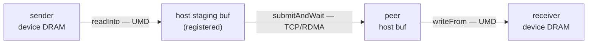
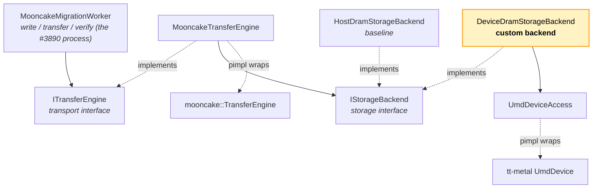
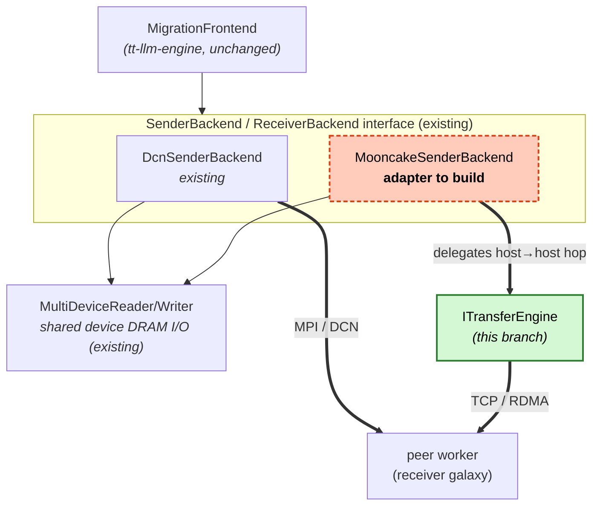

# ADR: Tenstorrent Custom Backend for the Mooncake Transfer Engine (#3890)

**Date:** 2026-06-05
**Status:** Accepted — interfaces + real backends landed in `tt-media-server/cpp_server` (UMD device DRAM behind `USE_METAL_CPP_LIB`, Mooncake transport behind `TT_TRANSPORT_WITH_MOONCAKE`); two-galaxy acceptance run pending
**Issue:** [#3890](https://github.com/tenstorrent/tt-inference-server/issues/3890) — Custom backend for DRAM access via UMD

> **This document lives in `mooncake/poc-transfer-engine/` (the Mooncake PoC
> hub); the code it describes lives in `tt-media-server/cpp_server`.**
> All implementation is in `tt-media-server/cpp_server` (namespace `tt::transport`,
> `src/transport/`, `include/transport/`) — see [`README.md`](README.md) for the
> map from this PoC to the source tree. The `tt-llm-engine` submodule is **not**
> modified — it stays on `main`. Unless prefixed with `tt-media-server/cpp_server/`,
> paths in this doc are relative to the **`cpp_server` root**.

## Context

#3890 is a **PoC**: learn what it takes to build a Tenstorrent backend for the
[Mooncake Transfer Engine](https://github.com/kvcache-ai/Mooncake). Stand up a
migration worker as an independent C++ process that (1) writes a tensor on the
sender galaxy, (2) transfers it via the engine + custom backend, (3) verifies it
on the receiver.

Core assumption: the Transfer Engine defines both a **Storage** mechanism
(host/device DRAM, …) and a **Transport** mechanism (TCP, RDMA, …). Reaching TT
device DRAM from a host process goes through the **UMD** (User-Mode Driver,
`tt_metal/third_party/umd`). Mooncake registers and DMAs **host** virtual
addresses only — it cannot touch device DRAM — so the custom backend's job is
staging device DRAM into a registered host buffer while the transport stays
generic. This is a **bounce buffer** (two extra copies); a zero-copy/RDMA-direct
path is a follow-up, out of scope for #3890.



## Motivation — why Mooncake?

The existing tt-llm-engine migration worker (`disaggregation/migration/`) already
moves KV cache galaxy-to-galaxy over **MPI/DCN** with ULFM fault tolerance. It
works — so Mooncake fills *capability/strategic* gaps, not a correctness hole.

**Transport-level (this PoC's scope):**
- Multi-NIC RDMA bandwidth + topology-aware paths — KV transfer is bandwidth-bound.
- Decoupling from MPI/PRTE rigidity → dynamic membership, elastic prefill–decode pools.
- Standard segment discovery and N×M batched transfers.

**Architecture-level (the bigger prize, beyond #3890):**
- A **pooled, global KV-cache store** with cross-request **prefix reuse** — the
  current worker is a point-to-point mover with no shared cache.
- KV tiering beyond device DRAM (cluster CPU DRAM / SSD pool).
- Ecosystem interop (vLLM, SGLang, NVIDIA Dynamo, LMCache).

**What Mooncake does *not* remove:** UMD device access is still required (Mooncake
replaces the *wire*, not device I/O); the TCP bounce-buffer PoC may be *slower*
than today's zero-copy MPI path until RDMA-direct lands; ULFM-grade fault
tolerance must be matched, not assumed.

## Decision — cpp_server storage/transport split

Model the storage/transport split as two interfaces in `tt::transport`. Each concrete
backend has a **real implementation behind a build guard** and a **no-op fallback**
otherwise, so `transport_lib` still builds in *every* configuration with no hard
Mooncake/tt-metal dependency: `UmdDeviceAccess` uses tt-metal's device-DRAM I/O when
built with `USE_METAL_CPP_LIB` (`-DTT_METAL_HOME=…`); `MooncakeTransferEngine` wraps
the real `mooncake::TransferEngine` when built with `TT_TRANSPORT_WITH_MOONCAKE`
(`-DENABLE_MOONCAKE=ON`, which builds the `transfer_engine` target inside
tt-llm-engine). `HostDramStorageBackend` (memcpy) and the migration worker's
storage-staging path need no guard. When a guard is off the corresponding methods log
and report failure; `transport_test` exercises the interfaces in every configuration.



- **Storage interface** `IStorageBackend` → `HostDramStorageBackend` (transport-only
  baseline) and `DeviceDramStorageBackend` (**the custom backend**: device DRAM
  via `UmdDeviceAccess`, keyed by `NocAddr = channel<<32 | local_addr`;
  `readInto`→`read`, `writeFrom`→`write`).
- **Transport interface** `ITransferEngine` → `MooncakeTransferEngine`, constructed
  *with* an `IStorageBackend` so both mechanisms are wired in one object.
  `EngineConfig.protocol` selects TCP (default) / RDMA; `metadata_uri =
  "P2PHANDSHAKE"` means direct peer handshake — no external etcd/redis/http.
- **Migration worker** `MooncakeMigrationWorker` maps 1:1 to the three scope items.
- `UmdDeviceAccess` and `MooncakeTransferEngine` hide tt-metal / Mooncake behind
  pimpls, so headers stay dependency-free.

## Relationship to the existing worker & future integration

The tt-llm-engine worker routes all transport through an abstract
**`SenderBackend` / `ReceiverBackend`** interface (today only `DcnSenderBackend`,
MPI/DCN). The integration goal — *Mooncake on top of the existing migration
layer* — is to add a **`MooncakeSenderBackend`** implementing that same interface and
delegating the host→host hop to this branch's `ITransferEngine`. The worker,
`MigrationFrontend`, and `MigrationLayerClient` stay unchanged; Mooncake becomes a
runtime-selectable transport alongside DCN/MPI. Both transports bounce through
host, sharing the existing `MultiDeviceReader` for the device→host read.



**Open design decision — where the Mooncake interface attaches:**
- **Option A (recommended): attach at `SenderBackend`.** Reuse `MigrationFrontend`,
  `MultiDeviceReader`, address tables, and the worker's threading/ULFM model; the
  adapter resolves KV addressing → byte transfers and uses Mooncake only for the
  wire. This branch's `DeviceDramStorageBackend`/`UmdDeviceAccess` then
  **dissolves** (the existing `MultiDeviceReader` does device I/O); only
  `MooncakeTransferEngine` survives.
- **Option B: attach at the byte interface.** Keep this branch's full storage+transport
  stack and bypass `MultiDeviceReader` — more PoC code survives, but
  re-implements addressing, zero-copy, and completion that already exist.

**Tensions to resolve under either:** the existing interface *fuses* device-read +
transport (with a zero-copy `acquire/publish`) while this branch *splits* them
(two copies); two UMD device-access layers now exist (pick one); routing/metadata
differ (MPI rank + `KvChunkAddressTable` vs `openSegment`/offset + P2PHANDSHAKE);
receiver-write and ACK/fault semantics differ (DCN receiver-drains-then-writes vs
Mooncake one-sided write); and Mooncake currently builds inside tt-llm-engine
(`DS_ENABLE_MOONCAKE`) while `transport_lib` is dependency-free.

## Mooncake API surface (verified against upstream `main`)

Placeholder types mirror these so the wrapper maps directly when wired up.

```cpp
// transfer_engine.h
int init(const std::string& metadata_conn_string, const std::string& local_server_name, ...);
Transport* installTransport(const std::string& proto, void** args);   // "tcp" for the PoC
int registerLocalMemory(void* addr, size_t length, ...);              // by HOST virtual address
SegmentHandle openSegment(const std::string& segmentName);
Status submitTransfer(BatchID, const std::vector<TransferRequest>&);
Status getTransferStatus(BatchID, size_t task_id, TransferStatus&);

// transport/transport.h
struct TransferRequest { OpCode opcode; void* source; SegmentID target_id;
                         uint64_t target_offset; size_t length; ... };
```

Our `tt::transport::TransferRequest` mirrors this: `op` · `local_addr` (host VA) ·
`target` (`SegmentHandle`) · `target_offset` · `length`. Segments are advertised
via the metadata service selected by `init` (`"P2PHANDSHAKE"` for direct handshake;
otherwise `protocol://…`, defaulting to `etcd`). A future zero-copy/RDMA-direct
custom `Transport` subclass must implement the pure-virtual set in `transport.h`
(modelled by `tcp_transport/tcp_transport.h`) — follow-up only.

## File map

**Code (under `tt-media-server/cpp_server/`, paths relative to that root):**

```
include/transport/   transfer_types.hpp · i_storage_backend.hpp · host/device_dram_storage_backend.hpp
                     umd_device_access.hpp · i_transfer_engine.hpp · mooncake_transfer_engine.hpp
                     mooncake_migration_worker.hpp
src/transport/       matching implementations (real backend + no-op fallback behind each guard)
                     README.md (code-level orientation: diagrams, build/test, future work)
tests/               transport_test.cpp (smoke tests over every interface, all configs)
tests/integration/   transport_migration_e2e.cpp + run_transport_migration_e2e.sh
                     (two-process acceptance harness; --mooncake builds only)
CMakeLists.txt       transport_lib + transport_test (all configs) + transport_migration_e2e (--mooncake)
```

**Docs & diagrams (this folder, `mooncake/poc-transfer-engine/`):**

```
README.md                          PoC hub: what #3890 is, where the code lives, how to build/run
adr-mooncake-backend.md            this design record
diagrams/3890-implemented.excalidraw   editable source of the architecture diagram
diagrams/architecture.png              rendered architecture diagram
```

## Consequences & validation

**Positive:** the storage/transport split and custom-backend interface are concrete,
named, and tested; real backends drop in behind the interfaces/pimpls without
touching call sites; `transport_lib` has no Mooncake/tt-metal dependency, so
default builds and CI are untouched; `tt-llm-engine` is unchanged.

**Negative / risks:** the bounce-buffer adds two copies (a correctness PoC, not the
perf design); enabling the real backends pulls Mooncake (+ transitive deps: glog,
gflags, yaml-cpp, zstd, boost, msgpack, yalantinglibs, asio) and tt-metal in at the
`cpp_server` process level — so the guarded paths can only be compiled/tested in a
build with `-DENABLE_MOONCAKE=ON` / `-DTT_METAL_HOME=…`, not the default CI config.

**Validation plan:**
1. **Now:** `transport_test` constructs every interface and exercises the host-DRAM
   backend memcpy round-trip and the migration worker's storage-staging path; the
   guarded transport/UMD paths report failure without crashing in the default build. ✅
2. **Storage backend, single galaxy:** `DeviceDramStorageBackend` round-trips
   device DRAM ↔ host buffer (UMD only, no Mooncake) — needs `TT_METAL_HOME`. ✅ (impl)
3. **Transport, loopback:** `MooncakeTransferEngine` write/read round-trip over
   loopback TCP with `P2PHANDSHAKE` (host-DRAM backend) — needs `ENABLE_MOONCAKE`. ✅ (impl)
4. **Two galaxies (acceptance):** `MooncakeMigrationWorker` writes a known tensor
   to sender device DRAM → staged + transferred → receiver byte-compares. Harness
   implemented (`tests/integration/transport_migration_e2e.{cpp,sh}`, host + device
   modes); ✅ (impl) — pending a two-process run on real hardware with both backends enabled.

## Open questions / follow-ups
- Resolve the **Option A vs B** interface-attachment decision above; build the
  `MooncakeSenderBackend`/`ReceiverBackend` adapter for the existing worker.
- Decide whether the real backend links Mooncake from the `tt-llm-engine`
  sub-build (`DS_ENABLE_MOONCAKE`) or a `cpp_server`-level integration.
- Custom `Transport` subclass for a zero-copy / RDMA-direct path (register the UMD
  DRAM mapping instead of a bounce buffer).
- Multi-tensor / batched transfers, concurrency, and failure/retry semantics
  (matching the incumbent's ULFM behaviour).
