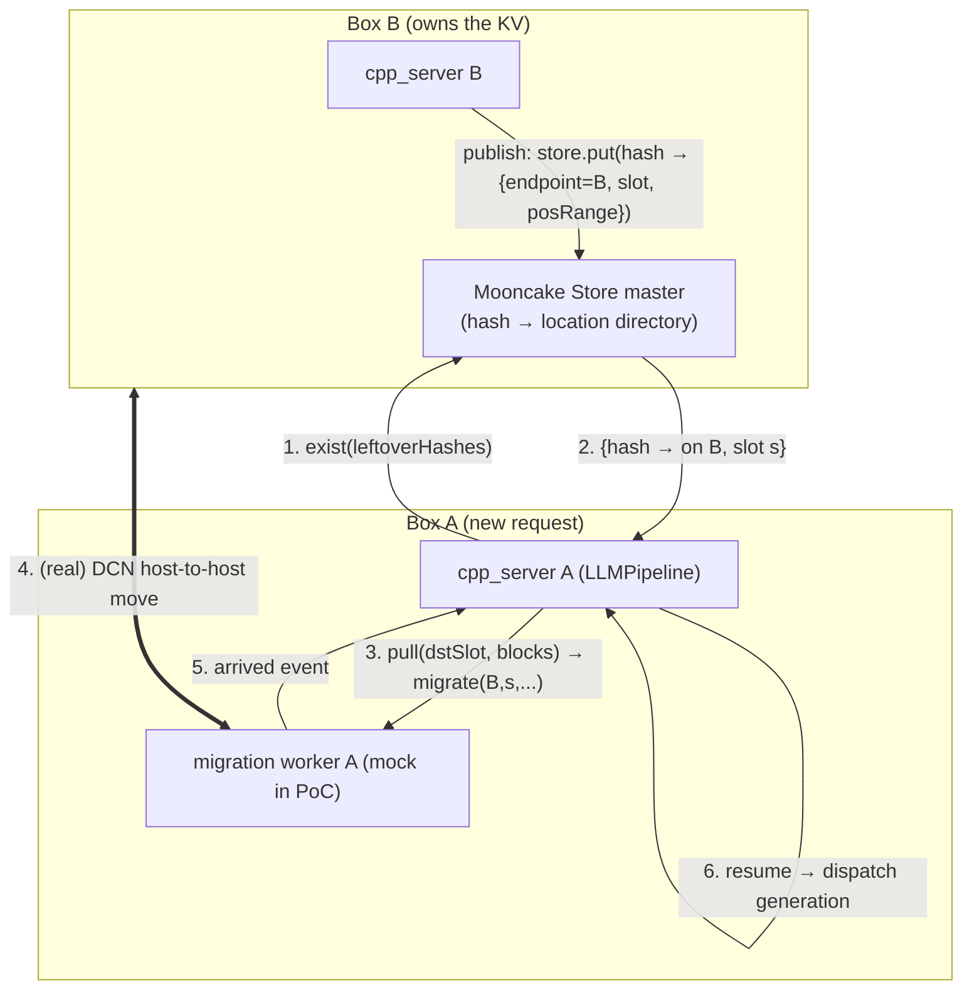
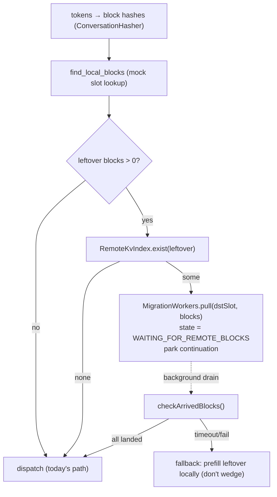
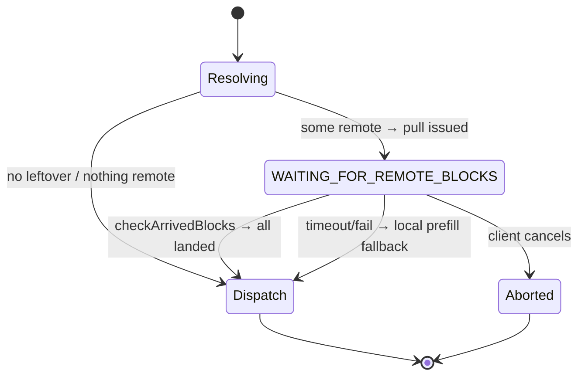
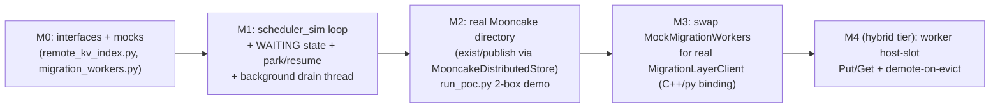

# poc2 — Hybrid Mooncake KV orchestration (control-plane PoC)

Builds on **poc1** (raw `MooncakeDistributedStore` put/get smoke test).
poc2 proves the *orchestration loop* that issue **#4017 "Add mocked migration
worker"** asks for: the scheduler looks for KV blocks **locally**, then
**remotely** via Mooncake, and pulls the missing ones through the migration
worker — asynchronously, behind a mockable interface.

> Scope of this PoC = **control plane** (who-has-what + park/resume), with a
> **mocked** migration worker. The real byte-mover (DCN/MPI worker) and the
> warm/cold tiering are wired in later phases. The mock "does almost nothing"
> on purpose (per #4017).

---

## Quick Start

```bash
# 1. Run tests (no Mooncake master needed — uses in-memory mocks)
python test_poc.py

# 2. Run demo with in-memory fake
python run_poc.py --fake

# 3. Run demo with real Mooncake (requires master)
./master_startup.sh  # in another terminal
python run_poc.py
```

---

## Files

| File | Purpose |
|------|---------|
| `remote_kv_index.py` | `RemoteKvIndex` interface + `MockRemoteKvIndex`, `InMemoryRemoteKvIndex`, `MooncakeRemoteKvIndex` |
| `migration_workers.py` | `MigrationWorkers` interface + `MockMigrationWorkers`, `DelayedMockMigrationWorkers` |
| `scheduler_sim.py` | `SchedulerSim` — the orchestration loop with park/resume + drain thread |
| `run_poc.py` | End-to-end demo (Scenario A: nothing remote, Scenario B: remote hit) |
| `test_poc.py` | Unit tests (all use in-memory mocks, no master needed) |
| `master_startup.sh` | Start Mooncake master (same as poc1) |

---

## 1. Mental model (the hybrid split)

Two jobs, two systems — they do **not** compete:

| Question | Answered by | Status |
|---|---|---|
| *Which box has block `hash`?* (directory) | **Mooncake Store** (`exist`/`get`/`put`) | exists (poc1) |
| *Move those bytes here* (mover) | **Migration worker** (`migrate()` → token → event) | exists in `tt-llm-engine` |
| *Decide what/when, park the request* | **Scheduler** (`LLMPipeline`) | the new glue |

Key fact that makes this cheap: the migration worker is **host-staged**
(device → host slot → host-to-host → host slot → device, see
`tt-llm-engine/.../device_io.hpp` `read_async`/`write_async`). So Mooncake
hooks onto a **host buffer that already holds the KV chunk** — no new DMA path,
no TT device-memory RDMA registration needed.



---

## 2. The async abstraction (the #4017 deliverable)

Two collaborators, each with a **mock** that keeps current behavior identical.

```text
RemoteKvIndex            # "where" — thin wrapper over Mooncake Store
  exist(hashes)  -> list[RemoteBlock]      # which hashes are remote + location
  publish(hash, location)                   # advertise local blocks

MigrationWorkers         # "move" — async fan-out over N migration workers
  pull(dstSlot, blocks)            -> PullHandle      # non-blocking
  checkArrivedBlocks()             -> list[PullHandle]# background drain (poll())
  isComplete(handle)               -> bool

RemoteBlock = { hash, blockIndex, srcEndpointId, srcSlot }
PullHandle  = { id }
```

- `exist()` returns **coordinates**, not a bool — because `migrate()` needs
  `(endpoint, srcSlot, posRange)`.
- `pull()` coalesces **contiguous** blocks into the fewest `migrate()` calls.
- `checkArrivedBlocks()` is what the background thread drains (wraps
  `MigrationLayerClient.poll()` → `MigrationReceived` events in the real impl).

**Mocks for the PoC**
- `MockRemoteKvIndex.exist()` → `[]` (nothing remote ⇒ scheduler behaves as today).
- `MockMigrationWorkers.pull()` → instantly "arrived"; `checkArrivedBlocks()`
  returns the completed handles.
- A second fake — `FakeAllRemoteIndex` — returns *everything* remote, so we can
  exercise the park/resume path end-to-end.

---

## 3. The orchestration loop (issue #4017 pseudocode → PoC)



Request state machine (the one new state):



---

## 4. Files we will create in `poc2/`

| File | Purpose |
|---|---|
| `master_startup.sh` | start Mooncake master (reused from poc1) |
| `remote_kv_index.py` | `RemoteKvIndex` over `MooncakeDistributedStore` (`exist`/`publish`) + `MockRemoteKvIndex`, `FakeAllRemoteIndex` |
| `migration_workers.py` | `MigrationWorkers` async fan-out interface + `MockMigrationWorkers` |
| `scheduler_sim.py` | the `resolveSession`-style loop: hash → local → exist → pull → park; request state machine; background drain thread |
| `run_poc.py` | end-to-end demo: "Box B" publishes blocks, "Box A" request misses locally, finds them remote, pulls (mock), resumes, dispatches |
| `test_poc.py` | asserts: (a) mock = no-op behaves like today; (b) `FakeAllRemoteIndex` parks then resumes via drain; (c) partial/contiguous coalescing |

PoC is **pure Python** (matches poc1 + #4017's Python pseudocode). No C++ build.

---

## 5. Phases / milestones



- **M0–M2** = the entirety of issue #4017 (mock, async, fan-out, consumed in a
  realistic loop) — runnable on one host with the Mooncake master.
- **M3** lights up the real migration worker we deep-dived.
- **M4** turns Mooncake into the warm/cold **tier** (publish real KV bytes from
  the worker's existing host slot; demote-on-evict instead of drop).

---

## 6. Mapping to the real C++ integration (for later, not this PoC)

So reviewers can see where the Python PoC lands in production:

| PoC concept | Real code (paths are in the two repos) |
|---|---|
| tokens → block hashes | `cpp_server` `computePrefixCachingInfoFromTokens` (`utils/conversation_hasher.hpp`) |
| `find_local_blocks` | `SessionManager::tryAcquireByPrefixHash` (`services/session_manager.hpp:121`) |
| integration point | `LLMPipeline::resolveSession`, right after local lookup (`services/llm_pipeline.cpp:150`) |
| park `onResolved` | same pattern as `acquireInFlight` cancelFn parking |
| background drain | trantor `EventLoopThread` timer (reuse `DisaggregationService`'s loop) → `loop->runInLoop` to resume |
| `pull()` real impl | `migration_worker::MigrationLayerClient::migrate()` (`disaggregation/migration/include/migration_client.hpp:89`) |
| `checkArrivedBlocks()` real impl | `MigrationLayerClient::poll()` → `on_migration_received` (`migration_client.hpp:105-111`) |
| lock dst slot during pull | `SessionManager::lockSlot` (`session_manager.hpp:97`) |
| Mooncake C++ client | `mooncake::Client` Put/Get/Remove (`tests/transport/mooncake/test_mooncake_store.cpp`) |
| hybrid tier hook (M4) | worker host slot in `device_io.hpp` `read_async`/`write_async` |

---

## 7. Run plan (single host)

```bash
# 0. venv with the mooncake wheel (see poc1/README)
pip install mooncake-transfer-engine==0.3.6.post1

# 1. start the master
./master_startup.sh

# 2. run the end-to-end demo
python run_poc.py        # Box B publishes, Box A misses→exist→pull→resume→dispatch

# 3. tests
python test_poc.py
```

---

## 8. Open decisions (carried from design discussion)

1. **Store model** → metadata-only directory for the PoC (bytes move via the
   worker). KV-bytes-in-Mooncake is the M4 hybrid tier, not the PoC.
2. **`exist()` returns coordinates** (endpoint + slot), not just presence.
3. **Precedence** when both a local copy-from-slot candidate *and* remote blocks
   exist → local-copy first, remote only for the remainder.
4. **Global key namespace** → block hash must be salted with model + dtype + TP
   layout + block size so two boxes agree (defer to M2+).
5. **Drain mechanism** → dedicated thread in the Python PoC; trantor timer in the
   real C++ server.
