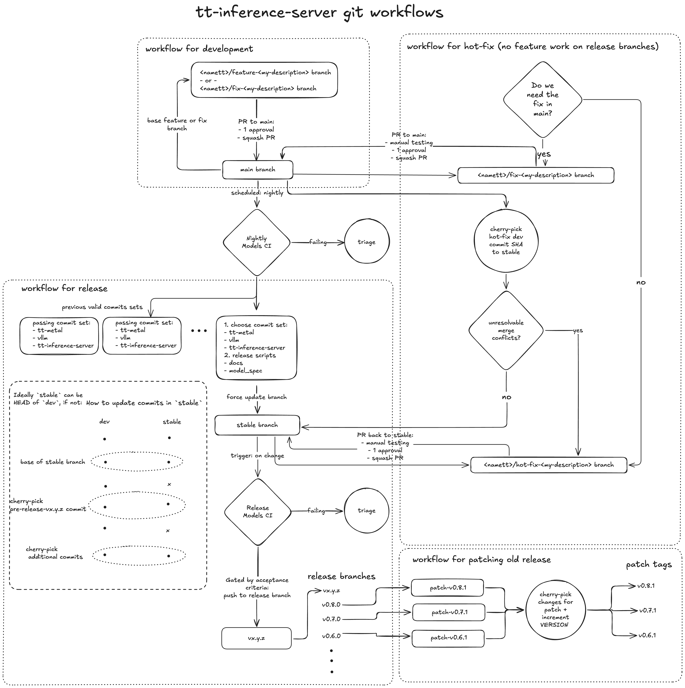
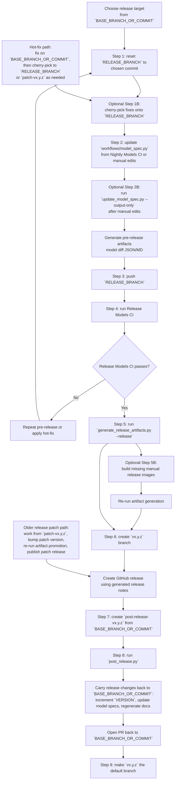

# Release process

This document describes the release process for `tt-inference-server` using the
current branch model shown in the git workflow diagram.

## What is a release?

A release is defined by:
- a commit of tt-inference-server
- a diff to `workflows/model_spec.py` and validation of that diff.
- pre-built and validated docker images with tt-metal, vLLM, and other libaries required to run inference
- automatically generated documentation pointing to usage of the docker images

A release is prepared from the `RELEASE_BRANCH` branch at a chosen
`tt-inference-server` commit. Most releases use one Nightly Models CI run to
populate and validate the `workflows/model_spec.py` updates, or simply update these  manually from results of interactive development. plus one Release
Models CI run to validate the final release Docker images.

A single release can still include multiple `tt_metal_commit` values across
different model and hardware combinations, and therefore multiple release
Docker images, as long as those combinations are captured in
`workflows/model_spec.py` and validated through the release process below.

Where a ModelSpecTemplate has an older `release_version` than the current repo VERSION
the user can be warned. In future the specific release code could be checked out and ran 
to give a seamless transition to running the latest released version and Docker image for any previously released version without needing to rebuild and re-test a given commit combination.

## Branch roles

- `BASE_BRANCH_OR_COMMIT`: active development trunk branch (`main`).
- `RELEASE_BRANCH`: default is `stable`, release staging branch cut from dev branch.
- `<namett>/hot-fix-<description>`: hot-fix branch used when a fix must land on
  dev branch, e.g. `main`, and also be cherry-picked into `RELEASE_BRANCH` or a patch branch.
- `vx.y.z`: release branch cut from `RELEASE_BRANCH`. Repo default branch, updated after every release.
- `patch-vx.y.z`: staging branch for patching an older shipped release.

## Git workflow diagram

Follow the git workflow for release described in the diagram below:



## Release process summary




## Pre-requisites

The release process can be run locally on a laptop or on a remote server.
Building carried-forward Docker images is still better on a remote machine with
high CPU and RAM because the build flow can trigger multiple Docker builds.

Permissions:
- Download-only flows:
  - [GitHub Personal Access Token](https://docs.github.com/en/authentication/keeping-your-account-and-data-secure/managing-your-personal-access-tokens)
    with read access to `tt-shield`.
- Full release flows:
  - [GitHub Personal Access Token](https://docs.github.com/en/authentication/keeping-your-account-and-data-secure/managing-your-personal-access-tokens)
    with read access to `tt-shield` and write access to `tt-inference-server`
    packages.
  - `crane` CLI: <https://github.com/google/go-containerregistry/tree/BASE_BRANCH_OR_COMMIT/cmd/crane>

Authenticate locally:

```bash
export GH_ID=tstescoTT
export GH_PAT=ghp_xxxxxxx
crane auth login ghcr.io -u "${GH_ID}" -p "${GH_PAT}"
# optional if you only need Docker CLI pulls
docker login ghcr.io -u "${GH_ID}" -p "${GH_PAT}"
```

The operational release gate is a passing Models CI. If any regression
is accepted into a release, capture it explicitly in the release notes known issues section.

Set branch vars accordingly, these are defaults for real releases:
```bash
# BASE_BRANCH_OR_COMMIT can be a specific commit if needed, ideally not outside history of BASE_BRANCH_OR_COMMIT branch.
export BASE_BRANCH_OR_COMMIT="main"
export RELEASE_BRANCH="stable"
```

## Pre-release

The pre-release steps occur on `RELEASE_BRANCH` branch only. This means that the automatic diffs to model_spec.py need to be added to `BASE_BRANCH_OR_COMMIT` in Post-release.

The steps below are automated in the `pre_release.py` script, but it is common that manual edits to `model_spec.py` are needed to uplift commits, so by default the commits are not done.

```bash
python3 scripts/release/pre_release.py --models-ci-run-id 19339722549 --base-branch "${BASE_BRANCH_OR_COMMIT}" --release-branch "${RELEASE_BRANCH}"

# keep only the chosen tt-metal commits in the generated pre-release artifacts
python3 scripts/release/pre_release.py --models-ci-run-id 19339722549 --base-branch "${BASE_BRANCH_OR_COMMIT}" --release-branch "${RELEASE_BRANCH}" \
  --tt-metal-commits abc1234 def5678

# if using just manual uplifted commits without --models-ci-run-id, the uplifting from the models ci runs is skipped.
python3 scripts/release/pre_release.py --base-branch "${BASE_BRANCH_OR_COMMIT}" --release-branch "${RELEASE_BRANCH}"

# if rerunning after manual model_spec.py edits, optionally keep only one intended tt-metal uplift
python3 scripts/release/pre_release.py --base-branch "${BASE_BRANCH_OR_COMMIT}" --release-branch "${RELEASE_BRANCH}" \
  --tt-metal-commits abc1234

# run with --commit to fully automate
python3 scripts/release/pre_release.py --models-ci-run-id 19339722549 --base-branch "${BASE_BRANCH_OR_COMMIT}" --release-branch "${RELEASE_BRANCH}" --commit
```

### Step 1: cut new `RELEASE_BRANCH` branch

Release engineer will use pre-defined tt-inference-server commit BASE_BRANCH_OR_COMMIT, this can be from results of nightly Models CI run for example, or a specific version required for a specific feature, or before a feature was added.
```bash
git checkout "${BASE_BRANCH_OR_COMMIT}"
git pull
# Make local RELEASE_BRANCH point to tip of BASE_BRANCH with chosen commit
# e.g. if RELEASE_BRANCH=stable
git branch -f "${RELEASE_BRANCH}" <chosen tt-inference-server commit>
git checkout "${RELEASE_BRANCH}"
# if release branch DNE, make it
git checkout -b "${RELEASE_BRANCH}"
```

### [optional] Step 1B: cherry-pick any commits needed

If needed:
```bash
git cherry-pick <needed commits>
```

### Step 2: update model_spec.py

Add changes to `model_spec.py` for the chosen commit sets. These can be determined automatically using the nightly Models CI outputs, or done manually.

Both the CI-driven flow and the manual `--output-only` flow generate the
pre-release diff artifacts from the git diff of `workflows/model_spec.py`.
The CI-driven flow stamps `release_version` on CI-updated
`ModelSpecTemplate` records, and `--output-only` stamps `release_version` on
manually edited templates whose `tt_metal_commit` changed. When CI references
are available they are attached to the changed `ModelSpecTemplate` records;
otherwise those entries render as `N/A` in the markdown output.

Both flows also accept `--tt-metal-commits <commit> [<commit> ...]` to keep
only template diffs whose resulting `tt_metal_commit` exactly matches one of
the supplied values. Any other template with a `tt_metal_commit` diff is
reverted to its previous release template before the pre-release diff artifacts
are generated. If no previous release template exists
for a changed template, the entire current `ModelSpecTemplate` is deleted.

When using `--models-ci-run-id` in this step, pass the Nightly Models CI
workflow run ID.

```bash
# process a specific Nightly Models CI workflow run_id to update passing models
python3 scripts/release/update_model_spec.py --models-ci-run-id 19339722549

# keep only the chosen tt-metal commits in the final release diff/output set
python3 scripts/release/update_model_spec.py --models-ci-run-id 19339722549 \
  --tt-metal-commits abc1234 def5678
```

### [optional] step 2B: manual changes to model_spec.py

Before starting Step 2, `workflows/model_spec.py` should be clean relative to
`HEAD` on `RELEASE_BRANCH`. After the CI-driven update has run, you may then make
manual edits before running `--output-only`.

Manually edit `model_spec.py`. After changes are added, re-run the helper to
stamp `release_version` on templates whose `tt_metal_commit` changed and
re-generate the pre-release diff artifacts:

```bash
python3 scripts/release/update_model_spec.py --output-only

# optionally keep only one intended tt-metal uplift in the release artifacts
python3 scripts/release/update_model_spec.py --output-only \
  --tt-metal-commits abc1234
```

#### outputs

- `workflows/model_spec.py`: Updates `ModelSpecTemplate`:
  - `tt_metal_commit`: from Models CI run id, or manual edits; non-allowlisted diffs are reverted to the previous release template when `--tt-metal-commits` is used, or deleted if the template did not exist in the previous release.
  - `release_version`: where tt_metal_commit has been changed.
- `release_logs/v{VERSION}/pre_release_models_diff.json`: summary of changed `ModelSpecTemplate` records derived from the filtered git diff of `workflows/model_spec.py` against the previous release version branch, with CI links when available. This now drives release dispatch refs, validates release device coverage in `.github/workflows/models-ci-config.json`, and is used by `scripts/release/post_release.py`.
- `release_logs/v{VERSION}/pre_release_models_diff.md`: This markdown version of `pre_release_models_diff.json` is used by `scripts/release/generate_release_notes.py`.
- `release_logs/v{VERSION}/models_ci_all_results_*.json`: this has full Models CI parsed data for analysis
- `release_logs/v{VERSION}/models_ci_last_good_*.json`: this may be used downstream for release process

### Step 3: force update `RELEASE_BRANCH` branch

```bash
git commit -m 'pre-release-vx.y.z'
git push --force-with-lease origin "${RELEASE_BRANCH}"
```

### Step 4: Start `Release` Models CI GitHub Actions Workflow

Dispatch release Models CI workflow for these release models in `release_logs/v{VERSION}/pre_release_models_diff.json`:
```bash
python3 scripts/release/pre_release.py --base-branch "${BASE_BRANCH_OR_COMMIT}" --release-branch "${RELEASE_BRANCH}" --start-release-workflow
```

https://github.com/tenstorrent/tt-shield/actions/workflows/release.yml
- use workflow from: `main`
- tt-metal ref: resolved from `release_logs/v{VERSION}/pre_release_models_diff.json`, then expanded to a full `tenstorrent/tt-metal` commit SHA
- tt-inference-server ref: ${RELEASE_BRANCH}
- vllm: resolved from `release_logs/v{VERSION}/pre_release_models_diff.json`, then expanded to a full `tenstorrent/vllm` commit SHA
- workflow: release

Before dispatch, the pre-release helper rewrites
`.github/workflows/models-ci-config.json` so that only models matched from
`release_logs/v{VERSION}/pre_release_models_diff.json` retain `ci.release`, and
their `ci.release.devices` are set exactly to the matched device lists. It then
validates that alignment and fails fast if any unexpected `ci.release` entries
remain.

On failure, repeat Pre-release steps or use Hot-Fix workflow.
On success, continue Release steps.

## Release

```bash
python3 release.py --models-ci-run-id 19339722549 --base-branch "${BASE_BRANCH_OR_COMMIT}" --release-branch "${RELEASE_BRANCH}"
```

### step 5: generate release artifacts

Evalulate acceptance criteria for `--models-ci-run-id` from reports.json `acceptance_criteria=True` field for each model. All models must be acceptance_criteria. For the release to be accepted as success.
Log and move (via [crane](https://github.com/google/go-containerregistry/blob/BASE_BRANCH_OR_COMMIT/cmd/crane/doc/crane.md)) the Docker images built within the Release workflow.
The two key release artifacts are:
- Docker images
- Repo compatibility artifacts and documentation
- release notes

When using `--models-ci-run-id` in this step, pass the Release Models CI
workflow run ID from Step 4.

```bash
python3 scripts/release/generate_release_artifacts.py --models-ci-run-id 29339722549 --release
```

#### Outputs:
- `release_model_spec.json`: all model specs fully expanded from the finalized `workflows/model_spec.py`
- `docs/model_support/*.md`: regenerated model support documentation (model type pages, hardware pages, individual model pages)
- `README.md`: updates to the `Model Support` section (links to `docs/model_support/`)
- `release_logs/v{VERSION}/release_artifacts_summary.json`
- `release_logs/v{VERSION}/release_artifacts_summary.md`
- `release_logs/v{VERSION}/models_ci_all_results_*.json`
- `release_logs/v{VERSION}/release_notes_v{VERSION}.md`
- `benchmarking/benchmark_targets/release_performance.json`

The checked-in `benchmarking/benchmark_targets/release_performance.json` baseline
stores the release benchmark summary rows plus the selected perf-target summary
datapoint for each released model/device/impl. Model support docs use this file
to show the overview performance summary values.

The `release_notes_v{VERSION}.md` file generated has sections, left blank if undefined below:
- Release title: tt-inference-server v{VERSION}
- Summary of Changes
- Recommended system software versions
- Known Issues
- Model and Hardware Support Diff: `release_logs/v{VERSION}/pre_release_models_diff.md`
- Performance
- Scale Out
- Deprecations and breaking changes
- Release Artifacts Summary: from `release_logs/v{VERSION}/release_artifacts_summary.md`
- Contributors: standard GitHub release
- Assets: standard GitHub release


### [optional] step 5B: build images for manually added models 

Ideally all released models have Models CI runs available. If manually added models still need containers, build the missing release
images:

```bash
python3 scripts/build_docker_images.py --push --release
```

Re-run `scripts/release/generate_release_artifacts.py` after this manual image build
step it should pick up the manually added docker images.

### Step 6: Make release

```bash
git checkout "${RELEASE_BRANCH}"
git checkout -b "v${VERSION}"
git push -u origin "v${VERSION}"
```

Make [new release on GitHub repo](https://github.com/tenstorrent/tt-inference-server/releases/new)

Use branch `vx.y.z` HEAD as the GitHub release tag target.
Use `release_logs/v{VERSION}/release_notes_v{VERSION}.md` as the GitHub release
body, and fill in any sections that were left blank by the generator.

## Post-release

After the release branch is completed, prepare the next release as development state on `BASE_BRANCH_OR_COMMIT`.

### step 7: make post-release branch

```bash
git checkout "${BASE_BRANCH_OR_COMMIT}"
git pull
git checkout -b post-release-vx.y.z
git checkout vx.y.z -- release_logs
```

### step 8: run post_release.py

The script uses the pre-release record of the model diffs from
`release_logs/v{VERSION}/pre_release_models_diff.json` to determine which
released template updates from `RELEASE_BRANCH` should be carried back onto `BASE_BRANCH_OR_COMMIT`.
For each matching template on `BASE_BRANCH_OR_COMMIT`, commit or status fields are only updated
when `BASE_BRANCH_OR_COMMIT` still has the released starting value from the pre-release diff.
If `BASE_BRANCH_OR_COMMIT` has already been changed manually, that field update is discarded and
reported in the PR draft. The template `release_version` is only updated when
the released `tt_metal_commit` is also applied; if `BASE_BRANCH_OR_COMMIT` has already diverged
on `tt_metal_commit`, leave `release_version` unchanged.

```bash
python3 scripts/release/post_release.py --increment minor
rm -rf release_logs
```

This helper:

- increments `VERSION`
- updates `workflows/model_spec.py` using `release_logs/v{VERSION}/pre_release_models_diff.json`
- generates and stages `release_model_spec.json`
- regenerates `docs/model_support/` and `README.md`
- writes `release_logs/post_release_pr.md`

Open a PR from the post-release branch back to development trunk (`main`). That PR carries the next
development VERSION, any forward-looking `model_spec.py` commit updates, and the
regenerated docs for the next release window.

### Step 9: make release branch vx.y.z the default branch

On GitHub repo select release branch vx.y.z (e.g. v0.11.0) as the default branch.
This is so new users are seamlessly directed to the latest and greatest released code.
This will in turn direct them to correct and updated documentation and images with pre-built tt-metal artifacts required to serve inference and reproduce results from release testing.

## Hot-fixes

If a fix is needed in the current release:

1. Create a hot-fix branch from `BASE_BRANCH_OR_COMMIT`.
2. PR the fix back to `BASE_BRANCH_OR_COMMIT`.
3. Cherry-pick the merged fix into `RELEASE_BRANCH` if it must land in the current release (see Step 1B).
4. If the issue affects an older shipped release, cherry-pick into the
   appropriate `patch-vx.y.z` branch instead and see section below.

This keeps the fix anchored in the trunk branch while still allowing a
release or patch branch to pick it up intentionally.

If the fix cannot be done on `BASE_BRANCH_OR_COMMIT` the fix can be PR direct to `RELEASE_BRANCH` or `patch-vx.y.z`

## Patching older releases

Older shipped versions are patched from dedicated patch branches, not from
`RELEASE_BRANCH`.

Typical flow:

1. Create or update `patch-vx.y.z` from the shipped release branch or tag.
2. Cherry-pick the required fix or fixes.
3. Increment VERSION patch number.
4. Re-run artifact promotion and any required Docker builds.
5. Create the patch tag and GitHub release.

If there are unresolvable conflicts when cherry-picking from `BASE_BRANCH_OR_COMMIT`, keep the
patch fix isolated to the patch branch and document the divergence clearly in
release notes.
