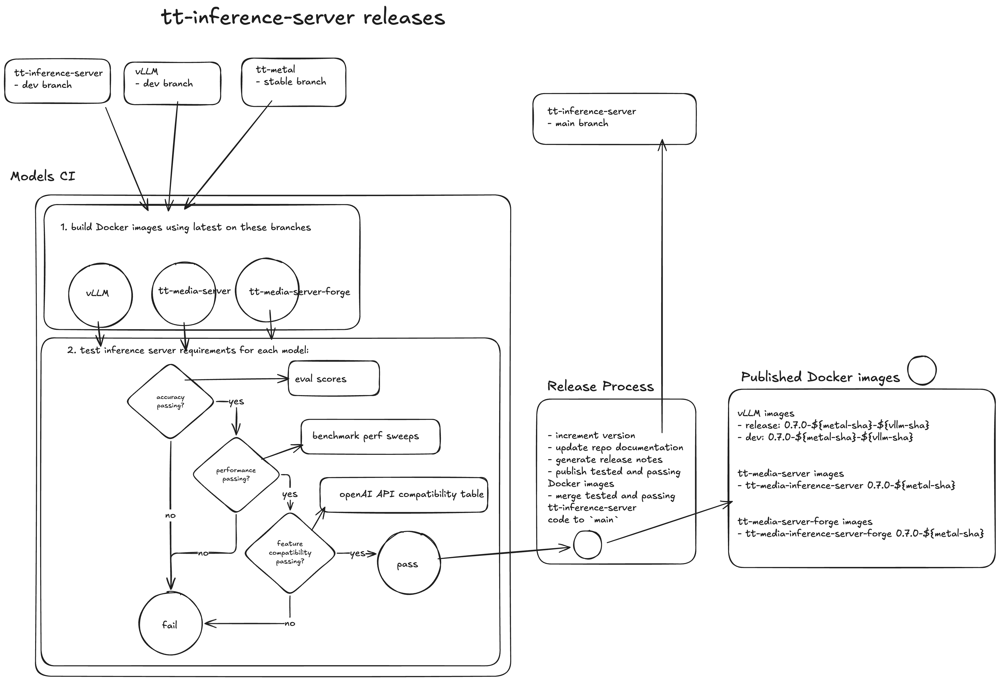
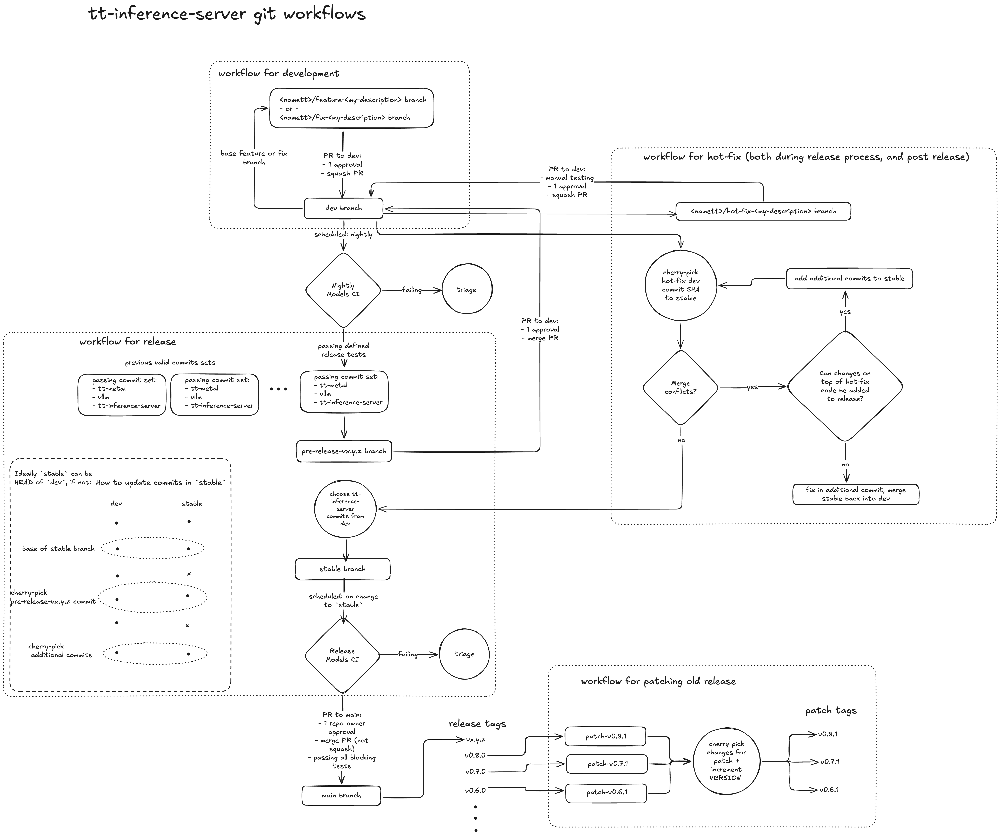

# Release process

This document gives the step by step instructions for making a release. There are a few points where optional steps are listed, especially for dealing with manual overrides or carrying forward older tt-metal SHA model versions.

The release process can be run locally on a laptop or on a remote server. However, the Docker image building for carrying forward older tt-metal SHA model versions should be done on a remote machine with high CPU and RAM because it will make parallel Docker image builds.

## Summary Diagram



## pre-requisite requirements
permissions requirement:
- Download only
    - [GitHub Personal Access Token](https://docs.github.com/en/authentication/keeping-your-account-and-data-secure/managing-your-personal-access-tokens) (PAT)
        - Read access to tt-shield repo.
- Full release:
    - [GitHub Personal Access Token](https://docs.github.com/en/authentication/keeping-your-account-and-data-secure/managing-your-personal-access-tokens) (PAT)
        - Read access to tt-shield repo.
        - Write access to tt-inference-server packages
    - crane CLI (https://github.com/google/go-containerregistry/tree/main/cmd/crane)

Login locally using GH PAT:
```bash
export GH_ID=tstescoTT
export GH_PAT=ghp_xxxxxxx
crane auth login ghcr.io -u ${GH_ID} -p ${GH_PAT}
# optionally login with docker CLI (if you only want to download logs and not do full release using crane)
docker login ghcr.io -u ${GH_ID} -p ${GH_PAT}
```

The operational requirement for releasing is a passing Models CI run. Any models with regressions that are being added as default impl should be clearly listed in the model waiver section of release notes. While the tt-inference-server Docker images support running multiple versions of tt-metal / vllm commits, this may occur for example due to consolidation of release artifacts and tt-metal versions used.

## Git Workflow Diagram

Follow the git workflow for release described below in the diagram and step by step instructions below:




## Creation of `stable` branch and update relevant files

We need to create `stable` branch either from HEAD of the `main` or from a specific on-nightly commit sha for which we have the most optimal and satisying results.

```bash
git checkout 50bd698
git checkout -b stable
```

## Step 1: update `models-ci-config.json`

Within the `models-ci-config.json` file, update which models and devices should belong to the upcoming release. 
Remove all the entries from the release list, which are not going to be actually released.

## Step 2: update `VERSION` file

Bump the version of the `VERSION` file (major/minor/patch syntax).

## during the release cycle run `release.yml` using the default arguments

From  the `tt-shield` repository, run the `release.yml` using the default arguments:

`tt-metal ref`: stable

`tt-inference-server ref`: stable

`vllm ref`: stable

`Workflow`: release

Once we are satisfied with release results we will progress with further phases.

Record relevant commit shas from the final release workflow run and its Summary output. For specific run, open the web page ```https://github.com/tenstorrent/tt-shield/actions/runs/<runId>```

Examples of the commits can be found inside the `Build Results Artifact` section:

`tt-metal-commit`: "079a2c23f4b360dd0c415a43dd2ffc94d0a792de",

`tt-inference-server-commit`: "fbccfcd",

`vllm-commit`: "6a6sg72e"


## Promote development specification to production

Ensure that all changes (in terms of arguments and properties for a specific model) are being set or cherry-picked from the main branch within the model_specs development catalogue:

`https://github.com/tenstorrent/tt-inference-server/tree/main/workflows/model_specs/dev`

Once we have everything set in development catalogue on the stable branch, we need to promote such changes from development to a production catalogue.

We need to promote the following arguments to the script:
- `--version` : example `0.17.0`
  
- `--tt-metal-commit` : example `b4bd581`
  
-  `--vllm-commit` example `f52987a` - this argument is mandatory only for llm models

Production catalogue is being maintained at:

`https://github.com/tenstorrent/tt-inference-server/tree/main/workflows/model_specs/prod`

Script that will execute this promotion automatically is:

`python3  scripts/release/promote_dev_spec_to_prod.py --version 0.17.0  --tt-metal-commit b4bd581 --vllm-commit 1234567`

Script will take into account only models which are planned for the current release (have defined `release` job in `models-ci-config.json`)

Once the script is executed we need to verify which changes are being introduced into the production catalogue.

## Check for shadowed duplicate blocks

`promote_dev_spec_to_prod.py` keys its upsert on (impl, engine, weights, **device set**). When a promotion adds a device to an existing model, the device set changes, so the script appends a new block instead of replacing the old one. Both blocks then claim the same devices — MODEL_SPECS keeps the last one (so run.py is fine), but the docs generator renders the first, publishing a stale or internal image tag. This produced wrong quickstarts for Qwen3.6-27B and Qwen3-Embedding-4B at v0.20.0.

 Run this immediately after promotion, before export_model_spec.py:
```bash 
MODEL_SPECS_ENV=prod PYTHONPATH=. python3 -c "
import collections
from workflows.model_spec import spec_templates
seen = collections.defaultdict(list)
for t in spec_templates:
    for s in t.expand_to_specs():
        seen[s.model_id].append(getattr(t, 'version', None))
dups = {k: v for k, v in seen.items() if len(v) > 1}
for k, v in sorted(dups.items()):
    print('DUPLICATE', k, '<- versions', v)
assert not dups, 'promotion created shadowed duplicate blocks'
print('OK: no duplicate model+device records')
"
```
 
 If it fails, delete the older block from workflows/model_specs/prod/<type>.yaml and re-run. len(MODEL_SPECS) must be unchanged afterwards — the deleted block was unreachable, so release_model_spec.json and values.yaml will show no diff.

## export_model_spec.py

After changes in production catalogue have been added and committed, re-generate the Model Support docs and `README.md` table and `release_model_spec.json` file by running:

```bash
python3 scripts/release/export_model_spec.py
```

`export_model_spec.py` will retrieve entries from the  "prod" catalogue.

Verify that this script will not produce changes in models which are not in the scope of this release. In case it did, revert all changes that happenned in `release_model_spec.json` for models out of scope. All modifications should be tracked using the `git diff` command.

Afterwards, `git add/commit/push` the changes for the `release_model_spec.json` file.

Additionally, `git add/commit/push` only untracked/modified docs files in `docs/model_support/`, but also only for models in the current scope.

If we want to use only one of the two outputs we can run the following:
 
`python3 scripts/release/export_model_spec.py --docs-only   # docs + README, no JSON`

`python3 scripts/release/export_model_spec.py --json-only   # release_model_spec.json only`

#### outputs

- `release_model_spec.json`: all model specs fully expanded from the ModelSpecTemplates in `workflows/model_spec.py`
- `release_logs/release_models_diff.md`: summary of diff with links to specific Models CI runs (THIS WILL NOT BE GENERATED!!!)
- `README.md` in case that we are adding new group of devices (very rare change)
- `docs/model_support/models_by_hardware.md` - in case the model/device change its status (for example from `EXPERIMENTAL -> FUNCTIONAL` )
- `docs/model_support/`: regenerated model support documentation (model type pages, individual model pages)
- `docs/model_support/{type}/README.md`: model/device STATUS changes are also noted here

## Generate new values.yml

Once we have new set of production data and values we can run the python script which will re-generate the values.yml.

`python -m venv .venv`

`source .venv/bin/activate`

`pip install -r requirements-dev.txt`

`python -m workflows.helm_generator`

`deactivate`

In case when we have new device definitions and support for new models the general README file should be changed as well.

`helm-docs --chart-search-root=charts/tt-inference-server --template-files=_supportedModels.gotmpl --template-files=README.md.gotmpl`

Afterwards we will push all those changes to the stable branch.

## Generate docker images as release artifacts

The next step is to copy docker images as release artifacts.
Depending on the model engine they will end up in one the following repositories

vllm: `vllm-tt-metal-src-release-ubuntu-22.04-amd64`

media: `tt-media-inference-server`

forge: `tt-media-inference-server-forge`

## Step 1: copy artifacts from tt-shield to tt-inference-server

Promote Docker images from Models CI on GHCR from `tt-shield` repo as `release` images on `tt-inference-server` repo. 

For example, from:
- `src: ghcr.io/tenstorrent/tt-shield/vllm-tt-metal-src-dev-ubuntu-22.04-amd64:0.0.5-ef93cf18b3aee66cc9ec703423de0ad3c6fde844-1d799da-52729064622`
- `dst: ghcr.io/tenstorrent/tt-inference-server/vllm-tt-metal-src-release-ubuntu-22.04-amd64:0.13.0-ef93cf1-1d799da`


Start by promoting Models CI images if existing for manual models (e.g. if ad hoc or dispatch  CI job was used).
```bash
crane copy <src> <dst>
# e.g.

# crane copy ghcr.io/tenstorrent/tt-shield/vllm-tt-metal-src-dev-ubuntu-22.04-amd64:0.13.0-80180b9d7d07ea9fcc99f723d4d46fe7a0b233bd-7678b70-76185610710  ghcr.io/tenstorrent/tt-inference-server/vllm-tt-metal-src-release-ubuntu-22.04-amd64:0.14.0-80180b9-7678b70

#crane copy ghcr.io/tenstorrent/tt-shield/tt-media-inference-server:0.13.0-80180b9d7d07ea9fcc99f723d4d46fe7a0b233bd-e799052-76185610891 ghcr.io/tenstorrent/tt-media-inference-server:0.14.0-80180b9
```
## Step 2: Re-bake the model catalogue into the copied image

 crane copy re-labels; it does not rebuild. The tt-shield image was built before promotion, so its baked /home/container_app_user/model_specs/model_spec.json is the prod catalogue from the previous release. Any model or device promoted in this release will be missing from it — the container crashes (No model spec found) or silently serves the old config. This affected v0.17.0 through v0.20.0.

# Manual catalogue re-bake (backfill a published vLLM image)

Fix a published vLLM image whose baked `model_spec.json` is stale/missing a model, without rebuilding. vLLM only. Verify on an RC tag; the live tag changes only at step 10.

**0. Setup** — name the image, an RC tag, and log in (read+write:packages).
```bash
export REPO=ghcr.io/tenstorrent/tt-inference-server/vllm-tt-metal-src-release-ubuntu-22.04-amd64
export TAG=0.18.0-c49bb76-6b4a3a7
export RC=$TAG-catalogfix-rc1
crane auth login ghcr.io -u <user> -p <PAT>
```

**1. Back up** the live image to a rollback tag.
```bash
INDEX=$(crane digest "$REPO:$TAG")
crane copy "$REPO@$INDEX" "$REPO:$TAG-precatalogfix"
```

**2. Resolve** the amd64 image digest (what `crane append` needs).
```bash
AMD64=$(crane manifest "$REPO:$TAG" | python3 -c "import json,sys;m=json.load(sys.stdin);print([x['digest'] for x in m['manifests'] if x['platform']['architecture']=='amd64'][0])")
```

**3. Clean source** — bake from a known-clean `main`.
```bash
git checkout main && git pull
git status --porcelain workflows/model_specs/prod/ VERSION   # must be empty
```

**4. Generate** `model_spec.json` from the prod catalogue.
```bash
PYTHONPATH=. python3 -c "from scripts.build_docker_images import generate_model_specs_json; generate_model_specs_json()"
```

**5. Pre-flight** — assert the fixed spec is present (KeyError = wrong branch, stop).
```bash
python3 -c "import json;print(json.load(open('model_spec.json'))['model_specs']['google/gemma-4-31B-it']['P300X2'])"
```

**6. Pack** the layer at the right path + ownership (uid/gid 1000).
```bash
rm -rf /tmp/catalog && mkdir -p /tmp/catalog/home/container_app_user/model_specs
cp model_spec.json /tmp/catalog/home/container_app_user/model_specs/
tar --owner=1000 --group=1000 -C /tmp/catalog -cf /tmp/catalog-layer.tar home
```

**7. Push to RC** (not the live tag yet).
```bash
crane append -b "$REPO@$AMD64" -f /tmp/catalog-layer.tar -t "$REPO:$RC"
```

**8. Verify RC** — pull the catalogue back out of the pushed image.
```bash
python3 - <<'PY'
import io, json, os, subprocess, tarfile
R, RC = os.environ["REPO"], os.environ["RC"]
sh = lambda a: subprocess.run(a, capture_output=True, check=True).stdout
man = json.loads(sh(["crane","manifest",f"{R}:{RC}"]))
blob = sh(["crane","blob",f"{R}@{man['layers'][-1]['digest']}"])
with tarfile.open(fileobj=io.BytesIO(blob), mode="r:gz") as tf:
    d = json.load(tf.extractfile(next(m for m in tf.getmembers() if m.name.endswith("model_spec.json"))))
print("gemma present:", "google/gemma-4-31B-it" in d["model_specs"])
PY
```

**9. Hardware test** the RC on the target device.
```bash
docker run --rm --env "HF_TOKEN=$HF_TOKEN" --ipc host --publish 8000:8000 \
  --device /dev/tenstorrent --mount type=bind,src=/dev/hugepages-1G,dst=/dev/hugepages-1G \
  --volume volume_id_gemma-4-31B-it:/home/container_app_user/cache_root \
  "$REPO:$RC" --model gemma-4-31B-it --tt-device p300x2
```

**10. Promote** the verified RC to the live tag (only step that changes what users get).
```bash
crane copy "$REPO:$RC" "$REPO:$TAG"
```

**11. Confirm** with the exact user-facing command.
```bash
docker pull "$REPO:$TAG"
python3 run.py --model gemma-4-31B-it --device p300x2 --workflow server --docker-server
```

**12. Rollback** if needed.
```bash
crane copy "$REPO:$TAG-precatalogfix" "$REPO:$TAG"
```


 **13. Verification** the release_version inside the image must equal the release you are cutting. If it is one behind, the re-bake did not run.
 ```bash
 crane export "$REPO:$TAG" - | tar -xO home/container_app_user/model_specs/model_spec.json \
  | python3 -c "import json,sys; print(json.load(sys.stdin)['release_version'])"
```
Note: this drops the buildkit attestation and changes the digest — the tag stays the same. Only applies to vLLM images; media/forge containers get their config from host env vars.


## Rollback — bad published/re-baked vLLM release image

`REPO=ghcr.io/tenstorrent/tt-inference-server/vllm-tt-metal-src-release-ubuntu-22.04-amd64`
`TAG=0.21.0-de59f8a-c127c17     # the published tag`
`SRC=ghcr.io/tenstorrent/tt-shield/vllm-tt-metal-src-dev-ubuntu-22.04-amd64:0.21.0-<...>   # source that was copied`

**Option 1** — undo the crane append (re-point tag to the un-baked copy):
```bash
crane copy "$SRC" "$REPO:$TAG"      # overwrites tag back to pre-append state
crane digest "$REPO:$TAG"           # confirm digest changed
```

Option 2 — restore from the backup (if you snapshotted before re-bake):
```bash
crane copy "$REPO:$TAG-precatalogfix" "$REPO:$TAG"
```

Option 3 — fully unpublish (delete the tag):
```bash
crane delete "$REPO:$TAG"           # if GHCR rejects, use the API:
PKG=tt-inference-server%2Fvllm-tt-metal-src-release-ubuntu-22.04-amd64
VID=$(gh api "/orgs/tenstorrent/packages/container/$PKG/versions" --paginate \
        --jq ".[] | select(.metadata.container.tags[]? == \"$TAG\") | .id")
gh api --method DELETE "/orgs/tenstorrent/packages/container/$PKG/versions/$VID"
```
⚠️ Only if nothing pulled it yet — deleting a consumed tag breaks pullers; otherwise prefer Option 1/2 (overwrite).

**Verify**
```bash
crane export "$REPO:$TAG" - | tar -xO home/container_app_user/model_specs/model_spec.json \
  | python3 -c "import json,sys; print(json.load(sys.stdin)['release_version'])"
```


## Step 3: verification through the list model images

Run `python3 scripts/list_model_images.py` in order to confirm that docker image is trully present within the repository. This is a safeguard which ensures docker images are named properly.

The full script path is: ```https://github.com/tenstorrent/tt-inference-server/blob/main/scripts/list_model_images.py```

## Step 4: tag stable branch with version value

* we create a new tag for `stable` HEAD value with value `vx.x.x`
  
  `git tag vx.x.x`
  
  `git push origin vx.x.x`
* we rename the `stable` branch to `vx.x.x` value, and afterwards we can delete the `stable`
  
  `git switch -c vx.x.x`
  
  `git push --set-upstream origin vx.x.x`

## Create post-release branch and PR

## Step 1: Create post-release branch

* branch `post-release-vx.x.x` should be created from main
* manually copy-paste changes from stable branch to this new branch in order to avoid potential conflicts that might have happened in the meantime

## Step 2: Create PR

* Open tt-inference-server PR `post-release-vx.x.x` to `main` https://github.com/tenstorrent/tt-inference-server/compare/dev...
* manually inspect and review `model_spec.py` changes
* include: `release_logs/release_models_diff.md`
* any manual changes from the automated edits should be noted
* set metadata information for a Release Object 
As a comment, at the top of the HTML body, within the commented section, add metadata information.
```metadata:run_id=24842121888```

```metadata:version=v0.13.0```
* the PR must be with merge commit option ("all commits from this branch will be added with a merge commit"), this is done in the case that there are merge conflicts that need to be resolved. The resolution commit is then available in the next release for the changes required on current `main`.
* Use `git add -f docs/model_support/**` to commit updates to generated model docs.
<!-- 
* NOTE: the release will process with `post-release-vx.x.x` branch which is now "stable" from `main`
-->

## Create GitHub RELEASE Object

We need to create new Draft Release Object `vx.x.x` targeting the given tag created in the previous step.

### Step 1: Reference Tag
Set tag for a given Release Object, created in a previous step.

## Step 2: copy paste Release notes from PR body

Release Notes must be added describing new supported engine features.

* we do the copy of the PR body
* we add repository paths towards the docker images
* add notes for changes to model support and performance (if possible use `release_logs/release_models_diff.md`)

## Step 3: Downloading workflow artifacts and assets upload to Release Object

 We need to download all the workflow_logs from a given tt-shield runId job. Of course we should consider only models which are in the scope for the release. Afterwards, we zip them as `vx.xx.x-release_artifacts.zip` and upload that artifact to release object as an Asset.

To do so we can use the script currently implemented in the tt-shield repository:
Once we clone the tt-shield repository, we can find the script at this path:
`.github/scripts/release_tools/build_release_artifact/build_release_artifacts.py`

As input properties we need to pass:
- runId of the release job that contains our workflow logs uploaded
- version of the release

By default the script reads the model/device combinations to package from the
`release` entries in `.github/workflows/models-ci-config.json` (the same release
list `promote_dev_spec_to_prod.py` consumes), so the models no longer need to be
listed by hand:

```bash
python3 build_release_artifacts.py \
        --run-id 26592936143 \
        --version v0.15.0 \
        --output-dir .
```

To override the scope — e.g. to rebuild a single model, or to package models
that are not in the release list — pass one or more `--model MODEL=dev1,dev2`
flags instead:

```bash
python3 build_release_artifacts.py \
        --run-id 26592936143 \
        --version v0.15.0 \
        --model speecht5_tts=p150,p300x2 \
        --output-dir .
```

Once the workflow assets are downloaded, we can upload them to already created Release Object.

## Step 4: Release Object publishing

At the end, we change the status of the Release Object to `Published` and mark the Release as the latest one.

<!-- 
Note: any hot-fixes to be applied on the RC branch should be based on the RC branch `<namett>/hot-fix-<fix-description>` and be PR back into `dev` via merge commit then `git cherry-pick` the changes back into RC branch. This ensures all future branches have the same commit SHAs and history is correct.
-->

## Update Release Zoo

From the `tt-shield` Actions tab we need to run the `"Update Release Zoo"` action so the page on Models Dashboard is being refreshed.

https://github.com/tenstorrent/tt-shield/actions/workflows/update-release-zoo.yml
