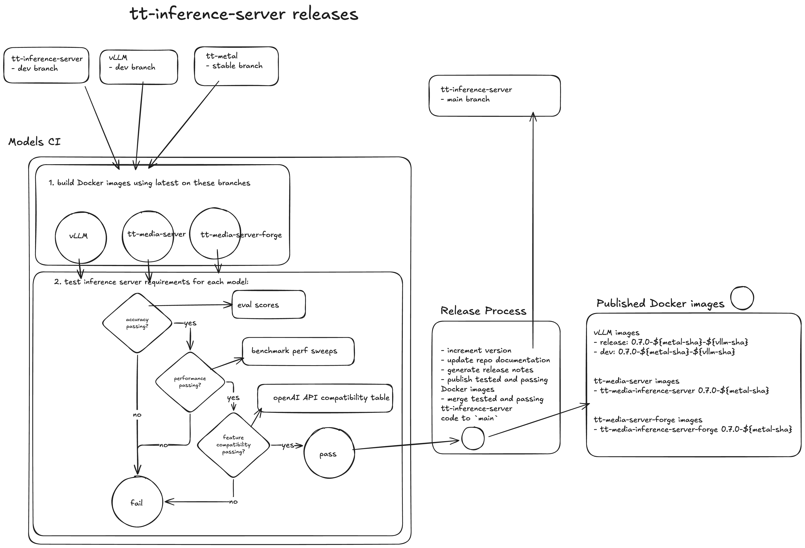

# Release process

This document gives the step by step instructions for making a release. There are a few points where optional steps are listed, especially for dealing with manual overrides or carrying forward older tt-metal SHA model versions.

The release process can be run locally on a laptop or on a remote server. However, the Docker image building for carrying forward older tt-metal SHA model versions should be done on a remote machine with high CPU and RAM because it will make parallel Docker image builds.

## Summary Diagram



## pre-requisite requirements
permissions requirement:
- Download only
    - [GitHub Personal Access Token](https://docs.github.com/en/authentication/keeping-your-account-and-data-secure/managing-your-personal-access-tokens) (PAT)
        - Read access to tt-shield repo.
- Full release:
    - [GitHub Personal Access Token](https://docs.github.com/en/authentication/keeping-your-account-and-data-secure/managing-your-personal-access-tokens) (PAT)
        - Read access to tt-shield repo.
        - Write access to tt-inference-server packages
    - crane CLI (https://github.com/google/go-containerregistry/tree/main/cmd/crane)

Login locally using GH PAT:
```bash
export GH_ID=tstescoTT
export GH_PAT=ghp_xxxxxxx
crane auth login ghcr.io -u ${GH_ID} -p ${GH_PAT}
# optionally login with docker CLI (if you only want to download logs and not do full release using crane)
docker login ghcr.io -u ${GH_ID} -p ${GH_PAT}
```

The operational requirement for releasing is a passing Models CI run. Any models with regressions that are being added as default impl should be clearly listed in the model waiver section of release notes. While the tt-inference-server Docker images support running multiple versions of tt-metal / vllm commits, this may occur for example due to consolidation of release artifacts and tt-metal versions used.

## Git Workflow Diagram

Follow the git workflow for release described below in the diagram and step by step instructions below:


## Creation of `stable` branch and update relevant files

We need to create `stable` branch either from HEAD of the `main` or from a specific on-nightly commit sha for which we have the most optimal and satisying results.

```bash
git checkout 50bd698
git checkout -b stable
```

## Step 1: update `models-ci-config.json`

Within the `models-ci-config.json` file, update which models and devices should belong to the upcoming release.

## Step 2: update `VERSION` file

Bump the version of the `VERSION` file (major/minor/patch syntax).

## run `release.yml` using the default arguments

From  the `tt-shield` repository, run the `release.yml` using the default arguments:

`tt-metal ref`: stable

`tt-inference-server ref`: stable

`vllm ref`: dev

`Workflow`: release

Once we are satisfied with release results we will progress with further phases.
Otherwise, we will repeat release workflow multiple times, until corrections are implemented in the relevant repositories.

Record relevant commit shas from the final release workflow run and its Summary output. Those will be set in the next phase, within the model_specs development catalogue. 

For specific run, open the web page ```https://github.com/tenstorrent/tt-shield/actions/runs/<runId>```

Examples of the commits can be found inside the `Build Results Artifact` section:

`tt-metal-commit`: "079a2c23f4b360dd0c415a43dd2ffc94d0a792de",

`tt-inference-server-commit`: "fbccfcd",

`vllm-commit`: "6a6sg72e"


## Promote development specification to production

For specific model/device combination update manually relevant commit sha references for tt-metal and vllm commit fields (if applicable) in models_spec dev catalogue. Also the upcoming release version should be set for models/devices that are in the scope to be released.

Changes are being set within the model_specs development catalogue:
`https://github.com/tenstorrent/tt-inference-server/tree/main/workflows/model_specs/dev`

Take into account, that during the release cycle some changes already might happen in development catalogue. We need to pick what is trully relevant.
Once we have everything set in development catalogue, we need to promote such changes from development to a production catalogue.

Production catalogue is being maintained at:
`https://github.com/tenstorrent/tt-inference-server/tree/main/workflows/model_specs/prod`

Script that will execute this promotion autoamtically is:
`python3  scripts/release/promote_dev_spec_to_prod.py`

Once the script is executed we need to verify which changes are being introduced into the production catalogue.

## update_model_spec.py


After changes in production catalogue have been added and committed, re-generate the Model Support docs and `README.md` table and `release_model_spec.json` file by running:

```bash
python3 scripts/release/update_model_spec.py --output-only --output-json release_model_spec.json
```

Verify that this script will not produce changes in models which are not in the scope of this release. In case it did, revert all changes that happenned in `release_model_spec.json`  for models out of scope. All modifications should be tracked using the `git diff` command.

Afterwards, `git add/commit/push` the changes for the `release_model_spec.json` file.

Additionally, `git add/commit/push` only untracked/modified docs files in `docs/model_support/`, but also only for models in the current scope.

#### outputs

- `release_model_spec.json`: all model specs fully expanded from the ModelSpecTemplates in `workflows/model_spec.py`
- `release_logs/release_models_diff.md`: summary of diff with links to specific Models CI runs (THIS WILL NOT BE GENERATED!!!)
- `README.md` in case that we are adding new group of devices (very rare change)
- `docs/model_support/models_by_hardware.md` - in case the model/device change its status (for example from `EXPERIMENTAL -> FUNCTIONAL` )
- `docs/model_support/`: regenerated model support documentation (model type pages, individual model pages)
- `docs/model_support/{type}/README.md`: model/device STATUS changes are also noted here


## Generate docker images as release artifacts

The next step is to copy docker images as release artifacts.
Depending on the model engine they will end up in one the following repositories

vllm: `vllm-tt-metal-src-release-ubuntu-22.04-amd64`

media: `tt-media-inference-server`

forge: `tt-media-inference-server-forge`

## Step 1: copy artifacts from tt-shield to tt-inference-server

Promote Docker images from Models CI on GHCR from `tt-shield` repo as `release` images on `tt-inference-server` repo. 

For example, from:
- `src: ghcr.io/tenstorrent/tt-shield/vllm-tt-metal-src-dev-ubuntu-22.04-amd64:0.0.5-ef93cf18b3aee66cc9ec703423de0ad3c6fde844-1d799da-52729064622`
- `dst: ghcr.io/tenstorrent/tt-inference-server/vllm-tt-metal-src-release-ubuntu-22.04-amd64:0.13.0-ef93cf1-1d799da`


Start by promoting Models CI images if existing for manual models (e.g. if ad hoc or dispatch  CI job was used).
```bash
crane copy <src> <dst>
# e.g.

# crane copy ghcr.io/tenstorrent/tt-shield/vllm-tt-metal-src-dev-ubuntu-22.04-amd64:0.13.0-80180b9d7d07ea9fcc99f723d4d46fe7a0b233bd-7678b70-76185610710  ghcr.io/tenstorrent/tt-inference-server/vllm-tt-metal-src-release-ubuntu-22.04-amd64:0.14.0-80180b9-7678b70

#crane copy ghcr.io/tenstorrent/tt-shield/tt-media-inference-server:0.13.0-80180b9d7d07ea9fcc99f723d4d46fe7a0b233bd-e799052-76185610891 ghcr.io/tenstorrent/tt-media-inference-server:0.14.0-80180b9
```

## Step 2: verification through the list model images

Run `python3 scripts/list_model_images.py` in order to confirm that docker image is trully present within the repository. This is a safeguard which ensures docker images are named properly.

The full script path is: ```https://github.com/tenstorrent/tt-inference-server/blob/main/scripts/list_model_images.py```

## Create post-release branch and PR

## Step 1: Create post-release branch

* branch `post-release-vx.x.x` should be created from main
* manually copy-paste changes from stable branch to this new branch in order to avoid potential conflicts that might have happened in the meantime

## Step 2: Create PR

* Open tt-inference-server PR `post-release-vx.x.x` to `main` https://github.com/tenstorrent/tt-inference-server/compare/dev...
* manually inspect and review `model_spec.py` changes
* include: `release_logs/release_models_diff.md`
* any manual changes from the automated edits should be noted
* set metadata information for a Release Object 
As a comment, at the top of the HTML body, within the commented section, add metadata information.
```metadata:run_id=24842121888```

```metadata:version=v0.13.0```
* the PR must be with merge commit option ("all commits from this branch will be added with a merge commit"), this is done in the case that there are merge conflicts that need to be resolved. The resolution commit is then available in the next release for the changes required on current `main`.
* Use `git add -f docs/model_support/**` to commit updates to generated model docs.
<!-- 
* NOTE: the release will process with `post-release-vx.x.x` branch which is now "stable" from `main`
-->

## Step 3: tag stable branch with version value

* we create a new tag for `stable` HEAD value with value `vx.x.x`
  
  `git tag vx.x.x`
  
  `git push origin vx.x.x`
* we rename the `stable` branch to `vx.x.x` value, and afterwards we can delete the `stable`
  
  `git switch -c vx.x.x`
  
  `git push --set-upstream origin vx.x.x`

## Create GitHub RELEASE Object

We need to create new Draft Release Object `vx.x.x` targeting the given tag created in the previous step.

### Step 1: Reference Tag
Set tag for a given Release Object, created in a previous step.

## Step 2: copy paste Release notes from PR body

Release Notes must be added describing new supported engine features.

* we do the copy of the PR body
* we add repository paths towards the docker images
* add notes for changes to model support and performance (if possible use `release_logs/release_models_diff.md`)

## Step 3: Downloading workflow artifacts and assets upload to Release Object

 We need to download all the workflow_logs from a given tt-shield runId job. Of course we should consider only models which are in the scope for the release. Afterwards, we zip them as `vx.xx.x-release_artifacts.zip` and upload that artifact to release object as an Asset.

To do so we can use the script currently implemented in the tt-shield repository:
Once we clone the tt-shield repository, we can find the script at this path:
`.github/scripts/release_tools/build_release_artifact/build_release_artifacts.py`

As input properties we need to pass:
- runId of the release job that contains our workflow logs uploaded
- version of the release
- all the models/devices combinations for which we want to download artifacts and zip it as the final asset for upload

```bash
python3 build_release_artifacts.py \
        --run-id 26592936143 \
        --version v0.15.0 \
        --model speecht5_tts=p150,p300x2 \
        --model whisper-large-v3=p150,p300x2 \
        --model distil-large-v3=p150,p300x2 \
        --output-dir .
```

Once the workflow assets are downloaded, we can upload them to already created Release Object.

## Step 4: Release Object publishing

At the end, we change the status of the Release Object to `Published` and mark the Release as the latest one.


<!-- 
Note: any hot-fixes to be applied on the RC branch should be based on the RC branch `<namett>/hot-fix-<fix-description>` and be PR back into `dev` via merge commit then `git cherry-pick` the changes back into RC branch. This ensures all future branches have the same commit SHAs and history is correct.
-->
