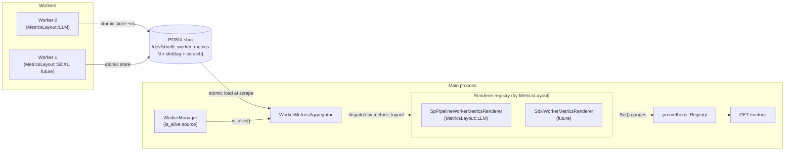
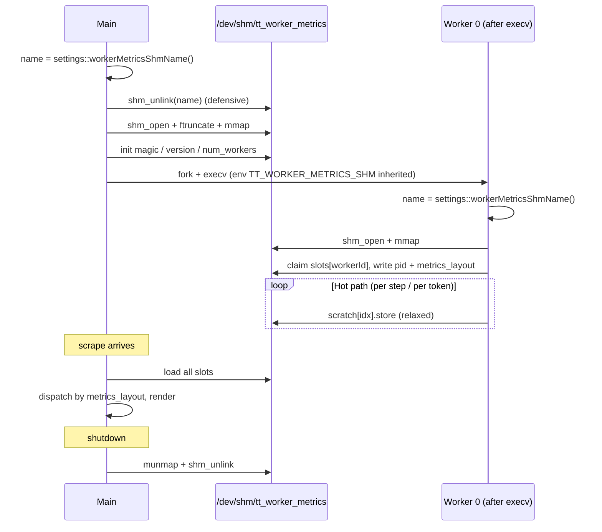
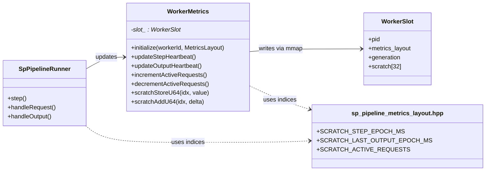
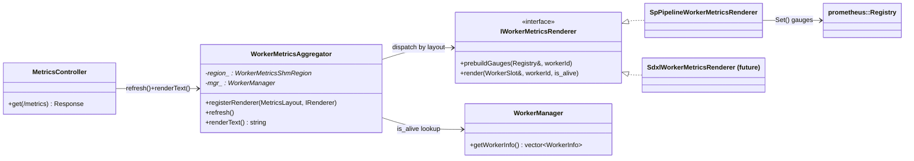

# Zero-Overhead Inference Server

Production-grade, zero-overhead C++ inference server for AI workloads on
Tenstorrent hardware. Supports LLM serving today; image, video, audio,
and text-to-speech models are on the roadmap.

## Non-Functional Requirements

These requirements drive design decisions in this codebase. They are ordered
by priority — when two requirements conflict, the higher-ranked one wins.

### 1. Performance (Zero-Overhead)

The server is the envelope around the model; that envelope must be invisible.
Every microsecond of framework overhead (serialization, scheduling, IPC,
queue management) is a design failure. The goal is not "fast" — it is
"never the bottleneck."

- Prefer zero-copy and shared-memory IPC (`/dev/shm`) over serialization.
- Tracy profiling instrumentation to detect and eliminate overhead regressions.
- Nightly performance benchmarks to catch regressions before they ship.

### 2. Fault Tolerance

Workers interact with Tenstorrent devices that can hang or crash. The server
must detect failed workers, restart them (including device re-initialization),
and continue serving. A single bad request must fail gracefully without
affecting other in-flight requests or the main process.

- Main process acts as supervisor; workers run as child processes (fork/exec).
- Worker health monitoring (heartbeat/watchdog).
- Request-level fault isolation — one failure does not cascade.

### 3. Observability

This is a customer-facing product. Clients and field engineers must be able
to diagnose production issues (slow tokens, hung devices, degraded throughput)
without reading source code.

- Structured logging with request-ID correlation across HTTP → worker → device.
- Production metrics (tokens/sec, queue depth, latency histograms, device health).
- Health/liveness endpoints that surface meaningful diagnostics, not just "alive."

### 4. Extensibility

New model types (image, video, audio, text-to-speech) will be added with increasing frequency. The
server must make this straightforward without modifying core infrastructure.

- Stable core (HTTP layer, tokenization, worker lifecycle) that rarely changes.
- Model-specific logic isolated in adapter layers (runner implementations).
- When hardware topology requires custom communication or scheduling, changes
  are confined to the worker level — the main server remains unchanged.

## Logging

```cpp
#include "utils/logger.hpp"

// Initialize once at startup (optional - auto-initializes on first use)
tt::utils::initialize_logger();

// High-performance macros with zero overhead when disabled
TT_LOG_DEBUG("Debug info: request_id={}, latency={}ms", id, latency);
TT_LOG_INFO("Server starting on port {}", port);
TT_LOG_ERROR("Connection failed: {}", error);
```

#### Configuration

```bash
# Environment variables
export TT_LOG_LEVEL=debug             # Runtime log level (trace, debug, info, warn, error, critical, off)
export TT_LOG_FILE=./logs/server.log  # Enable file logging (optional)
```

Available log levels (from most to least verbose):
- `trace` - Most detailed logging
- `debug` - Debug information
- `info` - Informational messages (default)
- `warn` - Warning messages
- `error` - Error messages only
- `critical` - Critical errors only
- `off` - Disable all logging

## LLM engine

Inference engine code lives under `include/runners/llm_runner/` and
`src/runners/llm_runner/`. Public C++ API types are in namespace
`tt::runners::llm_engine`. The engine uses the standard `TT_LOG_*` macros
(see **Logging** above). The static library CMake target is `llm_runner_lib`.

### Main features

- **Paged attention** — KV cache is managed in fixed-size blocks; sequences hold a block table and blocks are allocated or freed as needed. Enables non-contiguous cache and reuse across sequences.
- **Prefix caching** — Content-addressable blocks (hash over token content with optional prefix): when a new sequence shares a prefix with an existing block, the block is reused (reference-counted) so shared prefixes are not recomputed.
- **Prefill-only or decode-only batches** — Each scheduling step returns either a **prefill-only** batch or a **decode-only** batch; there are no mixed prefill+decode batches. Prefill is prioritized over decode when both are possible.
- **Preemption** — When decode cannot proceed (e.g. no free block to extend a sequence), a running sequence can be preempted: its KV cache is freed and it re-enters the waiting queue for later prefill.

The engine does **not** support chunked prefill: each request is prefilled in full when it is scheduled (subject to batch token limits).

**Device backend** — Host–device communication is behind an `IDeviceBackend` abstraction (`init`, `write`, `read`, `terminate`). Two implementations: **mock** (no hardware; echoes written pages back as read data) and **sockets** (TT device, H2D/D2H sockets, loopback kernels). The backend is selected via `LLM_DEVICE_BACKEND` environment variable (see Environment Variables). Default is mock.

### Choosing a Scheduling Policy

The LLM engine supports two scheduling policies that trade off individual request latency vs. overall throughput:

#### Prefill First (Default)
**When to use:** Low to moderate request rates, latency-sensitive applications

**Behavior:** Always prefills new requests when the prefill_queue has waiting requests. Decode is only attempted when nothing can be prefilled.

**Advantages:**
- **Better Time-To-First-Token (TTFT)** for individual requests
- New requests get processed immediately without waiting for decode batches
- Optimal for scenarios where user-perceived latency is critical

**Trade-offs:**
- Decode sequences may be interrupted when new requests arrive
- Lower overall device occupancy during mixed workloads

#### Max Occupancy
**When to use:** High request rates, throughput-oriented applications

**Behavior:** Keeps the device at full occupancy (`max_in_flight_count` from MAX_IN_FLIGHT_COUNT env var) whenever possible. When decode sequences finish and free slots, immediately prefills enough new sequences to refill capacity, then resumes decode at full width.

**Advantages:**
- **Better average TTFT across all users** under high load
- Maximizes device utilization and overall throughput
- Decode batches run at full capacity for better efficiency

**Trade-offs:**
- Individual requests may wait longer for their first token
- Decode sequences lose one decode step during each prefill batch

**Configuration:** Set via the `SCHEDULING_POLICY` environment variable (see `config/types.hpp` for valid values, `config/defaults.hpp` for defaults). The policy is selected at runtime based on your workload characteristics.

### Run unit tests

Run LLM engine unit tests (Google Test) from the `cpp_server` directory:

```bash
cd build && ctest --output-on-failure
# Or run test binaries directly:
./build/scheduler_test
./build/llm_runner_test
./build/sequence_test
./build/ipc_scheduler_smoke_test
```

## Quick Start

```bash
# Build (defaults to DeepSeek V3)
cd cpp_server
./build.sh

# Start the server (foreground)
./build/tt_media_server_cpp -p 8001

# Or start in background
./build/tt_media_server_cpp -p 8001 &

# Test it
curl http://localhost:8001/health

# Stop the server (if running in background)
pkill -f tt_media_server_cpp
# Or use Ctrl+C if running in foreground
```

## Build Options

```bash
# Default build
./build.sh

# Debug build
./build.sh --debug

# AddressSanitizer
./build.sh --asan
```

### Tokenizer files

The build script automatically pre-fetches tokenizer files for all supported
models from HuggingFace into `tokenizers/<model-name>/`:

```
tokenizers/
  deepseek-ai/DeepSeek-R1-0528/tokenizer.json
  deepseek-ai/DeepSeek-R1-0528/tokenizer_config.json
  meta-llama/Llama-3.1-8B-Instruct/tokenizer.json
  meta-llama/Llama-3.1-8B-Instruct/tokenizer_config.json
```

Llama models are gated on HuggingFace — set `HF_TOKEN` (or
`HUGGING_FACE_HUB_TOKEN`, or run `huggingface-cli login`) before building to
download them. If the Llama download fails, the build continues (DeepSeek is
required; Llama is optional unless `LLM_DEVICE_BACKEND=llama`). If both
`tokenizer.json` and `tokenizer_config.json` already exist for a model, the
build skips the download (no `HF_TOKEN` needed for subsequent builds). To force
re-download, remove the model directory under `tokenizers/<org>/<model>/`.

To add a new model, manually download its tokenizer files into a subdirectory
matching the HuggingFace model name:

```bash
mkdir -p tokenizers/<org>/<model>
wget -O tokenizers/<org>/<model>/tokenizer.json \
  https://huggingface.co/<org>/<model>/raw/main/tokenizer.json
wget -O tokenizers/<org>/<model>/tokenizer_config.json \
  https://huggingface.co/<org>/<model>/raw/main/tokenizer_config.json
```

### Runtime model selection

Model-specific behavior (chat template, stop tokens, decode filtering) is
selected at **runtime** via the `LLM_DEVICE_BACKEND` environment variable — no
recompilation needed:

| `LLM_DEVICE_BACKEND` | Model | Tokenizer |
|----------------------|-------|-----------|
| `mock` or `pipeline` (default when unset: `mock`) | DeepSeek V3 | `tokenizers/deepseek-ai/DeepSeek-R1-0528/` |
| `llama` | Llama 3.1 8B Instruct | `tokenizers/meta-llama/Llama-3.1-8B-Instruct/` |

The runtime selection uses an OOP strategy pattern — see
`include/utils/tokenizer_strategy.hpp` for the `ITokenizerStrategy` interface
and `create_tokenizer_strategy()` factory.

## Starting the Server

### Basic Usage

```bash
# Start with default settings (0.0.0.0:8000, auto-detect threads)
./build/tt_media_server_cpp

# Start on a specific port
./build/tt_media_server_cpp -p 8001

# Start with custom host and port
./build/tt_media_server_cpp -h 127.0.0.1 -p 8080

# Start with specific number of IO threads
./build/tt_media_server_cpp -t 16

# Show help
./build/tt_media_server_cpp --help
```

### Command Line Options

| Option | Description | Default |
|--------|-------------|---------|
| `-h, --host HOST` | Listen address | `0.0.0.0` |
| `-p, --port PORT` | Listen port | `8000` |
| `-t, --threads N` | Number of IO threads | CPU cores |
| `--help` | Show help message | - |

### Environment Variables

Configuration follows a unified system with clear separation of concerns:
- **Type definitions**: `config/types.hpp` - enums and type conversions (ModelService, ModelType, LLMMode, SchedulingPolicy, etc.)
- **Default values**: `config/defaults.hpp` - default values for all environment variables
- **Runner config**: `config/runner_config.hpp` — LLMConfig, EmbeddingConfig, RunnerConfig variant; runtime values filled via `tt::config::llmEngineConfig()` in `config/settings.hpp` / `settings.cpp`
- **Runtime settings**: `config/settings.hpp` - reads environment variables and provides runtime accessors

All environment variable reads go through `config/settings.hpp` (no direct `getenv` elsewhere).

| Variable | Description | Default |
|----------|-------------|---------|
| `DEVICE_IDS` | Bracket-pair device list, one worker per pair (e.g. `(0,1,2,3),(4,5,6,7)`). num_workers = number of pairs; each worker's `TT_VISIBLE_DEVICES` = that pair's contents. | `(0)` |
| `MODEL_SERVICE` | Service mode: `embedding` or `llm`. Same as tt-media-server. | `llm` |
| `MAX_BATCH_DELAY_TIME_MS` | Max wait (ms) to fill batch (embedding). Same as tt-media-server. | `5` |
| `MAX_QUEUE_SIZE` | Maximum number of requests that can be queued. | `1000` |
| `MAX_IN_FLIGHT_COUNT` | Maximum number of requests being processed simultaneously. | `32` |
| `TT_PYTHON_PATH` | Path added to Python `sys.path` for embedding runner (C++ only). | `..` |
| `LLM_DEVICE_BACKEND` | LLM device backend and model: `mock` or `pipeline` (DeepSeek V3 tokenizer), `llama` (Llama 3.1 8B Instruct). | `mock` |
| `OPENAI_API_KEY` | Bearer token for API authentication. | `your-secret-key` |
| `LLM_MODE` | LLM operating mode: `regular`, `prefill`, or `decode`. See Prefill/Decode Split Mode. | `regular` |
| `SOCKET_HOST` | Socket host for prefill/decode communication. Decode server: bind address. Prefill server: decode server address. | `localhost` |
| `SOCKET_PORT` | Socket port for prefill/decode communication. | `9000` |
| `SCHEDULING_POLICY` | LLM scheduling policy: `prefill_first` (prioritize new requests) or `max_occupancy` (maximize throughput). See Choosing a Scheduling Policy. | `prefill_first` |
| `ENABLE_ACCUMULATED_STREAMING` | Enable token accumulation before streaming (send multiple tokens per chunk). | `false` |
| `MAX_ACCUMULATED_TOKENS` | Maximum tokens to accumulate before streaming when `ENABLE_ACCUMULATED_STREAMING` is true. | `5` |
| `KAFKA_BROKERS` | Kafka broker addresses (comma-separated) for session offloading. See Kafka Messaging section. | `localhost:9092` |
| `KAFKA_OFFLOAD_TOPIC_NAME` | Kafka topic name for session offload messages. | `session-offload` |
| `KAFKA_GROUP_ID` | Kafka consumer group ID for load balancing across consumer instances. | `migration-workers` |

### Prefill/Decode Split Mode

The server supports running in a split architecture where prefill and decode operations are handled by separate server instances on different machines. This enables distributing the workload across multiple nodes.

**Modes:**
- `regular` (default): Single server handles both prefill and decode
- `prefill`: Server only performs prefill (processes prompt, generates first token)
- `decode`: Server receives HTTP requests, forwards to prefill server, then generates remaining tokens locally

**Architecture:**
```
Client HTTP Request
        │
        ▼
┌───────────────────┐
│   Decode Server   │ (LLM_MODE=decode, port 8001)
│   Socket Server   │ (SOCKET_PORT=9000)
└─────────┬─────────┘
          │ TCP Socket
          ▼
┌───────────────────┐
│  Prefill Server   │ (LLM_MODE=prefill, port 8002)
│   Socket Client   │ (connects to decode server)
└───────────────────┘
```

**Running the split architecture:**

1. **Start Decode Server** (receives HTTP requests, listens for prefill connections):
   ```bash
   LLM_MODE=decode SOCKET_HOST=0.0.0.0 SOCKET_PORT=9000 \
     ./build/tt_media_server_cpp -p 8001
   ```

2. **Start Prefill Server** (connects to decode server):
   ```bash
   LLM_MODE=prefill SOCKET_HOST=<decode-server-ip> SOCKET_PORT=9000 \
     ./build/tt_media_server_cpp -p 8002
   ```

3. **Send requests to the Decode Server**:
   ```bash
   curl -X POST http://<decode-server>:8001/v1/chat/completions \
     -H "Content-Type: application/json" \
     -H "Authorization: Bearer your-secret-key" \
     -d '{"messages": [{"role": "user", "content": "Hello, how are you?"}], "max_tokens": 50}'
   ```

**Flow:**
1. Client sends request to decode server (HTTP)
2. Decode server sends prefill request to prefill server (socket)
3. Prefill server processes prompt, generates first token, sends prefill result with token IDs
4. Decode server continues generating remaining tokens locally
5. Decode server streams response to client

## Kafka Messaging (Session Offloading)

The server supports Kafka-based messaging for session offloading, enabling distributed session management.

### Architecture

```
┌─────────────────┐         ┌─────────────────┐
│  Main Server    │────────▶│  Kafka Broker   │
│  (Producer)     │  Offload │  (Topic)        │
│                 │  Request └─────────────────┘
└─────────────────┘                 │
                                    ▼
                            ┌───────────────┐
                            │   Consumer    │
                            │   Instance    │
                            │(MigrationWorker)
                            └───────────────┘
```

**Note:** Kafka producer integration is currently in development and will be integrated into the `SessionManager` to handle session offload requests when capacity thresholds are reached.

### Prerequisites

1. **Install librdkafka** (Kafka C/C++ client library):
   ```bash
   # Option 1: Use the install script (recommended)
   ./install_dependencies.sh --kafka
   
   # Option 2: Manual installation
   sudo apt update
   sudo apt install librdkafka-dev
   
   # Verify installation
   dpkg -l | grep librdkafka
   ```

2. **Download and Install Kafka 4.2.0** (KRaft mode - no Zookeeper required):
   ```bash
   # Download Kafka in project root
   cd /path/to/tt-inference-server
   wget https://downloads.apache.org/kafka/4.2.0/kafka_2.13-4.2.0.tgz
   tar -xzf kafka_2.13-4.2.0.tgz
   cd kafka_2.13-4.2.0
   
   # Format storage (only needed once)
   KAFKA_CLUSTER_ID="$(bin/kafka-storage.sh random-uuid)"
   bin/kafka-storage.sh format -t $KAFKA_CLUSTER_ID -c config/server.properties --standalone
   ```

3. **Start Kafka Server**:
   ```bash
   # From the kafka_2.13-4.2.0 directory, start Kafka (keep this running in a separate terminal)
   cd kafka_2.13-4.2.0
   bin/kafka-server-start.sh config/server.properties
   ```
   
   Kafka will start on `localhost:9092` by default.

4. **Create Kafka Topic**:
   ```bash
   # From the kafka_2.13-4.2.0 directory
   bin/kafka-topics.sh --create \
     --topic session-offload \
     --bootstrap-server localhost:9092 \
     --partitions 1 \
     --replication-factor 1
   ```

### Building with Kafka Support

Build the server with Kafka enabled:

```bash
cd tt-media-server/cpp_server
./build.sh --kafka
```

This builds:
- `tt_media_server_cpp` - Main server (will include Kafka producer in SessionManager)
- `tt_consumer` - Standalone Kafka consumer instance

**Note:** When Kafka producer is implemented in the main server, you may need to set `KAFKA_ENABLED=true` at runtime:
```bash
KAFKA_ENABLED=true ./build/tt_media_server_cpp -p 8000
```

### Configuration

Kafka configuration can be customized via environment variables:

| Variable | Description | Default |
|----------|-------------|---------|
| `KAFKA_BROKERS` | Kafka broker addresses (comma-separated) | `localhost:9092` |
| `KAFKA_OFFLOAD_TOPIC_NAME` | Topic name for session offload messages | `session-offload` |
| `KAFKA_GROUP_ID` | Consumer group ID for load balancing | `migration-workers` |

### Running Kafka Consumer

Start a consumer instance to handle offload requests:

```bash
# Start consumer on default port (8001)
KAFKA_ENABLED=true ./build/tt_consumer

# Start consumer on custom port
KAFKA_ENABLED=true ./build/tt_consumer -p 8002

# With custom Kafka configuration
KAFKA_ENABLED=true \
KAFKA_BROKERS="kafka1:9092,kafka2:9092" \
KAFKA_OFFLOAD_TOPIC_NAME="my-offload-topic" \
KAFKA_GROUP_ID="my-consumer-group" \
./build/tt_consumer -p 8001
```

**Note:** The `KAFKA_ENABLED=true` environment variable may be required at runtime to enable Kafka functionality.

The consumer:
- Subscribes to the configured Kafka topic
- Polls for offload requests
- Processes messages independently
- Provides a health endpoint at `/health`

**Consumer Options:**
| Option | Description | Default |
|--------|-------------|---------|
| `-h, --host HOST` | Listen address | `0.0.0.0` |
| `-p, --port PORT` | HTTP port | `8001` |
| `-t, --threads N` | Number of IO threads | `1` |

### Verifying Kafka Setup

```bash
# From the kafka_2.13-4.2.0 directory:
cd kafka_2.13-4.2.0

# Check if Kafka topic exists
bin/kafka-topics.sh --list --bootstrap-server localhost:9092

# Describe topic details (partitions, replicas)
bin/kafka-topics.sh --describe --topic session-offload --bootstrap-server localhost:9092

# Monitor consumer group
bin/kafka-consumer-groups.sh --bootstrap-server localhost:9092 --group migration-workers --describe

# Check consumer health (from any directory)
curl http://localhost:8001/health
```

### Message Format

Offload request messages are JSON with the following structure:

```json
{
  "timestamp_us": 1234567890,
  "action": "offload",
  "session_id": "session-abc-123",
  "current_session_count": 850,
  "max_sessions": 1000
}
```

### Stopping Kafka Consumer

```bash
# Stop the consumer
pkill -f tt_consumer

# Stop Kafka server (from kafka directory)
cd kafka_2.13-4.2.0
bin/kafka-server-stop.sh
```

### Tracy profiling (Tracy build only)

When built with Tracy, use the **C++ Server [CodeLLDB + Tracy]** launch config, then connect the Tracy Profiler UI to **localhost:8086** (main) or **localhost:8087**, **8088**, … (workers). Workers are started via fork+exec so each runs in a fresh process and starts its own Tracy listener.

See [TRACY.md](TRACY.md) for building the GUI, remote port forwarding, and launch configs.

## Authentication

The server uses Bearer token authentication for protected API endpoints. The token is read from the `OPENAI_API_KEY` environment variable at startup. If not set, it defaults to `your-secret-key`.

### Unprotected Endpoints

The following endpoints do not require authentication:
- `GET /health`
- `GET /tt-liveness`
- `GET /docs`
- `GET /swagger`
- `GET /openapi.json`

### Running in Background

```bash
# Start in background with nohup (persists after terminal close)
nohup ./build/tt_media_server_cpp -p 8001 > server.log 2>&1 &

# Start in background (simple)
./build/tt_media_server_cpp -p 8001 &

# Check if running
pgrep -f tt_media_server_cpp

# View logs
tail -f server.log
```

## Stopping the Server

```bash
# If running in foreground: Press Ctrl+C

# If running in background:
pkill -f tt_media_server_cpp

# Or find the PID and kill it
pgrep -f tt_media_server_cpp
kill <PID>

# Force kill if needed
pkill -9 -f tt_media_server_cpp
```

## API Endpoints

| Endpoint | Method | Auth Required | Description |
|----------|--------|---------------|-------------|
| `/v1/chat/completions` | POST | ✅ Yes | OpenAI-compatible chat completion |
| `/health` | GET | ❌ No | Health check (unchanged: always 200 with status + timestamp) |
| `/tt-liveness` | GET | ❌ No | Liveness (like Python: 200 with status alive + model info; model_ready = any worker warmed up; 500 only on failure) |
| `/docs` | GET | ❌ No | Swagger UI documentation |
| `/openapi.json` | GET | ❌ No | OpenAPI specification |

## Usage Examples

### Non-streaming Chat Completion

```bash
curl -X POST http://localhost:8001/v1/chat/completions \
  -H "Authorization: Bearer your-secret-key" \
  -H "Content-Type: application/json" \
  -d '{
    "messages": [{"role": "user", "content": "Hello, world!"}],
    "max_tokens": 100,
    "stream": false
  }'
```

**Response:**
```json
{
  "id": "chatcmpl-abc123",
  "object": "chat.completion",
  "created": 1234567890,
  "model": "test-model",
  "choices": [
    {
      "index": 0,
      "message": {
        "role": "assistant",
        "content": "token_0 token_1 token_2 ..."
      },
      "finish_reason": "stop"
    }
  ],
  "usage": {
    "prompt_tokens": 0,
    "completion_tokens": 100,
    "total_tokens": 100
  }
}
```

### Streaming Chat Completion (SSE)

```bash
curl -X POST http://localhost:8001/v1/chat/completions \
  -H "Authorization: Bearer your-secret-key" \
  -H "Content-Type: application/json" \
  -d '{
    "messages": [{"role": "user", "content": "Hello, world!"}],
    "max_tokens": 10,
    "stream": true
  }' --no-buffer
```

**Response (Server-Sent Events):**
```
data: {"id":"chatcmpl-abc123","object":"chat.completion.chunk","choices":[{"delta":{"role":"assistant","content":""},"index":0}],...}

data: {"id":"chatcmpl-abc123","object":"chat.completion.chunk","choices":[{"delta":{"content":"token_0"},"index":0}],...}

...

data: [DONE]
```

### Health Check

```bash
curl http://localhost:8001/health
```

**Response:**
```json
{
  "status": "healthy",
  "timestamp": 1234567890
}
```

### Liveness Check

```bash
curl http://localhost:8001/tt-liveness
```

Liveness probe (same as Python tt-liveness). Always returns 200 when the process can respond; 500 only on unrecoverable failure. The `model_ready` field reflects whether any worker has warmed up.

**Response (200):**
```json
{
  "status": "alive",
  "model_ready": true,
  "queue_size": 0,
  "max_queue_size": 10000,
  "workers": [
    {
      "worker_id": "0",
      "is_ready": true
    }
  ]
}
```

### Swagger UI

Open in browser: http://localhost:8001/docs

## Architecture

The C++ server mirrors the Python implementation's architecture:

```
cpp_server/
├── include/
│   ├── api/
│   │   ├── llm_controller.hpp       # OpenAI-compatible LLM API
│   │   ├── embedding_controller.hpp
│   │   └── health_controller.hpp
│   ├── config/
│   │   ├── settings.hpp             # Runtime config accessors (reads env vars)
│   │   ├── types.hpp                # Type definitions and enums
│   │   ├── defaults.hpp             # Default values for all env vars
│   │   └── runner_config.hpp        # LLMConfig, EmbeddingConfig, RunnerConfig variant
│   ├── domain/
│   │   ├── llm_request.hpp
│   │   ├── llm_response.hpp
│   │   ├── chat_completion_*.hpp
│   │   └── embedding_*.hpp
│   ├── runners/
│   │   ├── llm_runner.hpp           # LLMRunner (scheduler + model runner)
│   │   ├── llm_runner/              # LLM engine (config, scheduler, block manager, model_runner)
│   │   │   ├── config.hpp           # Config, DeviceBackend, ModelRunnerType
│   │   │   ├── model_runner.hpp     # IModelRunner, make_model_runner()
│   │   │   ├── device_backend.hpp  # IDeviceBackend, make_device_backend()
│   │   │   └── ...
│   │   ├── llama_model_runner.hpp   # LlamaModelRunner (pybind11 in-process)
│   │   ├── embedding_runner.hpp
│   │   └── runner_interface.hpp
│   ├── utils/
│   │   ├── runner_factory.hpp       # create_runner() (env-based selection)
│   │   └── tokenizer_strategy.hpp  # LLM_DEVICE_BACKEND → tokenizer
│   ├── services/
│   │   ├── llm_service.hpp
│   │   └── embedding_service.hpp
│   └── worker/
│       └── single_process_worker.hpp
├── src/
│   ├── api/
│   ├── config/
│   ├── runners/
│   │   ├── llm_runner.cpp
│   │   ├── llm_runner/              # model_runner, device_backend, scheduler, ...
│   │   ├── llama_model_runner.cpp
│   │   └── embedding_runner.cpp
│   ├── utils/
│   │   └── runner_factory.cpp       # create_runner() → LLMRunner or EmbeddingRunner
│   ├── services/
│   └── main.cpp
└── CMakeLists.txt
```

## Components

### Domain Objects
- `LLMRequest` / `LLMResponse`: Internal pipeline request and response types
- `LLMStreamChunk`: Internal streaming chunk callback type used by LLMService
- `ChatCompletionRequest` / `ChatCompletionResponse`: OpenAI-compatible chat completions request and response
- `ChatCompletionStreamChunk`: Chat completions SSE streaming chunk

### Scheduler
- `ThreadSafeQueue<T>`: Lock-free thread-safe queue for task management
- `Scheduler`: Manages worker threads and task distribution

### Services
- `BaseService`: Base class with pre/post processing hooks
- `LLMService`: LLM-specific service implementation

### Runners
- **Runner factory** (`utils/runner_factory.cpp`): Creates the runner based on `MODEL_SERVICE` and `LLM_DEVICE_BACKEND`. For LLM, builds `tt::config::LLMConfig` via `tt::config::llmEngineConfig()` (`config/settings.hpp` / `settings.cpp`) and passes it to `LLMRunner`; the model runner (stub or Llama pybind11) is created inside the engine via `make_model_runner(config)` (see `include/runners/llm_runner/model_runner.hpp` and `model_runner.cpp`).

### API
- `LLMController`: Drogon HTTP controller with OpenAI-compatible endpoints

## Worker Metrics

Worker processes publish operational signals (heartbeats, active request
count, etc.) to the main process through a single POSIX shared-memory
segment. The main process aggregates them at scrape time and exposes them
via the existing `/metrics` endpoint, alongside the server-side metrics.

### Design intent

- **Single `/metrics` endpoint owned by main.** Operators configure one
  Prometheus job; per-worker port discovery is unnecessary, and the same
  endpoint works in single-process and HA-replica deployments.
- **Push via shared memory, not IPC queues.** The worker hot path
  (`step()`, per-token updates) must be a single relaxed atomic store with
  no syscalls, no allocations, and no producer-side blocking. A
  `boost::interprocess::message_queue` would impose mutex + condvar +
  memcpy per update; per-update sockets would add latency to
  `active_requests` decrements. The shared-memory approach lets the writer
  pay nothing per update, and the reader (main process) pays the
  aggregation cost only at scrape time (every 5-15s).
- **No common metrics header in the slot.** Different worker types
  (LLM, SDXL, embedding, TTS) will have entirely different liveness and
  load semantics. Hard-coding "heartbeat" or "active_requests" into the
  slot would force every future worker type to either lie about those
  fields or break the contract. Instead, each slot exposes only a minimal
  dispatch tag (`pid`, `metrics_layout`, `generation`) plus a layout-owned
  scratch area.
- **Layout enum names what the bytes mean, not who wrote them.** A future
  second runner that produces the same operational signals as the current
  `SpPipelineRunner` would reuse `MetricsLayout::LLM` and the existing
  renderer, instead of declaring a new layout.

### Architecture



### Lifecycle



`fork+execv` wipes the inherited mmap, so the worker re-opens the segment
by name. `TT_WORKER_METRICS_SHM` is inherited across `execv`, so main and
worker resolve to the same name automatically.

### Class diagram - worker side



### Class diagram - main side



### Adding a new worker type

1. Pick a `MetricsLayout` enum value in
   `include/worker/worker_metrics_shm.hpp`. Reuse an existing one if your
   new runner produces the same metric semantics; otherwise append a new
   value (never renumber).
2. Create `include/worker/<runner>_metrics_layout.hpp` with `SCRATCH_*`
   index constants. Append-only.
3. Create `<Runner>WorkerMetricsRenderer` implementing
   `IWorkerMetricsRenderer`. Pre-build the Prometheus gauges in
   `prebuildGauges`, read scratch via your layout's indices in `render`,
   and decide what (if anything) to emit when `is_alive == false`.
4. In your runner's hot path, call
   `WorkerMetrics::scratchStoreU64(<your index>, value)` (or
   `scratchAddU64` for counters).
5. In `main.cpp`, register the renderer for your `MetricsLayout` value
   and add the mapping in `metricsLayoutFromConfig()`.
6. Add Grafana panels using your new metric names.

No transport, slot layout, aggregator, or main lifecycle code needs to
change.

### Modifying an existing worker type

- **Adding a metric:** append a new `SCRATCH_*` index in the layout
  header, write it from the runner, read+emit it in the renderer.
- **Removing a metric:** stop writing/reading the index but leave the
  constant in place (commented as deprecated).
- **Repurposing or shrinking an index, or reordering:** safe because main
  and worker are always launched from the same binary (main forks and
  execs the same executable), so there is never a version skew between
  producer and consumer of the layout. No compatibility shim needed.
- **Renaming a Prometheus metric** is a Grafana / dashboard concern only;
  no shm changes.

### Operational knobs

- `TT_WORKER_METRICS_SHM` env var sets the shared-memory segment name
  (defaults to `/tt_worker_metrics`). Inherited across `fork+execv`, so
  setting it on the main process applies symmetrically to every worker.
- Stale segments left by an unclean shutdown are auto-recovered on next
  start (defensive `shm_unlink` before `shm_open(O_CREAT)`).

## Runner Types

The server supports the following runner types, selected via the `LLM_DEVICE_BACKEND` environment variable:

| Runner | Value | Description |
|--------|-------|-------------|
| Mock / Pipeline | `mock` or `pipeline` (default when unset: `mock`) | Mock: no device. Pipeline: TT device. Both use DeepSeek V3 tokenizer. |
| Llama runner | `llama` | In-process pybind11: embeds Python and calls `tt_model_runners.llama_runner.Llama31_8BRunner` (TT device). Requires `TT_METAL_HOME`, `HF_MODEL`, tokenizer under `tokenizers/meta-llama/Llama-3.1-8B-Instruct/`. |

### LLM mock runner (default)

When `LLM_DEVICE_BACKEND` is unset or `mock`, the engine uses a stub model runner (no real device). Useful for testing the server and API without hardware.

## Performance

With `LLM_DEVICE_BACKEND=mock`, the stub runner can be used to benchmark server overhead (no device I/O). Real throughput with `llama` depends on the TT device and model.

## Building

### Prerequisites

1. **CMake** >= 3.19
2. **Drogon Framework** >= 1.8
3. **C++20 compatible compiler** (GCC 10+, Clang 12+)
4. **Boost** (headers; used for Boost.Interprocess in the LLM engine IPC queue).
5. **JsonCpp** (used for tokenizer_config parsing).

### Install Drogon (Ubuntu/Debian)

```bash
# Install dependencies
sudo apt install git gcc g++ cmake libjsoncpp-dev uuid-dev \
     openssl libssl-dev zlib1g-dev libbrotli-dev libboost-dev

# Clone and build Drogon
git clone https://github.com/drogonframework/drogon
cd drogon
git submodule update --init
mkdir build && cd build
cmake -DCMAKE_BUILD_TYPE=Release ..
make -j$(nproc)
sudo make install
```

### Build the Server

```bash
cd cpp_server
chmod +x build.sh
./build.sh           # Release build
./build.sh --debug   # Debug build
./build.sh --asan    # AddressSanitizer + LeakSanitizer (memory/leak detection)
./build.sh --tsan    # ThreadSanitizer (data-race detection; cannot combine with --asan)
```

Optional **Kafka** (`KAFKA_ENABLED=ON`, `messaging` / `migration_worker` / `tt_consumer`): install **librdkafka** first, then build with `--kafka`:

```bash
sudo apt install librdkafka-dev
# or: ./install_dependencies.sh --kafka
./build.sh --kafka
```

### Memory leak detection

1. **AddressSanitizer (ASan) + LeakSanitizer (LSan)** — recommended on macOS and Linux:
   ```bash
   ./build.sh --asan
   cd build && ctest --output-on-failure
   # Or run the server and exit; at exit ASan will report leaks and address errors.
   ./tt_media_server_cpp -p 8001
   ```
   Leak reports appear at process exit. Use `LSAN_OPTIONS=verbosity=1` for more detail.

2. **Valgrind** (Linux only; not supported on current macOS):
   ```bash
   valgrind --leak-check=full --show-leak-kinds=all ./build/tt_media_server_cpp -p 8001
   # Or for unit tests:
   valgrind --leak-check=full ./build/scheduler_test
   ```
   Build a normal (non-ASan) binary; Valgrind instruments at runtime.
### Tokenizer (mlc-ai/tokenizers-cpp)

The server includes tokenizer support for encode/decode:

1. Install [Rust](https://rustup.rs) (required by tokenizers-cpp).
2. tokenizers-cpp is **fetched at configure time** via CMake FetchContent. CMake will download it into `build/_deps/`.
3. Build the server — tokenizer files are pre-fetched automatically by `build.sh`:
   ```bash
   ./build.sh
   ```

4. Tokenizer files are stored per-model under `tokenizers/<model-name>/`. The
   active tokenizer is selected at runtime based on `LLM_DEVICE_BACKEND` (see
   [Runtime model selection](#runtime-model-selection) above).

   To fetch DeepSeek R1 0528 tokenizer and config from Hugging Face into `tokenizers/`:
   ```bash
   mkdir -p cpp_server/tokenizers
   wget -q -O cpp_server/tokenizers/tokenizer.json https://huggingface.co/deepseek-ai/DeepSeek-R1-0528/resolve/main/tokenizer.json
   wget -q -O cpp_server/tokenizers/tokenizer_config.json https://huggingface.co/deepseek-ai/DeepSeek-R1-0528/resolve/main/tokenizer_config.json
   ```

## Performance

The `LLMTestRunner` is designed to generate tokens at **120,000 tokens/second** using busy-wait loops for microsecond precision timing. This allows benchmarking the server infrastructure overhead independent of actual model inference.

Token generation timing:
- Target: 120,000 tokens/second
- Token interval: ~8.33 microseconds
- Uses `std::chrono::high_resolution_clock` for precise timing

## Comparison with Python FastAPI

| Feature | Python FastAPI | C++ Drogon |
|---------|---------------|------------|
| Framework | FastAPI + Uvicorn | Drogon |
| Async Model | asyncio | epoll/kqueue + threads |
| JSON Library | Pydantic | jsoncpp |
| Queue | multiprocessing.Queue | std::queue + mutex |
| Target Throughput | Variable | 120k tokens/sec |

## Performance Testing

To compare with the Python server:

1. Start the C++ server:
   ```bash
   ./build/tt_media_server_cpp -p 8001
   ```

2. Start the Python server:
   ```bash
   cd .. && python main.py --port 8000
   ```

3. Run load tests against both servers and compare:
   - Request latency
   - Streaming chunk latency (time between tokens)
   - CPU utilization
   - Memory usage

## Troubleshooting

### Server won't start

1. **Port already in use:**
   ```bash
   # Check what's using the port
   lsof -i :8001
   # Kill it or use a different port
   ./build/tt_media_server_cpp -p 8002
   ```

2. **Permission denied:**
   ```bash
   chmod +x ./build/tt_media_server_cpp
   ```

3. **Missing libraries:**
   ```bash
   # Check for missing shared libraries
   ldd ./build/tt_media_server_cpp
   # Install Drogon if missing
   sudo ldconfig
   ```

### Build fails

1. **Drogon not found:**
   ```bash
   # Install Drogon system-wide
   cd /path/to/drogon/build
   sudo make install
   sudo ldconfig
   ```

2. **CMake too old:**
   ```bash
   cmake --version  # Need 3.19+
   ```

### Server crashes

Check the logs in `./logs/` directory or stderr output for error messages.
