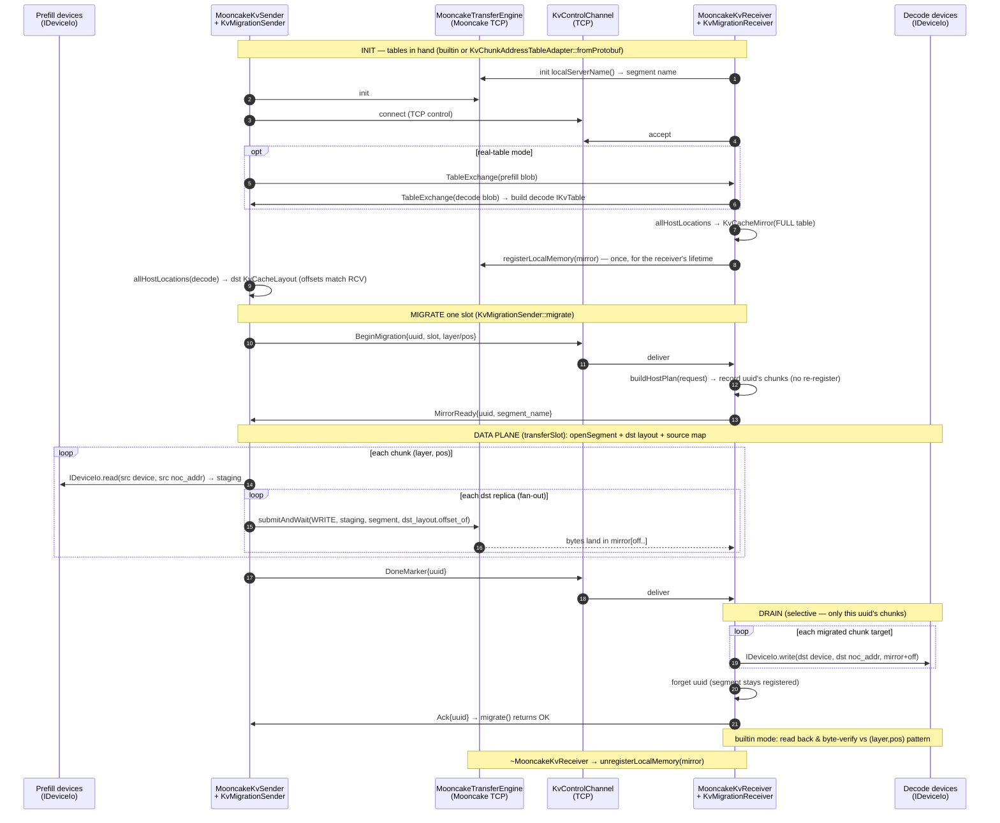

<!-- SPDX-License-Identifier: Apache-2.0 -->
<!-- SPDX-FileCopyrightText: © 2026 Tenstorrent USA, Inc. -->

# `tt::transport` — Mooncake KV-cache migration

Move a slot's KV cache from a **prefill** node's device DRAM to a **decode**
node's device DRAM over the [Mooncake Transfer Engine](https://github.com/kvcache-ai/Mooncake),
addressed by a real `KvChunkAddressTable`. The sender computes the **full
destination addressing**; the receiver only drains a host **mirror** to device.

The decode host registers **one** mirror segment over its *full* table at init,
so its offsets are stable for the receiver's lifetime — every migration (even
concurrent ones to disjoint chunks) writes into that single segment at the same
offsets the sender derives from the exchanged table.

Origin/PoC rationale (the storage/transport split, `#3890`): see
[`mooncake/poc-transfer-engine/`](../../../../mooncake/poc-transfer-engine/).

## Module stack

```
 multi-host       KvMigrationMultiHostSender (n→m fan-out)        kv_migration_multi_host_sender.*
 orchestration   KvMigrationSender / KvMigrationReceiver         kv_migration_orchestrator.*
 control plane    KvControlChannel  / KvControlMessage           over ISocketTransport (TCP; blocking, empty⇔closed)
 data plane       MooncakeKvSender  / MooncakeKvReceiver         mooncake_kv_{sender,receiver}.*
 addressing       IKvTable → allHostLocations → KvCacheLayout (full table, once)
                            → KvCacheMirror (receiver) ≡ sender dst layout
                          → buildHostPlan (per-request subset: reads/writes/drain)
 device I/O       IDeviceIo → MultiDeviceUmd → UmdDeviceAccess   (UMD, USE_METAL_CPP_LIB)
 transport        ITransferEngine → MooncakeTransferEngine       (mooncake, TT_TRANSPORT_WITH_MOONCAKE)
```

## Component & dataflow

```
            ┌──────────────── control plane (TCP) — KvControlChannel ────────────────-┐
 KvMigration│  TableExchange · BeginMigration · MirrorReady · DoneMarker · Ack        │KvMigration
   Sender  ─┤                                                                         ├─ Receiver
 (migrate)  └─────────────────────────────────────────────────────────────────────────┘ (serveOne/run)
     │ drives                                                                       drives │
     ▼                                                                                     ▼
 MooncakeKvSender.transferSlot()                                   MooncakeKvReceiver.prepareMirror()/drain()
     │                                                                                     │
     │  addressing (host-only, no tt-metal/Mooncake dep):                                  │
     │   IKvTable ─allHostLocations(host)─► KvCacheLayout  (full table, built once at init) │
     │     ├ InMemoryKvTable           (tests / reduced config)                            │
     │     └ KvChunkAddressTableAdapter → real KvChunkAddressTable (.pb)                   │
     │   sender dst layout ≡ receiver KvCacheMirror; buildHostPlan = per-request subset    │
     ▼ read (src table)                                                  drain ▼ (dst table)
 IDeviceIo (MultiDeviceUmd→UmdDeviceAccess)                                IDeviceIo
     │                          one-sided WRITE(mirror_offset)                   ▲
     └─► MooncakeTransferEngine ═══════════ Mooncake TCP/RDMA ═══════════► mirror segment
```

## Physical mirror (the addressing idea)

At init the decode host registers **one** Mooncake segment that is a **1:1 byte
image** of its *full* KV region, packed per `(device, channel)` by
`allHostLocations → KvCacheLayout`. The sender writes each chunk to the offset it
computes from the **decode** table — identical to what the receiver computes —
then the receiver drains only the touched chunks to device. Because the segment
and its offsets are fixed for the receiver's lifetime, a migration only records
*which* chunks it will drain (`prepareMirror`); it never re-registers, so
back-to-back or concurrent migrations to disjoint chunks all share the one
segment safely.

```
 decode device DRAM (per device, per channel)     host mirror buffer = ONE Mooncake segment
   (devA, ch0)  local..   ┌──────────────────►   [ (devA,ch0) | (devA,ch1) | (devB,ch3) | … ]
   (devA, ch1)  local..   │   offset = seg_base[dev,ch] + (local_addr − dev_base[dev,ch])
   (devB, ch3)  local..   │   → sender computes the SAME offset from the dst table
                          │   → also knows dst NocAddr ⇒ device→device RDMA = drop the mirror
```

Fan-out: a chunk's device group has N replicas (real table: 2) → the sender
issues N WRITEs, the receiver drains all N. A whole slot spans many devices
(and, on the real decoder table, many hosts → one segment/mirror per host).

## Multi-host fan-out (n→m)

A whole-slot migration spans several **decode hosts** (layers on different
meshes, replicas in different device groups), each its own receiver process with
its own segment + mirror + control channel. `KvMigrationMultiHostSender` drives
that n→m spread by separating two concerns:

- **Routing** — *which* hosts a request touches — is computed from the shared
  decode table via `hostsForRequest(decodeTable, request.dstSlice())`, so it is
  exact and table-driven (no guessing, no broadcast).
- **Resolution** — host → control channel — is **injected**. A static map drives
  the unit tests; a discovery service supplies the same map in production, with
  no change to this class.

It builds one per-host `MooncakeKvSender` up front (each host's destination
addressing is whole-table-stable, so it is reused across migrations) and reuses
`KvMigrationSender` for each host's `Begin → MirrorReady → Done → Ack` sequence.
Hosts are driven in deterministic sorted order. A host that is involved but
missing from the channel map, or whose per-host migration fails, fails the whole
call — but the remaining hosts are still attempted so the failure report is
comprehensive. Same all-or-nothing retry contract as `KvMigrationSender::migrate`
(re-drive the same request). Owns no threads; the per-host receivers run in their
own processes.

## End-to-end sequence



## Contract for a higher-layer caller

This module moves bytes and reports success; it deliberately does **not** decide
slot readiness, retry policy, or fault tolerance. A caller wiring it into a
migration worker (the not-yet-built integration) must uphold all of the
following — most are not enforced in code:

1. **Build both sides from byte-identical decode tables.** The sender's decode
   table and the receiver's local table must be the *same* table (exchange it via
   `exchangeTables` / `TableExchange`). Offsets are computed independently on each
   side from `allHostLocations → KvCacheLayout`; parity holds only if the inputs
   match. Mismatched tables silently misalign the mirror.

2. **Never consume a slot until `migrate()` returns `true`.** A `false` return
   means the slot is **not** migrated — the decode device may hold a partial mix
   of new and stale KV. Gate decode on success: only let the decode engine read a
   slot's KV after its migration succeeded (e.g. a per-slot ready/generation flag
   you flip on success). `drain()` is **not** atomic across chunks, so partial
   state is observable on the device; the only safe "all-or-nothing" is at *your*
   visibility boundary, not in `drain()`.

3. **Recover by retrying the same request — there is no rollback.** On failure
   the bytes remain in the persistent mirror and the receiver keeps the uuid's
   plan, so a re-sent `DoneMarker` (or a re-run `migrate()` of the *same* request)
   re-drives the drain with no re-transfer (idempotent forward recovery). Nothing
   restores the decode device's prior contents — "untouch on failure" is not
   possible because prior KV is never saved.

4. **uuids: unique per migration; don't reuse while pending.** A successful drain
   frees the uuid; a failed drain keeps it retryable. `prepareMirror` rejects a
   duplicate uuid, so a fresh `BeginMigration` must use a new uuid (retry a failed
   *drain* via `DoneMarker`, not a new `Begin`). Failed-and-never-retried uuids
   linger in the receiver's pending map — bound your retries / clean up.

5. **Serialize migrations that touch the same chunk.** Concurrent migrations to
   **disjoint** chunks are safe — they share the one registered mirror at stable,
   non-overlapping offsets. Two in-flight migrations writing the **same**
   `(device, noc_addr)` race on that mirror region; the caller must serialize
   those (it is a logical conflict regardless).

6. **Ensure prefill/decode model (chunk size) compatibility.** The sender checks
   `decode.size_bytes == prefill.size_bytes` *per chunk at transfer time* and
   aborts the migration on mismatch — there is no up-front config compatibility
   check. The caller is responsible for only pairing tables that describe the same
   model/dtype/layout.

7. **Budget host memory for the full-table mirror.** The receiver registers one
   host buffer that mirrors its **entire** local KV region at construction (not
   per request). Host DRAM cost ≈ the full decode-side KV image for this host;
   ensure headroom before constructing the receiver.

8. **Tear down (or time-bound) the control connection on give-up.** The receiver
   unblocks from a stuck migration when the peer closes the control connection
   (orderly FIN → `receive()` returns `nullopt` → `serveOne()`/`run()` exit) or a
   read timeout fires. A caller that abandons a migration must close the
   connection (or set a control-socket read timeout); production
   `TcpSocketTransport` also has TCP keepalive as a backstop. Do not keep a dead
   connection open expecting the receiver to notice on its own.

9. **Drive one migration at a time per `migrate()` call.** The control sequence is
   `Begin → MirrorReady → Done → Ack`; `migrate()` runs it synchronously and owns
   no threads. Concurrency, fault/retry policy, and ULFM-style fault tolerance
   (matching the existing MPI/DCN worker) are the caller's responsibility — this
   module implements none of them.

10. **Use a blocking, TCP-style control transport (TCP-only).** `KvControlChannel`
    requires an `ISocketTransport` whose `receiveRawData()` blocks until a full
    message and returns empty **only** on close (`TcpSocketTransport` / the e2e
    `TcpControl`). `receive()` treats an empty read as "closed". A non-blocking
    transport that returns empty to mean "no message yet" — notably
    `ZmqSocketTransport` (recv returns empty whenever its queue is momentarily
    empty) — is **not** compatible: the channel would abort a healthy migration on
    the first gap between messages. Do not select the ZMQ backend
    (`SOCKET_TRANSPORT=zmq`) for the migration control path. (ZMQ is unrelated to
    Mooncake, which carries the bulk bytes over its own TCP/RDMA transport.)

## Known optimizations & follow-ups

Deliberately deferred — correct as-is, but worth revisiting when the path is
wired to a real workload (and measured against one).

### Duplication: two multi-device DRAM-I/O layers

`MultiDeviceUmd` / `IDeviceIo` (here) and `MultiDeviceReader` / `MultiDeviceWriter`
(`tt-llm-engine/disaggregation/migration/`) both dispatch device-DRAM read/write
across a device map — two parallel implementations of the same job. Differences:
the existing layer keys I/O by `FabricNodeId` (the cross-node identity) with
async/completion support; `MultiDeviceUmd` keys by the collapsed `LocalDeviceId`
(`encodeDevice` = `mesh<<16 | chip`) and fuses read+write.

- **Cost:** any change to device-access semantics (TLB handling, fd exhaustion,
  async drain, error mapping) must land in two places, and the `LocalDeviceId`
  collapse discards the `FabricNodeId` identity the existing layer carries.
- **Follow-up:** converge on one layer when this path integrates with the
  migration worker (the README's own integration goal). Either adopt
  `MultiDeviceReader/Writer` behind `IDeviceIo`, or promote `IDeviceIo` as the
  shared interface — but not both long-term.

### Perf: fan-out WRITEs are issued serially (blocking, one-per-batch)

`transferSlot` reads each chunk once, then writes it to the N replicas of its
device group one at a time via `submitAndWait`, which allocates a **batch of 1**
and **busy-polls** `getTransferStatus` to completion (`mooncake_transfer_engine.cpp`).
So wall-clock ≈ `Σ over (chunks × replicas) of (submit + RTT)` — latency-bound in
both fan-out width and chunk count — and a core spins per in-flight transfer.
`submitAndWait` is documented as "convenience over the batched Mooncake API"; the
native API (`allocateBatchID(N)` + `submitTransfer(batchId, {entries…})` +
per-entry `getTransferStatus`) supports overlapping transfers.

Alternatives, lowest-effort first (each needs an `ITransferEngine` primitive
beyond single `submitAndWait`):

1. **Batch the per-chunk fan-out** — submit a chunk's N replica WRITEs as one
   Mooncake batch, wait once. Collapses N serialized RTTs/chunk to ~1; keeps the
   single reused staging buffer (all N writes ship the same bytes); ~N× on the
   fan-out dimension. **Recommended first step.**
2. **Batch across chunks** — submit many chunks' writes in one (or K-sized) batch.
   Max throughput, but needs one staging buffer per in-flight chunk (≈ `M×chunk`
   host memory) instead of one reused buffer.
3. **Async + double-buffer** — overlap `device_.read(chunk i+1)` with the
   in-flight WRITEs of chunk i. Needs a non-blocking submit and ≥2 staging
   buffers; composes with (1).
4. **Drop the busy-spin** — add backoff / a blocking wait in the poll loop.
   Orthogonal CPU win; free to fold into any of the above.

Cross-cutting: batching yields per-entry status, so error handling must aggregate
which replica failed into the same `ok=false` (then the [contract](#contract-for-a-higher-layer-caller)'s
retry-the-whole-request applies). The `Begin→…→Done→Ack` ordering is unaffected —
`DoneMarker` is sent only after `transferSlot` returns.

## Files

| Area | Files | Role |
|------|-------|------|
| addressing | `kv_table_view.hpp` | `IKvTable`, `FabricNode`, `KvTableConfig`, `ChunkLoc`, `encodeDevice` |
| | `in_memory_kv_table.hpp` | hand-built table (tests + reduced config) |
| | `kv_chunk_address_table_adapter.*` | `IKvTable` over the real `KvChunkAddressTable` (protobuf, guarded) |
| | `kv_table_adapter.*` | `buildHostPlan` (per-request subset) + `allHostLocations` (full table, for the init-time mirror/layout); host-filter + device-group fan-out |
| | `kv_cache_layout.*` | physical `(device,channel)` regions + `offset_of` |
| | `kv_cache_mirror.*` / `remote_region.*` | receiver mirror buffer / sender's dst view — share `KvCacheLayout` |
| device I/O | `i_device_io.hpp`, `multi_device_umd.*`, `umd_device_access.*` | per-`(device,NocAddr)` DRAM I/O via UMD |
| transport | `i_transfer_engine.hpp`, `mooncake_transfer_engine.*` | Mooncake engine wrapper (pimpl) |
| control | `kv_control_message.*`, `kv_control_channel.*` | wire messages + framed channel over a blocking `ISocketTransport` (TCP; empty read ⇔ closed) |
| data plane | `mooncake_kv_sender.*`, `mooncake_kv_receiver.*` | read→WRITE(fan-out) / register full mirror once at init + per-uuid selective drain |
| orchestration | `kv_migration_orchestrator.*` | `migrate()` / `serveOne()`+`run()` over the control channel |
| multi-host | `kv_migration_multi_host_sender.*` | sender-side n→m fan-out: route via `hostsForRequest`, one per-host sender + orchestrator per decode host |
| PoC (#3890) | `i_storage_backend.hpp`, `*_storage_backend.*`, `mooncake_migration_worker.*` | original dummy-tensor storage/transport split |

## Build guards

Every real backend sits behind a guard with a no-op fallback, so `transport_lib`
+ tests build in **every** configuration. tt-metal/Mooncake hide behind pimpls.

| Guard | Enables | Flag |
|-------|---------|------|
| `USE_METAL_CPP_LIB` | real UMD device-DRAM I/O | `--blaze` |
| `TT_TRANSPORT_WITH_MOONCAKE` | real Mooncake transport | `--mooncake` (implies `--blaze`) |
| `TT_TRANSPORT_WITH_KV_TABLE` | real `KvChunkAddressTable` adapter (protobuf) | `-DENABLE_KV_TABLE=ON` (needs `migration_lib`) |

## Build & run

```bash
./build.sh                  # both guards OFF — everything builds (no-op fallbacks)
./build.sh --blaze          # real UMD device-DRAM
./build.sh --mooncake       # real Mooncake transport → builds the e2e harnesses

cd build && ctest --output-on-failure          # unit tests (any config)
#   kv_cache_addressing_test · kv_table_adapter_test · kv_control_channel_test
#   mooncake_kv_migration_test · kv_migration_orchestrator_test  (all host-only)
#   TransportKvMigrationE2E  (host+builtin real-Mooncake round trip; --mooncake build)

# Real KV migration, host + builtin table, no hardware (orchestration + addressing
# + real Mooncake TCP, host-backed device store). This IS the ctest above — the
# binary runs the receiver in-process and fork()s its own sender:
./build/transport_kv_migration_e2e
# Hardware / real-table paths can't run in one gtest process, so they stay on the
# two-process shell harness (--role sender|receiver):
MODE=device  tests/e2e/scripts/run_transport_kv_migration_e2e.sh      # real device DRAM (--blaze + HW)
TABLE=prefill_kv_table.pb DECODE_TABLE=decoder_kv_table.pb \
             tests/e2e/scripts/run_transport_kv_migration_e2e.sh      # real table (-DENABLE_KV_TABLE=ON)
```

## Status

| Layer | Validation |
|-------|-----------|
| addressing (full-table layout/offset, mirror↔sender parity, adapter, host plan) | unit-tested (any build) |
| control codec + channel + table exchange | unit-tested (loopback) |
| data plane sender→wire→receiver→device (fan-out, multi-channel, one mirror registered once, concurrent disjoint migrations) | unit-tested (fakes) |
| orchestration (Begin/MirrorReady/Done/Ack) over a threaded channel | unit-tested |
| multi-host n→m fan-out (routing via `hostsForRequest`, per-host orchestration, partial-failure reporting) | unit-tested (fakes) |
| real Mooncake TCP, host store (full round trip, fan-out) | ctest `TransportKvMigrationE2E` (`--mooncake` build, no HW) |
| real UMD device DRAM / real `.pb` table / multi-host scale-out | manual shell-harness run (+`--blaze`/HW/`ENABLE_KV_TABLE`) |

The sender computing both `mirror_offset` **and** the dst `NocAddr` is what makes
device→device RDMA a localized swap: drop the mirror, WRITE straight to the
device address — no change to addressing or orchestration.


## Worker discovery via the Mooncake Metadata Service (#4209)

OS-assigned ports change on every start, so two independent hosts can't hard-code each
other's address. The metadata service is a shared registry that fixes this: the receiver
registers under a **predefined logical name** mapped to its **auto-detected IP + dynamic
port**, and the sender looks up that name to resolve the live address. No rendezvous
file, no fixed port. **Host RAM only.**

```
   receiver: init(metadata, name="kv-receiver-0") + registerLocalMemory
                 └─► metadata service: kv-receiver-0 → {IP, dynamic port}
   sender:   openSegment("kv-receiver-0")  ──► service resolves the address
                 └─► submitTransfer (TCP, one tensor)
```

Driver: `migration_worker_discovery` (`--mooncake` only). Start the metadata service on a
host both peers can reach, then run a receiver and a sender:

```bash
# Single-host smoke test (auto-starts the service, runs both workers):
tests/e2e/scripts/run_migration_worker_discovery.sh

# Two-host run:
#  metadata host (META_HOST): serves http://0.0.0.0:18080/metadata
tests/integration/run_mooncake_metadata_server.sh
#  receiver host:
MC_TCP_BIND_ADDRESS=<receiver-ip> build/migration_worker_discovery --role receiver \
  --metadata http://META_HOST:18080/metadata --name kv-receiver-0 --bytes 1048576
#  sender host:
build/migration_worker_discovery --role sender \
  --metadata http://META_HOST:18080/metadata --name kv-sender-0 \
  --peer kv-receiver-0 --bytes 1048576
```

Gotchas:
- **HTTP metadata plugin must be compiled in** (`USE_HTTP ON` in
  `tt-llm-engine/cmake/mooncake.cmake`, with `libcurl` on the include/library path), else
  the client aborts with `Unable to find metadata storage plugin http`.
- **Use the wheel's `http_metadata_server.py`** (what `run_mooncake_metadata_server.sh`
  starts), not `mooncake_master` — the latter serves a different route and 404s every
  PUT/GET.
- **Multi-NIC hosts:** set `MC_TCP_BIND_ADDRESS=<this host's IP>` so the engine advertises
  a reachable interface (auto-detect may pick `docker0`/`flannel.1`).
- The `404 metadata not found` lines at startup are **expected** — the engine probes for
  its own name before registering it.

## Mooncake Migration Worker discovery

`bringup_mooncake_worker` is the worker's entry point / composition root (one process per
worker). `PeerDiscoveryService` owns *how* peers are resolved (the resolve-with-retry loop +
timeout); `MooncakeMigrationWorker` owns the ordered lifecycle — allocate host-DRAM pool → init
engine → register/publish (makes us discoverable) → **delegate** peer discovery → hold until
SIGTERM → teardown in reverse. **Register-before-discover** is the invariant the worker owns.
Workers are symmetric peers: each takes its own `--name` and its peers as `--peer`; success
is `CONNECTED to N peers` then `READY`. Logic is launcher-agnostic — a bash loop, MPI, or an
orchestrator all just spawn one process per worker.

**MPI e2e test** (`tests/e2e/scripts/run_migration_workers_mpi.sh`, ctest
`MooncakeMpiDiscovery`): starts the metadata service, then `mpirun -np 20` launches 4 prefill +
16 decode workers on one host. `migration_worker_rank_launch.sh` maps each rank to a
disaggregated topology — `prefill-p` peers `decode-(4p..4p+3)`, each `decode-d` peers back to
`prefill-(d/4)` — and the test passes once all 20 log `CONNECTED` within the timeout.

```bash
# all 20 workers, self-contained (auto-starts metadata service):
WORKER_BIN=./build/bringup_mooncake_worker \
  tests/e2e/scripts/run_migration_workers_mpi.sh
```

## Validation status

| Step | Status |
|------|--------|
| Interfaces + host-DRAM round-trip + worker staging (`transport_test`, any build) | impl |
| Device-DRAM backend single-galaxy round-trip (UMD, `--blaze`) | impl |
| Mooncake transport loopback TCP (host backend, `--mooncake`) | impl |
| Two-galaxy acceptance, both backends enabled | pending a two-process HW run |
| Metadata-service worker discovery, two hosts, host RAM (#4209, `migration_worker_discovery`) | **validated** (two hosts, 1 MiB tensor, byte-verified MATCH) |
| Productionized discovery worker (#4294, `bringup_mooncake_worker`) | **validated locally** (single host, MPI `-np 20` = 4 prefill + 16 decode, all `CONNECTED`→`READY`; run manually, not yet wired into CI) |

Note: the unit/smoke `transport_test` runs in any CI build; the MPI discovery
e2e (`MooncakeMpiDiscovery`) is currently a manual/local check (it needs the
Mooncake build + a metadata service) and is not yet in a GitHub workflow.

## Future work

**Wiring into the tt-llm-engine migration worker:**
The existing KV-migration worker lives in
[`../../tt-llm-engine/disaggregation/migration/`](../../tt-llm-engine/disaggregation/migration/)
and already moves KV cache galaxy-to-galaxy over **MPI/DCN** with ULFM fault
tolerance. It routes all transport through an abstract `SenderBackend` /
`ReceiverBackend` interface (today only `DcnSenderBackend`). Add a 
`MooncakeSenderBackend` implementing that same interface. Mooncake fills
*capability* gaps (multi-NIC RDMA bandwidth, dynamic membership, a pooled global
KV-cache store with cross-request prefix reuse), not a correctness hole. 

**Discovery lifecycle (post-merge):** discovery resolves peers once at bring-up and the
worker then holds the handles until SIGTERM. Steady-state membership changes are not yet
handled — if a peer crashes and restarts on a new dynamic port, its cached `SegmentHandle`
goes stale. Production needs periodic peer health checks and re-discovery/reconnection on
peer restart (plus metrics: peer count, time-to-ready, reconnection events). Discovery is
already cancellable (a SIGTERM during bring-up aborts the poll loop promptly); wiring the
MPI e2e into CI is also pending.
