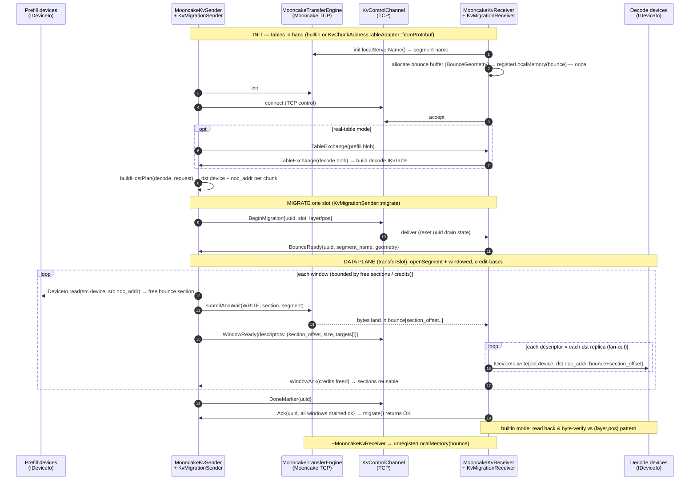

<!-- SPDX-License-Identifier: Apache-2.0 -->
<!-- SPDX-FileCopyrightText: © 2026 Tenstorrent USA, Inc. -->

# `tt::transport` — Mooncake KV-cache migration (RDMA-over-host)

Move a slot's KV cache from a **prefill** node's device DRAM to a **decode**
node's device DRAM over the [Mooncake Transfer Engine](https://github.com/kvcache-ai/Mooncake),
addressed by a real `KvChunkAddressTable`. The sender computes the **full
destination addressing** and streams the slot through a small, double-pinned
host **bounce buffer** on the decode side; the receiver drains each window from
the bounce buffer to device DRAM.

> The sender fills the bounce buffer **a window at a time** (windowed +
> credit-based, pipelined so device reads overlap in-flight network WRITEs). The
> buffer is **double-pinned** — the *same* host buffer is both `ibv_reg_mr`'d for
> the NIC and NOC-mapped for DRISC device DMA. Placement is by **explicit
> per-window descriptors** the sender sends over the control channel, so the
> receiver holds **no table**. Device I/O is **DRISC NOC-DMA** (`DriscDeviceIo`).

Origin/PoC rationale (the storage/transport split, `#3890`): see
[`mooncake/poc-transfer-engine/`](../../../../mooncake/poc-transfer-engine/).

## Module stack

```
 multi-host       KvMigrationMultiHostSender (n→m fan-out)      kv_migration_multi_host_sender.*
 orchestration    KvMigrationSender / KvMigrationReceiver   kv_migration_orchestrator.*
 control plane    KvControlChannel / KvControlMessage               over ISocketTransport (TCP/RDMA; BounceReady · WindowReady · WindowAck)
 data plane       MooncakeKvSender / MooncakeKvReceiver     mooncake_kv_{sender,receiver}.*
 bounce buffer      KvBounceBuffer + BounceSectionAllocator                  kv_bounce_buffer.* (double-pinned: DoublePinnedBuffer + KvStagingPool)
 addressing       IKvTable → buildHostPlan (per-request subset) → per-window slot descriptors
 device I/O       IDeviceIo → DriscDeviceIo (NOC-DMA)                (coexistence UMD open, USE_METAL_CPP_LIB)
 transport        ITransferEngine → MooncakeTransferEngine          (mooncake, TT_TRANSPORT_WITH_MOONCAKE; TCP or RDMA)
```

## Component & dataflow

```
            ┌──────────────── control plane (TCP) — KvControlChannel ────────────────-┐
 KvMigration│  TableExchange · BeginMigration · BounceReady · WindowReady · WindowAck  │KvMigration
   Sender  ─┤                                            · DoneMarker · Ack            ├─ Receiver
 (migrate)  └─────────────────────────────────────────────────────────────────────────┘ (serveOne/run)
     │ drives                                                                       drives │
     ▼                                                                                     ▼
 MooncakeKvSender.transferSlot()                                   MooncakeKvReceiver.drainWindow()
     │                                                                                     │
     │  addressing (host-only, no tt-metal/Mooncake dep):                                  │
     │   IKvTable ─buildHostPlan(host, request)─► per-window bounce-section descriptors    │
     │     ├ InMemoryKvTable           (tests / reduced config)                            │
     │     └ KvChunkAddressTableAdapter → real KvChunkAddressTable (.pb)                   │
     │   sender owns ALL addressing (dst device + noc_addr per descriptor)                 │
     ▼ read (src table)                                       drain ▼ (per-window descrs)
 IDeviceIo (DriscDeviceIo, NOC-DMA)                                       IDeviceIo
     │            one-sided WRITE(free section) ─► WindowReady ─► drain ─► WindowAck ▲
     └─► MooncakeTransferEngine ═══════ Mooncake TCP/RDMA ═══════► bounce buffer (small segment)
```

## Addressing & the bounce buffer

The decode host registers **one** small Mooncake segment — the **bounce buffer**
(`BounceGeometry`: `section_count` fixed-size sections, tens of MiB by default),
double-pinned so the same host buffer is `ibv_reg_mr`'d for the NIC and
NOC-mapped for DRISC device DMA. It is **not** a picture of the KV region and
holds **no table**: a migration streams through it a window at a time.

The **sender** owns all addressing. From the **decode** table it computes, per
window, a set of `BounceSectionDescriptor`s — each names a free section it filled
and the destination `DrainTarget`s (device + `noc_addr`) that section's bytes
belong to. It one-sided-WRITEs the bytes into free sections, sends `WindowReady`
with those descriptors, and the receiver `drainWindow`s each section straight to
the device address(es) it is told, then returns the sections as credits
(`WindowAck`). The receiver only bounds-checks each section against the buffer.

```
 free sections fill ─► WindowReady{descriptors} ─► receiver drains ─► WindowAck{credits freed}
   descriptor = { section_offset, size, targets:[ {device, noc_addr}, … ] }
   sender knows the dst NocAddr directly ⇒ device→device RDMA = write straight to the device
```

Fan-out: a chunk's device group has N replicas (real table: 2) → a descriptor
lists N `targets`, and `drainWindow` writes the section to all N. A whole slot
spans many devices (and, on the real decoder table, many hosts → one bounce
buffer + receiver per host).

## Multi-host fan-out (n→m)

A whole-slot migration spans several **decode hosts** (layers on different
meshes, replicas in different device groups), each its own receiver process with
its own bounce buffer + segment + control channel. `KvMigrationMultiHostSender`
drives that n→m spread by separating two concerns:

- **Routing** — *which* hosts a request touches — is computed from the shared
  decode table via `hostsForRequest(decodeTable, request.dstSlice())`, so it is
  exact and table-driven (no guessing, no broadcast).
- **Resolution** — host → control channel — is **injected**. A static map drives
  the unit tests; a discovery service supplies the same map in production, with
  no change to this class.

It builds one per-host `MooncakeKvSender` up front (each host's destination
addressing is whole-table-stable, so it is reused across migrations) and reuses
`KvMigrationSender` for each host's `Begin → BounceReady → [WindowReady/WindowAck]*
→ Done → Ack` sequence. The per-host senders share one double-pinned staging
pool (the fan-out is serial).
Hosts are driven in deterministic sorted order. A host that is involved but
missing from the channel map, or whose per-host migration fails, fails the whole
call — but the remaining hosts are still attempted so the failure report is
comprehensive. Same all-or-nothing retry contract as `KvMigrationSender::migrate`
(re-drive the same request). Owns no threads; the per-host receivers run in their
own processes.

## End-to-end sequence



## Integration: the Kafka migration worker

`mooncake_kv_migration_worker` (`src/mooncake_kv_migration_worker_main.cpp`) is
the deployable binary that drives this data plane from a Kafka trigger — one
process, `--role prefill|decode`. The transport-lib pieces it composes:

- **`MooncakeMigrationExecutor`** (`mooncake_migration_executor.*`) — an
  `IMigrationExecutor` that runs `KvMigrationMultiHostSender::migrate` on a
  background thread and acks the terminal status. The Kafka consume-loop
  (`KvMigrationWorker`) hands each parsed request to it.
- **`KvControlChannelConnector` / `KvMigrationReceiverServer`**
  (`kv_migration_endpoints.*`) — prefill opens one control channel per decode
  host (injected `TcpSocketTransport` factory); decode runs
  `KvMigrationReceiver::run()` behind a server transport. `run()` waits
  indefinitely between requests (an idle receive is retried) and exits only when
  the connection closes.
- **Tables & device map** — `resolveEngineTables` (`engine_table_resolve.*`)
  always loads the KV `.pb` from disk (`--prefill-table` / `--table`; production
  path is typically the engine export under `/tmp`). The FabricNode→UMD
  DeviceMap is separate: prefer `--engine-handoff-port N` (worker listens;
  co-located engine or `engine_handoff_sender` / deploy pushes the map only),
  else `--device-map` file (`device_map_io.*`, `mesh chip umd` lines). The raw
  `.pb` blob is kept for peer `TABLE_EXCHANGE`. Transfer path is fail-closed:
  `engine_handoff_sender` exits non-zero on a missing/unreadable/empty map, and
  socket resolve rejects an empty handoff (no silent placeholder push). Device
  map is **required** when a host's table spans multiple meshes — the
  `& 0xFFFF` placeholder collides across meshes and is refused once a non-empty
  map is in play. At open, `buildDeviceIo` resolves each entry's ASIC
  `umd_chip_id` to the local visible-device index via a one-time enumeration
  (`enumerateDevicesByUniqueId`); an id matching no visible chip is a clean
  fail (nothing opened), and a KV location whose NoC channel exceeds the opened
  chip's DRAM-channel count is rejected as a table/device-map mismatch. Until
  the model runner pushes the map itself:

  ```bash
  mooncake_kv_migration_worker ... --table /tmp/local.pb --engine-handoff-port 18700
  print_local_device_map | engine_handoff_sender --host 127.0.0.1 --port 18700 \
    --device-map-stdin
  ```

The worker does **no** byte-verify of its own (it moves real KV). To validate the
data plane end-to-end without a model, bracket a migration with the standalone
`kv_seed_verify` helper (seed the prefill source, verify the decode dest). Full
two-galaxy procedure: `tests/e2e/TRANSPORT_KV_MIGRATION_E2E.md` §13.

## Contract for a higher-layer caller

This module moves bytes and reports success; it deliberately does **not** decide
slot readiness, retry policy, or fault tolerance. A caller wiring it into a
migration worker — `mooncake_kv_migration_worker` does this (see **Integration**
above and the run guide `tests/e2e/TRANSPORT_KV_MIGRATION_E2E.md` §13) — must
uphold all of the following (most are not enforced in code):

1. **The decode `.pb` must describe the decode host's real device layout.** The
   sender addresses every write from the decode table (obtained via
   `exchangeTables` / `TableExchange`); the receiver holds no table and drains to
   the device coordinates the sender puts in each descriptor. A decode table that
   doesn't match the decode devices silently sends bytes to the wrong address.

2. **Never consume a slot until `migrate()` returns `true`.** A `false` return
   means the slot is **not** migrated — the decode device may hold a partial mix
   of new and stale KV. Gate decode on success: only let the decode engine read a
   slot's KV after its migration succeeded (e.g. a per-slot ready/generation flag
   you flip on success). `drainWindow()` is **not** atomic across a window's
   targets, so partial state is observable on the device; the only safe
   "all-or-nothing" is at *your* visibility boundary, not in the drain.

3. **Recover by re-running the same request — there is no rollback.** The bounce
   buffer is transient (windows are overwritten as credits free), so there is no
   persistent buffer to re-drain: on failure, re-run `migrate()` for the *same*
   request and it re-transfers the windows from source. Nothing restores the
   decode device's prior contents — "untouch on failure" is not possible because
   prior KV is never saved.

4. **uuids: unique per migration.** A `BeginMigration` resets that uuid's drain
   state on the receiver, so a retry is a fresh `Begin` (which re-transfers).
   Don't reuse a uuid for a *different* request while one is in flight.

5. **Serialize migrations that touch the same chunk.** The module drives one
   migration at a time per receiver (contract 9). Two migrations that write the
   **same** `(device, noc_addr)` are a logical conflict regardless of ordering;
   the caller must serialize those.

6. **Ensure prefill/decode model (chunk size) compatibility.** The sender checks
   `decode.size_bytes == prefill.size_bytes` *per chunk at transfer time* and
   aborts the migration on mismatch — there is no up-front config compatibility
   check. The caller is responsible for only pairing tables that describe the same
   model/dtype/layout.

7. **Host memory is a small fixed bounce buffer.** The receiver registers one
   `BounceGeometry`-sized host buffer at construction (`section_count *
   section_size`, tens of MiB by default) — independent of the KV region size.
   The window/credit handshake bounds in-flight bytes to that buffer, so a
   whole-slot migration streams through it regardless of slot size.

8. **Close the control connection on give-up.** `run()` (the long-lived decode
   server) waits indefinitely for the next request and exits **only when the
   control connection closes** (`receiveMessage()` → `Closed`; an idle read
   timeout is retried, not treated as a close — so the server survives arbitrary
   gaps between requests). A caller that abandons a migration must therefore
   **close the connection** to unblock the receiver; production
   `TcpSocketTransport` also has TCP keepalive as a backstop. (`serveOne()`, the
   stepwise/test entry, still returns on either a close or a timeout.) Do not keep
   a dead connection open expecting the receiver to notice on its own.

9. **Drive one migration at a time per `migrate()` call.** The control sequence is
   `Begin → BounceReady → [WindowReady/WindowAck]* → Done → Ack`; `migrate()` runs
   it synchronously and owns no threads. Concurrency, fault/retry policy, and ULFM-style fault tolerance
   (matching the existing MPI/DCN worker) are the caller's responsibility — this
   module implements none of them.

10. **Use a TCP-style control transport with a tri-state receive (TCP-only).**
    `KvControlChannel` drives the transport's `tryReceiveMessage()`, which must
    distinguish **DATA** / **NO_DATA** (live connection, nothing buffered yet —
    including a server still awaiting its client) / **CLOSED**. `NO_DATA` is
    retried up to the channel's timeout; only `CLOSED` ends a `receive()` (and
    ends `run()`). `TcpSocketTransport` (and the e2e `TcpControl`) provide this. A
    transport that returns *empty* for both "no message yet" and "closed" —
    notably `ZmqSocketTransport` (recv returns empty whenever its queue is
    momentarily empty) — is **not** compatible: the channel can't tell an idle gap
    from a real close, so it would abort a healthy migration on the first gap (or
    never notice a genuine close). Use a blocking TCP-style transport for the
    migration control path. (ZMQ is unrelated to Mooncake, which carries the bulk
    bytes over its own TCP/RDMA transport.)

## Known optimizations & follow-ups

Deliberately deferred — correct as-is, but worth revisiting when the path is
wired to a real workload (and measured against one).

### `IDeviceIo` collapses the FabricNode identity

`DriscDeviceIo` is the single `IDeviceIo`, built on the disaggregation DRISC
path (`DriscSocketLink`, which constructs the `MultiDevice{Reader,Writer}` TUs).
`IDeviceIo` keys I/O by the collapsed `LocalDeviceId` (`encodeDevice` =
`mesh<<16 | chip`), which discards the `FabricNodeId` identity the disaggregation
layer carries — a thin adapter over that layer, worth revisiting if a caller
needs the full node identity.

### Perf: fan-out WRITEs are issued serially (blocking, one-per-batch)

`transferSlot` reads each chunk once, then writes it to the N replicas of its
device group one at a time via `submitAndWait`, which allocates a **batch of 1**
and **busy-polls** `getTransferStatus` to completion (`mooncake_transfer_engine.cpp`).
So wall-clock ≈ `Σ over (chunks × replicas) of (submit + RTT)` — latency-bound in
both fan-out width and chunk count — and a core spins per in-flight transfer.
`submitAndWait` is documented as "convenience over the batched Mooncake API"; the
native API (`allocateBatchID(N)` + `submitTransfer(batchId, {entries…})` +
per-entry `getTransferStatus`) supports overlapping transfers.

Alternatives, lowest-effort first (each needs an `ITransferEngine` primitive
beyond single `submitAndWait`):

1. **Batch the per-chunk fan-out** — submit a chunk's N replica WRITEs as one
   Mooncake batch, wait once. Collapses N serialized RTTs/chunk to ~1; keeps the
   single reused staging buffer (all N writes ship the same bytes); ~N× on the
   fan-out dimension. **Recommended first step.**
2. **Batch across chunks** — submit many chunks' writes in one (or K-sized) batch.
   Max throughput, but needs one staging buffer per in-flight chunk (≈ `M×chunk`
   host memory) instead of one reused buffer.
3. **Async + double-buffer** — overlap `device_.read(chunk i+1)` with the
   in-flight WRITEs of chunk i. Needs a non-blocking submit and ≥2 staging
   buffers; composes with (1).
4. **Drop the busy-spin** — add backoff / a blocking wait in the poll loop.
   Orthogonal CPU win; free to fold into any of the above.

Cross-cutting: batching yields per-entry status, so error handling must aggregate
which replica failed into the same `ok=false` (then the [contract](#contract-for-a-higher-layer-caller)'s
retry-the-whole-request applies). The `Begin→…→Done→Ack` ordering is unaffected —
`DoneMarker` is sent only after `transferSlot` returns.

## Files

| Area | Files | Role |
|------|-------|------|
| addressing | `kv_table_view.hpp` | `IKvTable`, `FabricNode`, `KvTableConfig`, `ChunkLoc`, `encodeDevice` |
| | `in_memory_kv_table.hpp` | hand-built table (tests + reduced config) |
| | `kv_chunk_address_table_adapter.*` | `IKvTable` over the real `KvChunkAddressTable` (protobuf, guarded) |
| | `kv_table_adapter.*` | `buildHostPlan` (per-request subset) + `allHostLocations` (full table, to enumerate the host's local devices to open); host-filter + device-group fan-out |
| | `kv_cache_layout.*` | physical `(device,channel)` regions + `offset_of` |
| device I/O | `i_device_io.hpp`, `drisc_device_io.*` | per-`(device,NocAddr)` DRAM I/O via DRISC NOC-DMA |
| transport | `i_transfer_engine.hpp`, `mooncake_transfer_engine.*` | Mooncake engine wrapper (pimpl) |
| control | `kv_control_message.*`, `kv_control_channel.*` | wire messages + framed channel over an `ISocketTransport` (TCP; tri-state recv: DATA / NO_DATA=retry / CLOSED) |
| data plane | `mooncake_kv_sender.*`, `mooncake_kv_receiver.*` | read→WRITE into free bounce sections (fan-out) / register bounce buffer once + per-window drain |
| orchestration | `kv_migration_orchestrator.*` | `migrate()` / `serveOne()`+`run()` over the control channel |
| multi-host | `kv_migration_multi_host_sender.*` | sender-side n→m fan-out: route via `hostsForRequest`, one per-host sender + orchestrator per decode host |
| integration | `mooncake_migration_executor.*` | `IMigrationExecutor` driving `KvMigrationMultiHostSender` — the Kafka worker's trigger→data-plane bridge |
| | `kv_migration_endpoints.*` | prefill control-channel connector + decode receiver-server (injected socket transport) |
| | `kv_table_provisioning.*` | `loadKvTableFile` (+ optional table-blob exchange over the control channel) |
| | `device_map.hpp`, `device_map_io.*`, `engine_table_handoff.*`, `engine_table_resolve.*` | `FabricNode→UMD chip` map + file `.pb` resolve + socket DeviceMap handoff |
| PoC (#3890) | `i_storage_backend.hpp`, `*_storage_backend.*`, `mooncake_migration_worker.*` | original dummy-tensor storage/transport split |

## Build guards

Every real backend sits behind a guard with a no-op fallback, so `transport_lib`
+ tests build in **every** configuration. tt-metal/Mooncake hide behind pimpls.

| Guard | Enables | Flag |
|-------|---------|------|
| `USE_METAL_CPP_LIB` | real DRISC NOC-DMA device-DRAM I/O | `--blaze` |
| `TT_TRANSPORT_WITH_MOONCAKE` | real Mooncake transport | `--mooncake` (implies `--blaze`) |
| `TT_TRANSPORT_WITH_KV_TABLE` | real `KvChunkAddressTable` adapter (protobuf) | `-DENABLE_KV_TABLE=ON` (needs `migration_lib`) |

## Build & run

```bash
./build.sh                  # both guards OFF — everything builds (no-op fallbacks)
./build.sh --blaze          # real DRISC NOC-DMA device-DRAM (needs MIGRATION_DRISC_SERVICE_ELF at run time)
./build.sh --mooncake       # real Mooncake transport → builds the e2e harnesses

cd build && ctest --output-on-failure          # unit tests (any config)
#   kv_table_adapter_test · kv_control_channel_test · kv_bounce_buffer_test
#   mooncake_kv_migration_test · kv_migration_orchestrator_test
#   drisc_device_io_test · double_pinned_buffer_test  (all host-only)
#   TransportKvMigrationE2E  (host+builtin real-Mooncake round trip; --mooncake build)

# Real KV migration, host + builtin table, no hardware (orchestration + addressing
# + real Mooncake TCP, host-backed device store). This IS the ctest above — the
# binary runs the receiver in-process and fork()s its own sender:
./build/transport_kv_migration_e2e
# Hardware / real-table paths can't run in one gtest process, so they stay on the
# two-process shell harness (--role sender|receiver):
MODE=device  tests/e2e/scripts/run_transport_kv_migration_e2e.sh      # real device DRAM via DRISC (--blaze + HW + MIGRATION_DRISC_SERVICE_ELF)
TABLE=prefill_kv_table.pb DECODE_TABLE=decoder_kv_table.pb \
             tests/e2e/scripts/run_transport_kv_migration_e2e.sh      # real table (-DENABLE_KV_TABLE=ON)

# Mooncake wire defaults to TCP; PROTOCOL=rdma switches per-window WRITEs to
# one-sided RDMA (needs an RNIC — cross-host only). Both e2e scripts take it.
# See tests/e2e/TRANSPORT_KV_MIGRATION_E2E.md §2 / §7.8.
PROTOCOL=rdma tests/e2e/scripts/run_transport_kv_migration_e2e.sh
```

## Status

| Layer | Validation |
|-------|-----------|
| addressing (per-window bounce-section descriptors, sender-owned dst addressing, adapter, host plan) | unit-tested (any build) |
| control codec + channel + table exchange | unit-tested (loopback) |
| data plane sender→wire→receiver→device (fan-out, multi-channel, bounce buffer registered once, windowed credit-based drain) | unit-tested (fakes) |
| orchestration (Begin/BounceReady/[WindowReady/WindowAck]*/Done/Ack) over a threaded channel | unit-tested |
| multi-host n→m fan-out (routing via `hostsForRequest`, per-host orchestration, partial-failure reporting) | unit-tested (fakes) |
| real Mooncake TCP, host store (full round trip, fan-out) | ctest `TransportKvMigrationE2E` (`--mooncake` build, no HW) |
| real DRISC device DRAM / real `.pb` table / multi-host scale-out | **not yet HW-validated** — the DRISC device path needs a byte-verified 2-galaxy run (shell harness + `mooncake_kv_migration_worker`, `--blaze`/HW/`ENABLE_KV_TABLE`) |

The sender already knows the dst `NocAddr` for every descriptor, so
device→device RDMA is a localized change: WRITE straight to the device address
instead of the bounce buffer — no change to addressing or orchestration.


## Worker discovery via the Mooncake Metadata Service (#4209)

OS-assigned ports change on every start, so two independent hosts can't hard-code each
other's address. The metadata service is a shared registry that fixes this: the receiver
registers under a **predefined logical name** mapped to its **auto-detected IP + dynamic
port**, and the sender looks up that name to resolve the live address. No rendezvous
file, no fixed port. **Host RAM only.**

```
   receiver: init(metadata, name="kv-receiver-0") + registerLocalMemory
                 └─► metadata service: kv-receiver-0 → {IP, dynamic port}
   sender:   openSegment("kv-receiver-0")  ──► service resolves the address
                 └─► submitTransfer (TCP, one tensor)
```

Driver: `migration_worker_discovery` (`--mooncake` only). Start the metadata service on a
host both peers can reach, then run a receiver and a sender:

```bash
# Single-host smoke test (auto-starts the service, runs both workers):
tests/e2e/scripts/run_migration_worker_discovery.sh

# Two-host run:
#  metadata host (META_HOST): serves http://0.0.0.0:18080/metadata
tests/integration/run_mooncake_metadata_server.sh
#  receiver host:
MC_TCP_BIND_ADDRESS=<receiver-ip> build/migration_worker_discovery --role receiver \
  --metadata http://META_HOST:18080/metadata --name kv-receiver-0 --bytes 1048576
#  sender host:
build/migration_worker_discovery --role sender \
  --metadata http://META_HOST:18080/metadata --name kv-sender-0 \
  --peer kv-receiver-0 --bytes 1048576
```

Gotchas:
- **HTTP metadata plugin must be compiled in** (`USE_HTTP ON` in
  `tt-llm-engine/cmake/mooncake.cmake`, with `libcurl` on the include/library path), else
  the client aborts with `Unable to find metadata storage plugin http`.
- **Use the wheel's `http_metadata_server.py`** (what `run_mooncake_metadata_server.sh`
  starts), not `mooncake_master` — the latter serves a different route and 404s every
  PUT/GET.
- **Multi-NIC hosts:** set `MC_TCP_BIND_ADDRESS=<this host's IP>` so the engine advertises
  a reachable interface (auto-detect may pick `docker0`/`flannel.1`).
- The `404 metadata not found` lines at startup are **expected** — the engine probes for
  its own name before registering it.

## Mooncake Migration Worker discovery

`bringup_mooncake_worker` is the worker's entry point / composition root (one process per
worker). `PeerDiscoveryService` owns *how* peers are resolved (the resolve-with-retry loop +
timeout); `MooncakeMigrationWorker` owns the ordered lifecycle — allocate host-DRAM pool → init
engine → register/publish (makes us discoverable) → **delegate** peer discovery → hold until
SIGTERM → teardown in reverse. **Register-before-discover** is the invariant the worker owns.
Workers are symmetric peers: each takes its own `--name` and its peers as `--peer`; success
is `CONNECTED to N peers` then `READY`. Logic is launcher-agnostic — a bash loop, MPI, or an
orchestrator all just spawn one process per worker.

**MPI e2e test** (`tests/e2e/scripts/run_migration_workers_mpi.sh`, ctest
`MooncakeMpiDiscovery`): starts the metadata service, then `mpirun -np 20` launches 4 prefill +
16 decode workers on one host. `migration_worker_rank_launch.sh` maps each rank to a
disaggregated topology — `prefill-p` peers `decode-(4p..4p+3)`, each `decode-d` peers back to
`prefill-(d/4)` — and the test passes once all 20 log `CONNECTED` within the timeout.

```bash
# all 20 workers, self-contained (auto-starts metadata service):
WORKER_BIN=./build/bringup_mooncake_worker \
  tests/e2e/scripts/run_migration_workers_mpi.sh
```

## KV table exchange at bring-up (#4295)

Production path is `mooncake_kv_migration_worker` (deployed by
`scripts/deploy_migration_workers.sh`). There is **one** prefill `.pb` and
**one** decode `.pb` for the fleet. Each role loads only its own file, then
both sides exchange tables over control `TABLE_EXCHANGE` (prefill dials;
decode listens and replies):

```
decode:  load decode.pb → register bounce buffer → control server
       → on TABLE_EXCHANGE: store prefill.pb, reply with decode.pb
prefill: load prefill.pb → resolvePeers → openChannels → awaitConnected
       → TABLE_EXCHANGE with one decode (send prefill.pb, recv decode.pb)
       → build sender → READY / Kafka
```

TE/Mooncake moves **KV bytes** only. `--decode-table` on prefill remains a
no-peer fallback. Deploy default: prefill peers every decode; decode peers none.
Control receive timeout on the worker is raised so a 100–350+ MiB exchange can
finish at bring-up.

## Validation status

| Step | Status |
|------|--------|
| Interfaces + host-DRAM round-trip + worker staging (`transport_test`, any build) | impl |
| Device-DRAM round-trip via DRISC NOC-DMA (`--blaze` + HW + `MIGRATION_DRISC_SERVICE_ELF`) | impl — **not yet HW-validated** |
| Mooncake transport loopback TCP (host backend, `--mooncake`) | impl |
| Two-galaxy acceptance — addressing + orchestration + Mooncake TCP (host store) | **validated** — byte-verified 1→1 across 2 galaxies |
| Two-galaxy acceptance — real device DRAM on HW (DRISC) | **pending** — needs a byte-verified 2-galaxy run on the DRISC device path |
| Unified worker `mooncake_kv_migration_worker` (Kafka→migration→ack) orchestration, 2 galaxies | **validated** — real Kafka trigger, byte-verified via `kv_seed_verify` (run guide §13); the device I/O underneath needs the DRISC HW run above |
| Metadata-service worker discovery, two hosts, host RAM (#4209, `migration_worker_discovery`) | **validated** (two hosts, 1 MiB tensor, byte-verified MATCH) |
| Productionized discovery worker (#4294, `bringup_mooncake_worker`) | **validated locally** (single host, MPI `-np 20` = 4 prefill + 16 decode, all `CONNECTED`→`READY`; run manually, not yet wired into CI) |

Note: the unit/smoke `transport_test` runs in any CI build; the MPI discovery
e2e (`MooncakeMpiDiscovery`) is currently a manual/local check (it needs the
Mooncake build + a metadata service) and is not yet in a GitHub workflow.

## Future work

**Wiring into the tt-llm-engine migration worker:**
The existing KV-migration worker lives in
[`../../tt-llm-engine/disaggregation/migration/`](../../tt-llm-engine/disaggregation/migration/)
and already moves KV cache galaxy-to-galaxy over **MPI/DCN** with ULFM fault
tolerance. It routes all transport through an abstract `SenderBackend` /
`ReceiverBackend` interface (today only `DcnSenderBackend`). Add a 
`MooncakeSenderBackend` implementing that same interface. Mooncake fills
*capability* gaps (multi-NIC RDMA bandwidth, a pooled global KV-cache store with
cross-request prefix reuse), not a correctness hole. 

**Discovery lifecycle (current + remaining):** Prefill bring-up resolves peers
from metadata, opens control channels, and fail-closes Ready until
TABLE_EXCHANGE succeeds with every configured decode. After Ready, a mesh watch
re-resolves `kv_control/<name>`, `replaceChannel`s when the endpoint moves, and
re-runs TABLE_EXCHANGE when TCP comes back (skipping via try_lock when migrate
owns the channel). After a successful exchange it also `refreshSegment`s the
peer so Mooncake WRITEs do not keep a pre-restart SegmentDesc. Still open:
TE refresh failure metrics, peer-count / time-to-ready / reconnection
dashboards, and wiring the MPI discovery e2e into CI. Discovery remains
cancellable (SIGTERM during bring-up aborts promptly).
