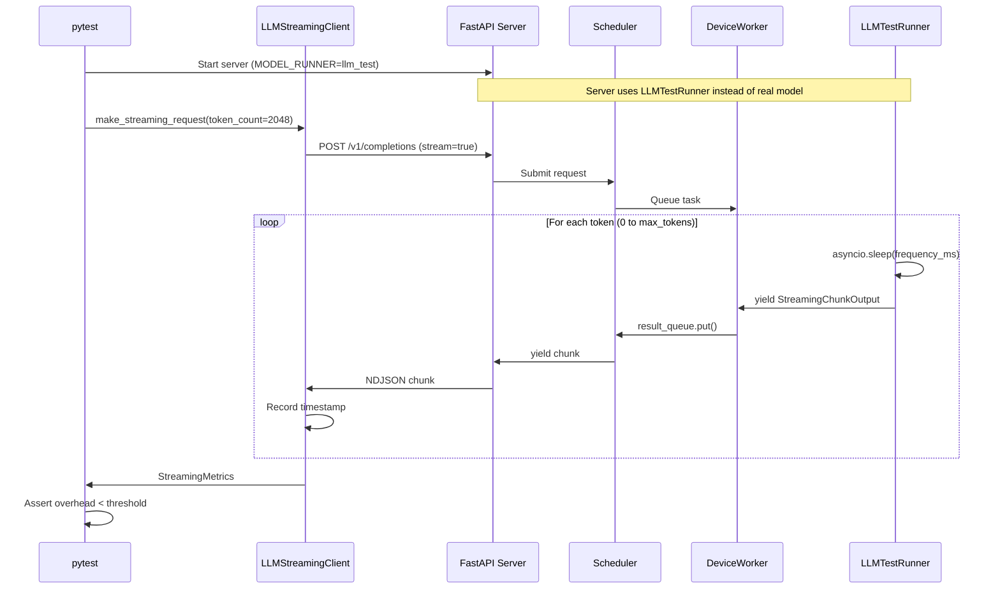

# Performance Tests

Performance regression in streaming infrastructure can silently degrade user experience. These tests catch bottlenecks early by measuring the overhead added by the server's async pipeline (queues, schedulers, HTTP layer) on top of model inference time.

## Architecture



## Components

### LLMTestRunner (`tt_model_runners/llm_test_runner.py`)

A mock model runner that emits tokens at a precise interval. It replaces real model inference during performance tests.

| Config | Value | Description |
|--------|-------|-------------|
| Frequency | 20ms | Milliseconds between token emissions |

> **Note**: The frequency is defined in `performance_tests/conftest.py` as `TEST_RUNNER_FREQUENCY_MS = 20` (single source of truth) and passed to the server via environment variable.

The runner emits **exactly** the number of tokens specified in the request's `max_tokens` parameter (which corresponds to `token_count` in the test client). Each chunk contains `token_{i}`:

```python
for i in range(request.max_tokens):
    await asyncio.sleep(frequency_seconds)
    yield StreamingChunkOutput(chunk=CompletionStreamChunk(text=f"token_{i}"))
```

### LLMStreamingClient (`llm_streaming_client.py`)

Async HTTP client that makes streaming requests and records precise timestamps for each received token. The `token_count` parameter specifies how many tokens to request—the LLMTestRunner will return exactly this many tokens.

### StreamingMetrics (`streaming_metrics.py`)

Collects timing samples and computes:
- **received_token_count**: Number of tokens received
- **mean_receive_interval_ms**: Average time between consecutive tokens
- **calculate_overhead_ms()**: `mean_receive_interval - TEST_RUNNER_FREQUENCY_MS`
- **throughput_tokens_per_second**: Tokens received per second

### Test (`test_llm_streaming.py`)

The main performance test that:
1. Starts the server with `MODEL_RUNNER=llm_test`
2. Sends a streaming request for N tokens
3. Measures timing overhead
4. Fails if overhead exceeds threshold

## Running Tests

```bash
# Run performance tests
pytest performance_tests/test_llm_streaming.py -vs -m performance

# With custom threshold (default: 3ms overhead per token)
TEST_RUNNER_MAX_PER_TOKEN_OVERHEAD_MS=5 pytest performance_tests/ -vs -m performance
```

## Failure Conditions

| Condition | Threshold | Meaning |
|-----------|-----------|---------|
| Token loss | 0 | All requested tokens must be received |
| Per-token overhead | 3ms | Server adds < 3ms latency per token |

## Example Output

```
StreamingMetrics(
    received_tokens=2048,
    total_streaming_time_ms=42150.32,
    mean_receive_interval_ms=20.58,
    throughput_tokens_per_second=48.57,
)
Overhead per token: 0.58ms
```
