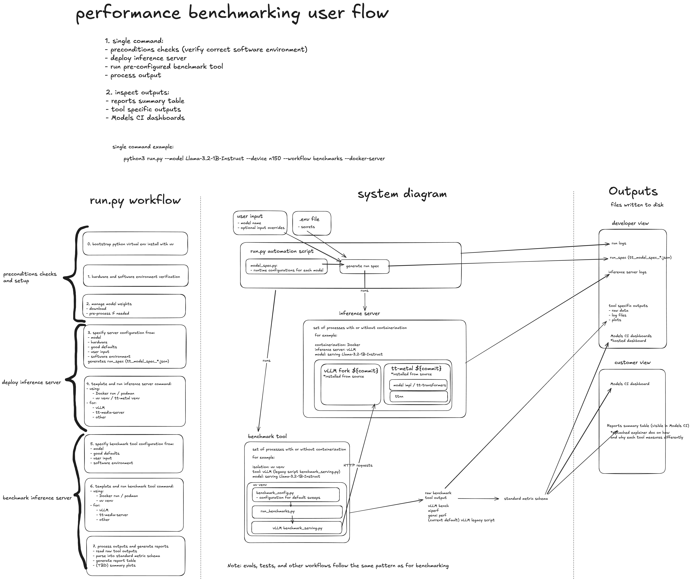

# tt-inference-server workflow runner

This project provides a command-line interface (CLI) to run various workflows related to the Tenstorrent inference server. It supports executing workflows locally or via Docker, handling environment setup, dependency management, and logging for multiple models and workflow types.
Table of Contents

- [Overview](#overview)
- [Features](#features)
- [Prerequisites](#prerequisites)
- [Installation](#installation)
- [run.py CLI Usage](#runpy-cli-usage)
- [Client Side Scripts](#client-side-scripts)
- [Workflow Setup](#workflow-setup)
- [Project Structure](#project-structure)
- [Error Handling](#error-handling)

# Overview

The main entry point of the project is `run.py`. This script enables you to execute different workflows—such as benchmarks, evals, server, release, or report—by specifying the model and workflow type. Depending on your configuration, workflows can run on your host system or inside a Docker container.

The module workflows/run_local.py is responsible for setting up the local execution environment. It handles tasks such as bootstrapping a virtual environment, installing dependencies, configuring workflow-specific settings, and finally launching the workflow script.
Features

    Multiple Workflows: Run benchmarks, evals, server, release, and report workflows.
    Execution Modes: Choose between running workflows locally or in Docker mode.
    Automatic Setup: Manages environment setup, including virtual environments and dependency installation.
    Logging: Detailed logging for tracking execution, errors, and debugging.

## Example diagram for benchmarks workflow



The workflows that run end to end tests on the inference server (benchmarks, evals, tests, spec_tests, and stress_tests) all follow the same pattern in configuring how to send HTTP requests to the inference server.

## Prerequisites

    Python 3.8+: Required to run the CLI and setup scripts.
    Docker: Needed if running workflows in Docker mode.
    Git: Required for cloning repositories during setup (e.g., for the llama-cookbook used in meta evals).

## Installation

Clone the Repository:
```
git clone https://github.com/yourusername/tt-inference-server.git
cd tt-inference-server
```

The workflows automatically create their own virtual environments as needed. You can execute the CLI directly using Python:
```
python run.py --model <model_name> --workflow <workflow_type> --device <device_type>
```
Dependencies:

Required dependencies are installed during the workflow setup process. Ensure you have internet connectivity for downloading packages and cloning any necessary repositories.

## run.py CLI Usage

Execute the CLI using run.py with the appropriate command-line arguments.
```
Command-line Arguments

Required Arguments:

    --model (required):
    Specifies the model to run. The available models are defined in MODEL_SPECS.

    --workflow (required):
    Specifies the workflow to run. Valid options include:
        benchmarks
        evals
        server
        release
        reports
        tests

    --device (required):
    Specifies the device to use. Choices include:
        cpu - CPU execution
        n150 - Tenstorrent N150 card  
        n300 - Tenstorrent N300 card
        p100 - Tenstorrent P100 card (Blackhole)
        p150 - Tenstorrent P150 card (Blackhole)
        t3k - TT-QuietBox/TT-LoudBox systems
        galaxy - Tenstorrent Galaxy systems
        gpu - GPU execution

Optional Arguments:

    --impl (optional):
    Implementation option. If not specified, the default implementation for the model and device will be inferred automatically.

    --local-server (optional):
    Run inference server on localhost.

    --docker-server (optional):
    Run inference server in Docker container.

    -it, --interactive (optional):
    Run docker in interactive mode.

    --workflow-args (optional):
    Additional workflow arguments (e.g., 'param1=value1 param2=value2').

    --service-port (optional):
    SERVICE_PORT. Defaults to 8000 or the SERVICE_PORT environment variable.

    --disable-trace-capture (optional):
    Disables trace capture requests, use to speed up execution if inference server already running and traces captured.

    --dev-mode (optional):
    Enable developer mode.

    --override-docker-image (optional):
    Override the Docker image used by --docker-server, ignoring the model config.

    --device-id (optional):
    Tenstorrent device ID (e.g. '0' for /dev/tenstorrent/0). Specifies which Tenstorrent device to use when multiple devices are available.

    --override-tt-config (optional):
    Override TT config as JSON string (e.g., '{"data_parallel": 16}'). This allows you to override Tenstorrent-specific configuration parameters that control model execution behavior on TT hardware. Common parameters include data_parallel settings, dispatch configurations, and memory allocation options.

    --vllm-override-args (optional):
    Override vLLM arguments as JSON string (e.g., '{"max_model_len": 4096, "enable_chunked_prefill": true}'). This allows you to override vLLM server configuration parameters such as max_model_len, max_num_seqs, enable_chunked_prefill, and other vLLM-specific settings that control inference behavior.

Example Commands

Run the evals workflow locally:

    python3 run.py --model Qwen2.5-72B-Instruct --workflow evals --device N150

Run a workflow with a Docker server:

    python3 run.py --model Llama-3.3-70B-Instruct --workflow evals --device T3K --docker-server

Run benchmarks workflow:

    python3 run.py --model Llama-3.3-70B-Instruct --workflow benchmarks --device T3K

Run server workflow in Docker with interactive mode:

    python3 run.py --model Llama-3.3-70B-Instruct --workflow server --device T3K --docker-server --interactive

Run with custom service port and additional workflow arguments:

    python3 run.py --model Qwen2.5-72B-Instruct --workflow evals --device N150 --service-port 9000 --workflow-args "batch_size=4 max_tokens=512"
```

## Client Side Scripts

The `run.py` CLI can be used to run client-side workflows (benchmarks and evals) against an external vLLM server that is already running and serving traffic. This is useful when you have a vLLM server deployed separately and want to run evaluations or benchmarks against it without managing the server lifecycle through `run.py`.

### Prerequisites for Client Side Usage

1. **External vLLM Server**: You must have a vLLM server already running and accessible via HTTP/HTTPS
2. **Model Compatibility**: The external server must be serving a model that is defined in the `MODEL_SPECS`
3. **Network Access**: The client machine running `run.py` must have network access to the vLLM server

### Supported Client Side Workflows

The following workflows can be run as client-side scripts against an external vLLM server:

- **benchmarks**: Performance benchmarking against the external server
- **evals**: Model evaluation and testing against the external server

### Configuration

To use `run.py` with an external vLLM server, you need to configure the server endpoint:

1. **Set the SERVICE_PORT environment variable** to match your external server's port:
   ```bash
   export SERVICE_PORT=8000  # Replace with your server's port
   ```

2. **[optional] Set the server JWT secret** for authorization (if set on server):
   ```bash
   export JWT_SECRET=my-string-secret
   ```

### Usage Examples

Run benchmarks against an external vLLM server:
```bash
# Server running on localhost:8000
python3 run.py --model Llama-3.3-70B-Instruct --workflow benchmarks --device T3K --disable-trace-capture

# can use --service-port or SERVICE_PORT env var to set another port
SERVICE_PORT=9000 python3 run.py --model Qwen2.5-72B-Instruct --workflow benchmarks --device N150 --disable-trace-capture
```

Run evaluations against an external vLLM server:
```bash
# Server running on localhost:8000
python3 run.py --model Llama-3.3-70B-Instruct --workflow evals --device T3K --disable-trace-capture

# can use --service-port or SERVICE_PORT env var to set another port
python3 run.py --model Qwen2.5-72B-Instruct --workflow evals --device N150 --disable-trace-capture --service-port 7592
```

Run multiple model inference servers, each must be on a separate card
```bash
# run model on multiple devices
python3 run.py --model Llama-3.1-8B-Instruct --workflow server --device n300 --docker-server --dev-mode --device-id 0
python3 run.py --model Llama-3.1-8B-Instruct --workflow server --device n300 --docker-server --dev-mode --device-id 1
```

### Important Notes

- **Use `--disable-trace-capture`**: When running against an external server, it's recommended to use the `--disable-trace-capture` flag to speed up execution, especially if the server is already running and traces have been captured previously.

- **Model Configuration**: The `--model` parameter must match a model defined in `MODEL_SPECS`, and the external server must be serving that exact model or a compatible variant.

- **Device Parameter**: The `--device` parameter is still required but represents the target hardware the model was optimized for, not necessarily the hardware the external server is running on.

- **No Server Management**: When running client-side scripts, `run.py` will not start, stop, or manage any inference servers. It assumes the external server is already running and accessible.

- **Authentication**: If your external vLLM server requires authentication, ensure the necessary tokens or credentials are configured in your environment.

### Troubleshooting

- **Connection Issues**: Verify the external server is accessible by testing with curl or a similar tool:
  ```bash
  curl http://your-server:port/v1/models
  ```

- **Model Mismatch**: Ensure the model served by the external server matches the model specified in the `--model` parameter.

- **Port Conflicts**: Make sure the `SERVICE_PORT` environment variable matches the actual port your external server is listening on.


## Workflow Setup

The module workflows/run_local.py handles local workflow execution through the WorkflowSetup class, which:

    Bootstraps the Environment:
    Checks the Python version, creates a virtual environment using the uv tool, and installs necessary packages.

    Configures Workflow-Specific Settings:
    Depending on the workflow type (benchmarks, evals, tests), it creates dedicated virtual environments, prepares datasets (e.g., for meta evals), and adjusts configuration files as needed.

    Executes the Workflow Script:
    After setup, it constructs the command line and executes the main workflow script with proper logging and output redirection.

## Project Structure
```
.
├── run.py                   # Main CLI entry point.
├── VERSION                  # Contains the current project version.
├── workflows/
│   ├── run_local.py         # Module for local workflow execution.
│   ├── run_docker.py        # Module for Docker-based execution (under development).
│   ├── model_spec.py               # Model configuration definitions.
│   ├── setup_host.py        # Host setup functions.
│   ├── utils.py             # Utility functions (logging, directory checks, etc.).
│   ├── workflow_config.py   # Workflow configuration details.
│   └── ...                  # Other workflow-related modules.
├── evals/
│   ├── eval_config.py       # Evaluation configuration details.
│   └── run_evals.py         # Evals run script.
```
## Error Handling

    Logging:
    Errors are caught in the main try/except block in run.py and are logged with detailed stack traces.

    Not Yet Implemented:
    Some workflows (e.g., benchmarks, server) currently raise NotImplementedError to indicate that further development is needed.


## Model config

All data known for a given model ahead of runtime is defined compactly and inferred where possible in the ModelSpec object defined in `workflows/model_spec.py`.

For example: `Llama-3.3-70B`
```python
    ModelSpec(
        impl=tt_transformers_impl,
        default_impl_map={
            DeviceTypes.T3K: True,
        },
        device_configurations={DeviceTypes.T3K},
        weights={
            "meta-llama/Llama-3.3-70B",
            "meta-llama/Llama-3.3-70B-Instruct",
            "meta-llama/Llama-3.1-70B",
            "meta-llama/Llama-3.1-70B-Instruct",
            "deepseek-ai/DeepSeek-R1-Distill-Llama-70B",
        },
        tt_metal_commit="v0.57.0-rc71",
        vllm_commit="2a8debd",
        status="testing",
    ),
```
Key concepts:

* weights: the ordered list of model weights that a model config is valid for. The same config is copied and made available in MODEL_SPECS map for each of the defined weights strs to match.
* default_impl_map: Maps each device type to a bool indicating whether this implementation is the default for that device. The default implementation will be used if one is not specified directly on CLI.
* device_configurations: the hardware supported for the model implementation and model architecture.

The performance targets for each model-hardware combination are defined in `benchmarking/benchmark_targets/model_performance_reference.json` key used is the default_impl ModelSpec's 1st model weights model name. This model name e.g. `Llama-3.3-70B` above, uniquely defines the targets for all models weights of the same model architecture. These base theoretical targets are the same for all implementations for the same model architecture and hardware combination. Targets can be added directly to a specific ModelSpec as needed for additional points of comparison.

The model evaluation targets are defined only for each model weights because they are dependent on the different outputs from models, not on the model implementation or the hardware running it.
