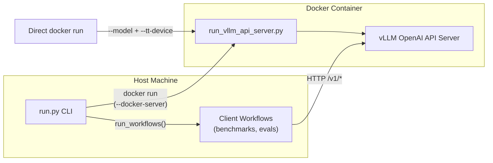
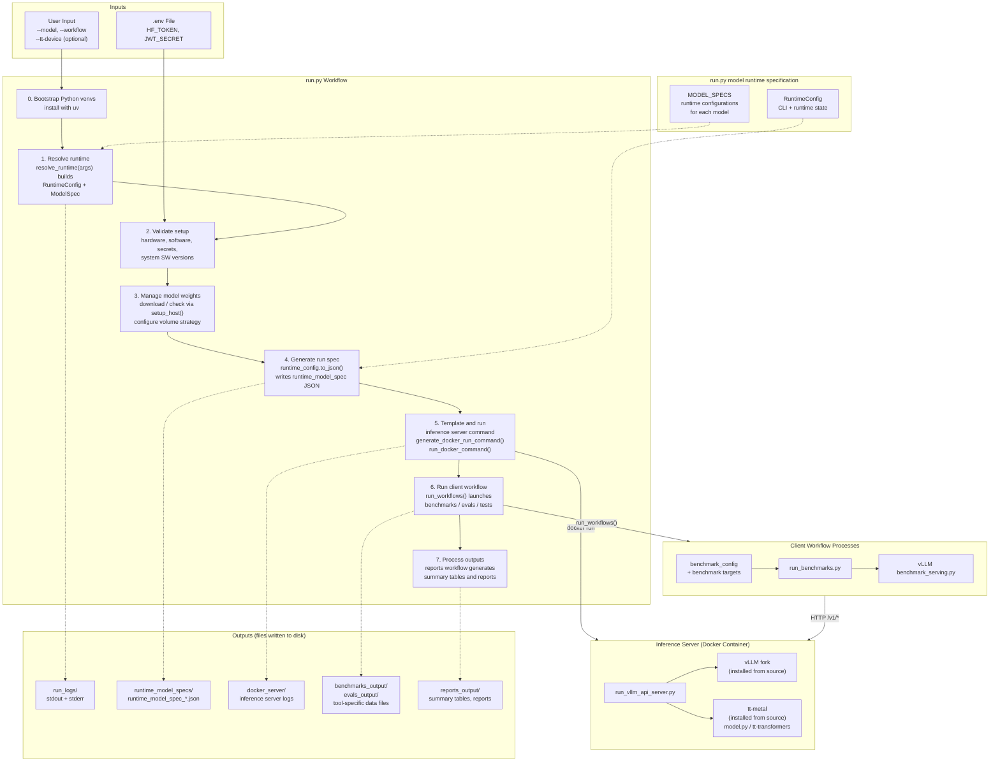
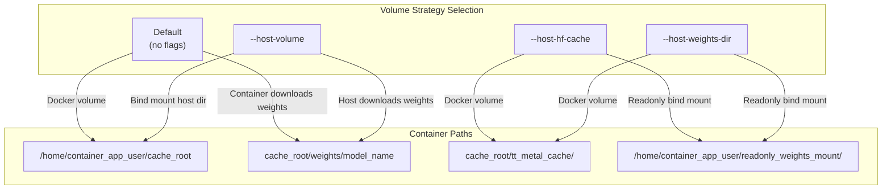
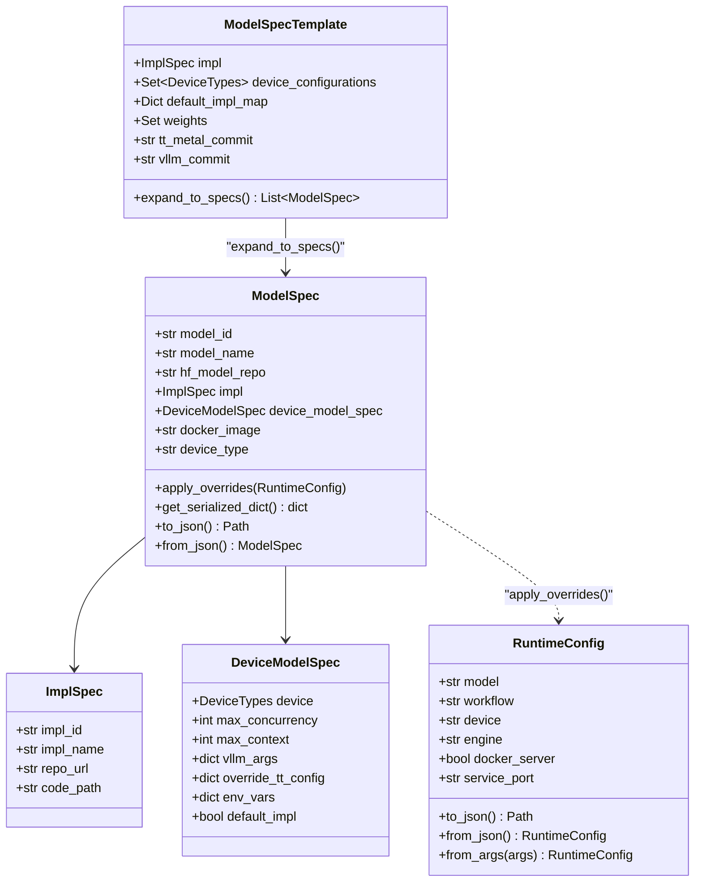

# tt-inference-server workflow runner

This project provides a command-line interface (CLI) to run various workflows related to the Tenstorrent inference server. It supports executing workflows locally or via Docker, handling environment setup, dependency management, and logging for multiple models and workflow types.

## Table of Contents

- [Overview](#overview)
- [Features](#features)
- [run.py Execution Flow](#runpy-execution-flow)
- [Prerequisites](#prerequisites)
- [Installation](#installation)
- [run.py CLI Usage](#runpy-cli-usage)
  - [Host Storage Options](#host-storage-options)
  - [Print Docker Command](#print-docker-command)
- [Container Interface](#container-interface)
- [Client Side Scripts](#client-side-scripts)
- [Workflow Setup](#workflow-setup)
- [Project Structure](#project-structure)
- [Error Handling](#error-handling)
- [Model Config](#model-config)

## Overview

The inference server has two independent interfaces:

1. **`run.py`** (host-side) -- optionally used to template the `docker run` command, validate the runtime, configure host setup, and run client-side workflows (`benchmarks`, `evals`).
2. **Container interface** (`run_vllm_api_server.py`) -- can be used independently from `run.py` via a direct `docker run` command, accepting `--model` and `--tt-device` to self-resolve the model spec from a bundled JSON. See the [container interface documentation](../vllm-tt-metal/README.md#container-interface-direct-docker-run).


```mermaid
flowchart LR
  subgraph host ["Host Machine"]
    runpy["run.py CLI"]
    client["Client Workflows<br/>(benchmarks, evals)"]
  end

  subgraph container ["Docker Container"]
    entrypoint["run_vllm_api_server.py"]
    vllm["vLLM OpenAI API Server"]
  end

  runpy -->|"docker run<br/>(--docker-server)"| entrypoint
  runpy -->|"run_workflows()"| client
  entrypoint --> vllm
  client -->|"HTTP /v1/*"| vllm

  directDocker["Direct docker run"] -->|"--model + --tt-device"| entrypoint
```

The `run.py` host-side CLI is optional. Users can either:
- Use `run.py --docker-server` to automate Docker setup, weight downloads, and container launch.
- Run the container directly with `docker run <image> --model <model> --tt-device <device>`.

Client workflows (`benchmarks`, `evals`, `reports`) send HTTP requests to the model inference server to measure performance (`benchmarks`) and accuracy (`evals`) and generate reports. Inference servers are: vLLM OpenAI API server, tt-media-server, or other in future.

## Features

- **Multiple Workflows**: Run benchmarks, evals, server, release, and report workflows.
- **Execution Modes**: Choose between running workflows locally or in Docker mode.
- **Automatic Setup**: Manages environment setup, including virtual environments and dependency installation.
- **Device Auto-Detection**: `--tt-device` is inferred from host hardware via `tt-smi` when omitted.
- **Docker Volume Strategies**: Four mutually exclusive strategies for persisting weights and caches.
- **Logging**: Detailed logging for tracking execution, errors, and debugging.

## run.py Execution Flow

Single command example:

```bash
python3 run.py --model Llama-3.2-1B-Instruct --tt-device n150 --workflow benchmarks --docker-server
```


```mermaid
flowchart TD
  subgraph inputs ["Inputs"]
    userInput["User Input<br/>--model, --workflow<br/>--tt-device (optional)"]
    envFile[".env File<br/>HF_TOKEN, JWT_SECRET"]
  end

  subgraph runpySteps ["run.py Workflow"]
    step0["0. Bootstrap Python venvs<br/>install with uv"]
    step1["1. Resolve runtime<br/>resolve_runtime(args) builds<br/>RuntimeConfig + ModelSpec"]
    step2["2. Validate setup<br/>hardware, software, secrets,<br/>system SW versions"]
    step3["3. Manage model weights<br/>download / check via setup_host()<br/>configure volume strategy"]
    step4["4. Generate run spec<br/>runtime_config.to_json()<br/>writes runtime_model_spec JSON"]
    step5["5. Template and run<br/>inference server command<br/>generate_docker_run_command()<br/>run_docker_command()"]
    step6["6. Run client workflow<br/>run_workflows() launches<br/>benchmarks / evals / tests"]
    step7["7. Process outputs<br/>reports workflow generates<br/>summary tables and reports"]
  end

  subgraph runpyCore ["run.py model runtime specification"]
    modelSpec["MODEL_SPECS<br/>runtime configurations<br/>for each model"]
    runtimeConfig["RuntimeConfig<br/>CLI + runtime state"]
  end

  subgraph inferenceServer ["Inference Server (Docker Container)"]
    entrypoint["run_vllm_api_server.py"]
    vllmFork["vLLM fork<br/>(installed from source)"]
    ttMetal["tt-metal<br/>(installed from source)<br/>model.py / tt-transformers"]
    entrypoint --> vllmFork
    entrypoint --> ttMetal
  end

  subgraph clientWorkflows ["Client Workflow Processes"]
    benchConfig["benchmark_config<br/>+ benchmark targets"]
    runBench["run_benchmarks.py"]
    benchServing["vLLM benchmark_serving.py"]
    runBench --> benchServing
    benchConfig --> runBench
  end


  subgraph outputFiles ["Outputs (files written to disk)"]
    runLogs["run_logs/<br/>stdout + stderr"]
    runSpecs["runtime_model_specs/<br/>runtime_model_spec_*.json"]
    serverLogs["docker_server/<br/>inference server logs"]
    toolOutputs["benchmarks_output/<br/>evals_output/<br/>tool-specific data files"]
    reports["reports_output/<br/>summary tables, reports"]
  end

  userInput --> step0
  envFile --> step2
  step0 --> step1
  step1 --> step2
  step2 --> step3
  step3 --> step4
  step4 --> step5
  step5 --> step6
  step6 --> step7

  modelSpec -.-> step1
  runtimeConfig -.-> step4

  step5 -->|"docker run"| inferenceServer
  step6 -->|"run_workflows()"| clientWorkflows
  clientWorkflows -->|"HTTP /v1/*"| inferenceServer

  step4 -.-> runSpecs
  step5 -.-> serverLogs
  step6 -.-> toolOutputs
  step7 -.-> reports
  step1 -.-> runLogs
```

Evals, tests, stress_tests, and other client workflows follow the same pattern as benchmarks: wait for the inference server to be healthy, optionally capture traces, then send HTTP requests to the server.

## Prerequisites

- **Python 3.8+**: Required to run the CLI and setup scripts.
- **Docker**: Needed if running workflows in Docker mode.
- **Git**: Required for cloning repositories during setup (e.g., for the llama-cookbook used in meta evals).

## Installation

Clone the repository:

```bash
git clone https://github.com/tenstorrent/tt-inference-server.git
cd tt-inference-server
```

The workflows automatically create their own virtual environments as needed. You can execute the CLI directly using Python:
```
python run.py --model <model_name> --workflow <workflow_type> --tt-device <device_type>
```
Dependencies:

Required dependencies are installed during the workflow setup process. Ensure you have internet connectivity for downloading packages and cloning any necessary repositories.

## run.py CLI Usage

`run.py` is the host-side automation CLI. It can optionally be used to:
1. Template the `docker run` command for the [container interface](../vllm-tt-metal/README.md#container-interface-direct-docker-run)
2. Validate the runtime environment
3. Configure the host setup (weights download, volume creation)
4. Run client-side workflows (`benchmarks`, `evals`)

```
Usage: python3 run.py --model <model> --workflow <workflow> [options]
```

### Command-line Arguments

**Required Arguments:**

| Argument | Description |
|---|---|
| `--model` | Model to run. Available models are defined in `MODEL_SPECS`. |
| `--workflow` | Workflow to run: `benchmarks`, `evals`, `server`, `release`, `reports`, `tests`. |

**Model and Device Arguments:**

| Argument | Default | Description |
|---|---|---|
| `--tt-device` | Largest supported device on host | Target device: `n150`, `n300`, `p100`, `p150`, `t3k`, `galaxy`. The legacy alias `--device` is still supported. |
| `--impl` | Model spec default | Implementation option. If not specified, the default implementation for the model and device is inferred. |
| `--engine` | Model spec default | Inference engine override: `vllm`, `media`, `forge`. |

**Server Arguments:**

| Argument | Default | Description |
|---|---|---|
| `--docker-server` | false | Run inference server in a Docker container. |
| `--local-server` | false | Run the vLLM inference server directly on the host. Requires `--tt-metal-home` and always uses host filesystem persistence for logs and TT caches. |
| `-it`, `--interactive` | false | Run Docker in interactive mode. |
| `--service-port` | `8000` | Service port for inference HTTP server, e.g. vLLM. |
| `--bind-host` | `0.0.0.0` | Host interface for Docker port publishing. Use `127.0.0.1` for localhost-only access. |
| `--no-auth` | false | Disable vLLM API key authorization (skips `JWT_SECRET` requirement). |
| `--print-docker-cmd` | false | Print the Docker run command and exit without starting the server. |

**Host Storage Options:**

| Argument | Default | Description |
|---|---|---|
| `--host-volume` | None for Docker, repo `persistent_volume/` for local when omitted | Host directory for persistent cache/log/tensor storage. |
| `--host-hf-cache` | None | Host HuggingFace cache directory to reuse for model weights. If the flag is given without a path, it defaults to `HOST_HF_HOME`, then `HF_HOME`, then `~/.cache/huggingface`. |
| `--host-weights-dir` | None | Host directory with pre-downloaded model weights. |
| `--image-user` | `1000` | UID passed to `docker run --user`. Docker only; `--local-server` ignores this flag and runs as the invoking host user. Must match the UID the image was built with. Default release images use UID `1000`. Only override when using a custom image built with a different UID. |

Only one of `--host-volume`, `--host-hf-cache`, `--host-weights-dir` can be specified explicitly. For `--local-server`, omitting all three still uses the repo `persistent_volume/` path for TT caches and logs.

**Advanced Arguments:**

| Argument | Description |
|---|---|
| `--dev-mode` | Enable developer mode (bind mounts source code into container). |
| `--override-docker-image` | Override the Docker image used by `--docker-server`. |
| `--device-id` | Tenstorrent device IDs, comma-separated PCI indices (e.g. `0` or `0,1,2`). |
| `--override-tt-config` | Override TT config as JSON string (e.g., '{"data_parallel": 16}'). |
| `--vllm-override-args` | Override vLLM arguments as JSON string (e.g., '{"max_model_len": 4096}'). |
| `--disable-trace-capture` | Disable trace capture requests to speed up execution. |
| `--workflow-args` | Additional workflow arguments (e.g., 'param1=value1 param2=value2'). |


### Secrets

Secrets can be provided via a `.env` file in the repository root or as environment variables:

```bash
# Option 1: .env file (automatically loaded by run.py)
HF_TOKEN=hf_...
JWT_SECRET=my-secret-string

# Option 2: environment variables
export HF_TOKEN=hf_...
export JWT_SECRET=my-secret-string
```

### Host Storage Options

When running with `--docker-server`, `run.py` supports four mutually exclusive strategies for how model weights and caches are persisted. For `--local-server`, the same flags choose the model weights source, but logs and TT caches always live on the host filesystem under a persistent volume root.


```mermaid
flowchart TD
  subgraph strategies ["Volume Strategy Selection"]
    default_strat["Default<br/>(no flags)"]
    hostVol["--host-volume"]
    hostHF["--host-hf-cache"]
    hostWeights["--host-weights-dir"]
  end

  subgraph containerPaths ["Container Paths"]
    cacheRoot["/home/container_app_user/cache_root"]
    weightsDir["cache_root/weights/model_name"]
    ttCache["cache_root/tt_metal_cache/"]
    roMount["/home/container_app_user/readonly_weights_mount/"]
  end

  default_strat -->|"Docker volume"| cacheRoot
  default_strat -->|"Container downloads weights"| weightsDir

  hostVol -->|"Bind mount host dir"| cacheRoot
  hostVol -->|"Host downloads weights"| weightsDir

  hostHF -->|"Readonly bind mount"| roMount
  hostHF -->|"Docker volume"| ttCache

  hostWeights -->|"Readonly bind mount"| roMount
  hostWeights -->|"Docker volume"| ttCache
```

**File permissions for Docker modes:** The container runs as a non-root user. There is no root-level entrypoint that adjusts permissions at startup, so mounted volumes must already be accessible to the image's built-in UID (UID `1000` for default release images). `--local-server` is different: it launches a host process and therefore uses the invoking host user's permissions instead of `--image-user`.

| Strategy | Host permission requirement |
|---|---|
| Docker named volume (default) | None. Docker seeds the volume from the image with correct ownership. |
| `--host-volume` (bind mount) | Host directory must be **writable** by the image UID (e.g. `sudo chown 1000 <path>`). |
| `--host-hf-cache` / `--host-weights-dir` (readonly bind mounts) | Host path must be **readable** by the image UID. TT Metal caches use a separate Docker named volume. |

**1. Docker volume (default)**

No flags needed. A Docker volume is created automatically for model weights and TT Metal caches. Weights are downloaded inside the container on first start via `ensure_weights_available()`. No host permission setup is needed.

```bash
python3 run.py --model Llama-3.1-8B-Instruct --workflow server --docker-server
```

**2. Host persistent volume (`--host-volume`)**

Bind mounts an entire host directory as the container's `cache_root`. All data (weights, TT Metal caches) lives on the host filesystem. Weights are downloaded on the host by `setup_host()`. The host directory must be writable by the image's built-in UID (UID `1000` for default release images, e.g. `sudo chown 1000 ~/persistent_volume` or `sudo chown 1000 /mnt/data/tt-cache`).

```bash
python3 run.py --model Llama-3.1-8B-Instruct --workflow server --docker-server \
  --host-volume /mnt/data/tt-cache
```

**3. Host HuggingFace cache (`--host-hf-cache`)**

Mounts the host's existing HuggingFace cache directory readonly into the container. TT Metal caches use a separate Docker named volume, so no host write access is needed for caches. The `run.py` script will find that snapshot weights directory and mount that to docker container.

```bash
python3 run.py --model Llama-3.1-8B-Instruct --workflow server --docker-server \
  --host-hf-cache ~/.cache/huggingface
```

**4. Host weights directory (`--host-weights-dir`)**

Mounts a host directory containing pre-downloaded model weights readonly into the container. TT Metal caches use a separate Docker named volume, so no host write access is needed for caches.

```bash
python3 run.py --model Llama-3.1-8B-Instruct --workflow server --docker-server \
  --host-weights-dir /mnt/models/Llama-3.1-8B-Instruct
```

**5. Local server (`--local-server`)**

For local vLLM runs, `run.py` resolves host storage through `setup_host()` before launching the process. If you omit all host storage flags, TT caches, logs, and downloaded weights use `REPO_ROOT/persistent_volume/`. If you pass `--host-hf-cache` or `--host-weights-dir`, those paths are used only for weights; TT caches and logs still use the host volume path.

If the resolved `persistent_volume/` tree already exists from an earlier Docker or different-UID run, fix its ownership or permissions for the current host user before retrying. `--image-user` does not affect `--local-server`.

```bash
python3 run.py --model Llama-3.1-8B-Instruct --workflow server --local-server \
  --tt-metal-home /opt/tt-metal
```

### Print Docker Command

Use `--print-docker-cmd` to output the generated `docker run` command without starting the server. This is useful for inspecting or customizing the command before running it manually.

```bash
python3 run.py --model Llama-3.1-8B-Instruct --workflow server --docker-server --print-docker-cmd
```

### Example Commands

Run the evals workflow:
```bash
python3 run.py --model Qwen2.5-72B-Instruct --workflow evals --tt-device N150
```

Run a workflow with a Docker server:
```bash
python3 run.py --model Llama-3.3-70B-Instruct --workflow evals --tt-device T3K --docker-server
```

Run benchmarks workflow:
```bash
python3 run.py --model Llama-3.3-70B-Instruct --workflow benchmarks --tt-device T3K
```

Run server workflow in Docker with interactive mode:
```bash
python3 run.py --model Llama-3.3-70B-Instruct --workflow server --tt-device T3K --docker-server --interactive
```

Run server workflow in Docker bound to localhost only:

```bash
python3 run.py --model Llama-3.3-70B-Instruct --workflow server --tt-device T3K --docker-server --bind-host 127.0.0.1
```

Run with custom service port and additional workflow arguments:
```bash
python3 run.py --model Qwen2.5-72B-Instruct --workflow evals --tt-device N150 --service-port 9000 --workflow-args "batch_size=4 max_tokens=512"
```

## Container Interface

The inference server container can be used independently from `run.py` via a direct `docker run` command. See the full [container interface documentation](../vllm-tt-metal/README.md#container-interface-direct-docker-run) for details, including CLI args, secrets, and persistent volume overrides.

## Client Side Scripts

The `run.py` CLI can be used to run client-side workflows (benchmarks and evals) against an external vLLM server that is already running and serving traffic. This is useful when you have a vLLM server deployed separately and want to run evaluations or benchmarks against it without managing the server lifecycle through `run.py`.

### Prerequisites for Client Side Usage

1. **External vLLM Server**: You must have a vLLM server already running and accessible via HTTP/HTTPS
2. **Model Compatibility**: The external server must be serving a model that is defined in the `MODEL_SPECS`
3. **Network Access**: The client machine running `run.py` must have network access to the vLLM server

### Supported Client Side Workflows

The following workflows can be run as client-side scripts against an external vLLM server:

- **benchmarks**: Performance benchmarking against the external server
- **evals**: Model evaluation and testing against the external server

### Configuration

To use `run.py` with an external vLLM server, you need to configure the server endpoint:

1. **Set the SERVICE_PORT environment variable** to match your external server's port:
   ```bash
   export SERVICE_PORT=8000  # Replace with your server's port
   ```

2. **[optional] Set the server JWT secret** for authorization (if set on server):
   ```bash
   export JWT_SECRET=my-string-secret
   ```

### Usage Examples

Run benchmarks against an external vLLM server:
```bash
# Server running on localhost:8000
python3 run.py --model Llama-3.3-70B-Instruct --workflow benchmarks --tt-device T3K --disable-trace-capture

# can use --service-port env var to set another port
python3 run.py --model Qwen2.5-72B-Instruct --workflow benchmarks --tt-device N150 --disable-trace-capture --service-port 9000  
```

Run evaluations against an external vLLM server:
```bash
# Server running on localhost:8000
python3 run.py --model Llama-3.3-70B-Instruct --workflow evals --tt-device T3K --disable-trace-capture

# can use --service-port to set another port
python3 run.py --model Qwen2.5-72B-Instruct --workflow evals --tt-device N150 --disable-trace-capture --service-port 7592
```

Run multiple model inference servers, each must be on a separate card
```bash
# run model on multiple devices
python3 run.py --model Llama-3.1-8B-Instruct --workflow server --tt-device n300 --docker-server --dev-mode --device-id 0
python3 run.py --model Llama-3.1-8B-Instruct --workflow server --tt-device n300 --docker-server --dev-mode --device-id 1
```

### Important Notes

- **Use `--disable-trace-capture`**: When running against an external server, it's recommended to use the `--disable-trace-capture` flag to speed up execution, especially if the server is already running and traces have been captured previously.

- **Model Configuration**: The `--model` parameter must match a model defined in `MODEL_SPECS`, and the external server must be serving that exact model or a compatible variant.

- **Device Parameter**: `--tt-device` selects the target hardware profile. If omitted, `run.py` infers a default from available host hardware. The legacy alias `--device` is still accepted.

- **No Server Management**: When running client-side scripts, `run.py` will not start, stop, or manage any inference servers. It assumes the external server is already running and accessible.

- **Authentication**: If your external vLLM server requires authentication, ensure the necessary tokens or credentials are configured in your environment.

### Troubleshooting

- **Connection Issues**: Verify the external server is accessible by testing with curl or a similar tool:
  ```bash
  curl http://your-server:port/v1/models
  ```

- **Model Mismatch**: Ensure the model served by the external server matches the model specified in the `--model` parameter.

- **Port Conflicts**: Make sure the `--service-port` arg, or `SERVICE_PORT` environment variable matches the actual port your external server is listening on.


## Workflow Setup

The module `workflows/run_workflows.py` handles workflow execution through `WorkflowSetup`, which:

1. **Bootstraps the Environment**: Checks the Python version, creates a virtual environment using the `uv` tool, and installs necessary packages.
2. **Configures Workflow-Specific Settings**: Depending on the workflow type (benchmarks, evals, tests), it creates dedicated virtual environments, prepares datasets, and adjusts configuration files as needed.
3. **Executes the Workflow Script**: After setup, it constructs the command line and executes the main workflow script with proper logging and output redirection.

Each workflow run script receives the runtime model spec JSON path (`--runtime-model-spec-json`) which contains both the `ModelSpec` and `RuntimeConfig` needed to execute.

## Project Structure

```
.
├── run.py                          # Main CLI entry point
├── VERSION                         # Current project version
├── model_spec.json         # Bundled model spec catalog (used by container interface)
├── workflows/
│   ├── model_spec.py               # ModelSpecTemplate, ModelSpec, ImplSpec, DeviceModelSpec
│   ├── runtime_config.py           # RuntimeConfig dataclass (CLI/runtime state)
│   ├── run_docker_server.py        # Docker command generation and container lifecycle
│   ├── run_workflows.py            # Workflow orchestration and WorkflowSetup
│   ├── setup_host.py               # Host setup: SetupConfig, HostSetupManager
│   ├── validate_setup.py           # Pre-run validation checks
│   ├── device_utils.py             # Device inference from tt-smi
│   ├── workflow_config.py          # Static WorkflowConfig definitions
│   ├── workflow_types.py           # Enums: DeviceTypes, WorkflowType, InferenceEngine, etc.
│   ├── workflow_venvs.py           # Virtual environment setup per workflow
│   ├── utils.py                    # Utility functions (logging, directory checks, etc.)
│   └── bootstrap_uv.py            # uv package manager bootstrap
├── vllm-tt-metal/
│   └── src/
│       └── run_vllm_api_server.py  # Container entrypoint (independent from run.py)
├── benchmarking/
│   ├── run_benchmarks.py           # Benchmarks workflow run script
│   └── benchmark_config.py         # Benchmark configuration and targets
├── evals/
│   ├── run_evals.py                # Evals workflow run script
│   └── eval_config.py              # Evaluation configuration
├── stress_tests/
│   └── run_stress_tests.py         # Stress tests workflow run script
└── tests/
    └── run_tests.py                # Tests workflow run script
```

## Error Handling

- **Logging**: Errors are caught in the main `try`/`except` block in `run.py` and logged with detailed stack traces. All output is also streamed to log files under `workflow_logs/run_logs/`.
- **Validation**: `validate_setup()` runs pre-flight checks (directory permissions, system software versions, workflow config existence) before any workflow executes. Failures are reported with actionable error messages.
- **Docker Lifecycle**: When `--docker-server` is used with a non-server workflow, `run.py` registers an `atexit` handler to stop the Docker container on exit.

## Model Config


```mermaid
classDiagram
  class ModelSpecTemplate {
    +ImplSpec impl
    +Set~DeviceTypes~ device_configurations
    +Dict default_impl_map
    +Set weights
    +str tt_metal_commit
    +str vllm_commit
    +expand_to_specs() List~ModelSpec~
  }
  class ModelSpec {
    +str model_id
    +str model_name
    +str hf_model_repo
    +ImplSpec impl
    +DeviceModelSpec device_model_spec
    +str docker_image
    +str device_type
    +apply_overrides(RuntimeConfig)
    +get_serialized_dict() dict
    +to_json() Path
    +from_json() ModelSpec
  }
  class ImplSpec {
    +str impl_id
    +str impl_name
    +str repo_url
    +str code_path
  }
  class DeviceModelSpec {
    +DeviceTypes device
    +int max_concurrency
    +int max_context
    +dict vllm_args
    +dict override_tt_config
    +dict env_vars
    +bool default_impl
  }
  class RuntimeConfig {
    +str model
    +str workflow
    +str device
    +str engine
    +bool docker_server
    +str service_port
    +to_json() Path
    +from_json() RuntimeConfig
    +from_args(args) RuntimeConfig
  }

  ModelSpecTemplate --> ModelSpec : "expand_to_specs()"
  ModelSpec --> ImplSpec
  ModelSpec --> DeviceModelSpec
  ModelSpec ..> RuntimeConfig : "apply_overrides()"
```

All data known for a given model ahead of runtime is defined compactly in `ModelSpecTemplate` objects in `workflows/model_spec.py`. Each template expands into multiple `ModelSpec` instances -- one per combination of device type and weight variant.

For example: `Llama-3.3-70B`

```python
ModelSpecTemplate(
    impl=tt_transformers_impl,
    default_impl_map={
        DeviceTypes.T3K: True,
    },
    device_configurations={DeviceTypes.T3K},
    weights={
        "meta-llama/Llama-3.3-70B",
        "meta-llama/Llama-3.3-70B-Instruct",
        "meta-llama/Llama-3.1-70B",
        "meta-llama/Llama-3.1-70B-Instruct",
        "deepseek-ai/DeepSeek-R1-Distill-Llama-70B",
    },
    tt_metal_commit="v0.57.0-rc71",
    vllm_commit="2a8debd",
    status="testing",
)
```

Key concepts:

- **weights**: The set of HuggingFace model repos that share this configuration. The template is expanded so that each weight string becomes a separate `ModelSpec` in `MODEL_SPECS`.
- **default_impl_map**: Maps each device type to a bool indicating whether this implementation is the default for that device. The default implementation is used when `--impl` is not specified on the CLI.
- **device_configurations**: The set of hardware devices supported for this model implementation.
- **RuntimeConfig**: Captures all CLI/runtime state (workflow, service port, Docker flags, overrides) separately from the static model definition. Created via `RuntimeConfig.from_args()` and applied to the model spec via `model_spec.apply_overrides(runtime_config)`.
- **model_spec.json**: Exported at `run.py` startup from `MODEL_SPECS` and bundled into Docker images. The container interface uses this catalog to resolve a model spec from `--model` + `--tt-device` without needing `run.py`.

Performance targets for each model-hardware combination are defined in `benchmarking/benchmark_targets/model_performance_reference.json`. The key is the default-impl `ModelSpec`'s first model weights name (e.g. `Llama-3.3-70B`), which uniquely defines targets for all weight variants of the same architecture. Targets can be added directly to a specific `ModelSpec` for additional comparison points.

Evaluation targets are defined per model weights because they depend on model output, not on the implementation or hardware.
